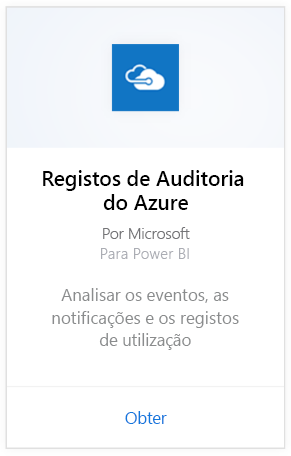
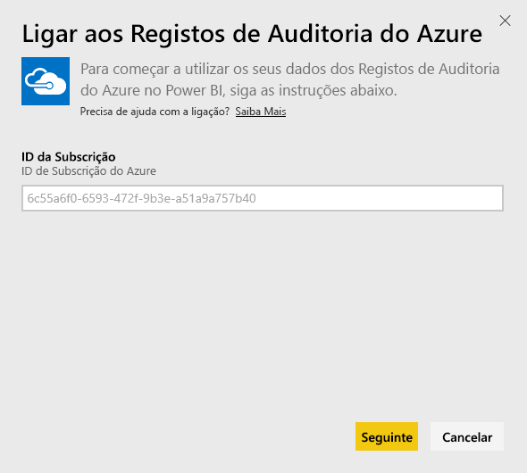
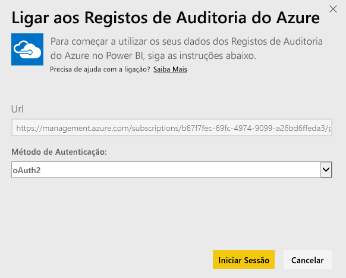
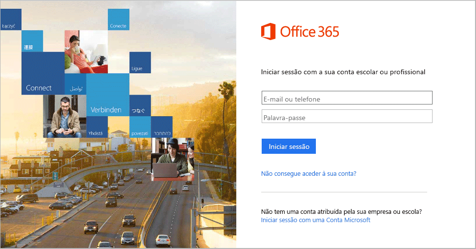
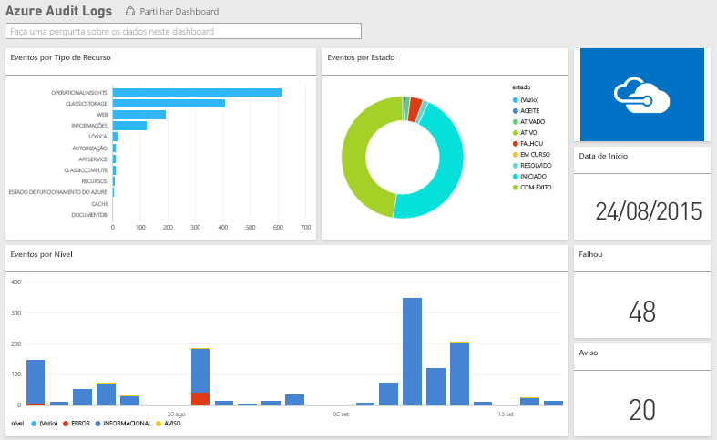

# Ligue-se aos Registos de Auditoria do Azure com o Power BI
Com o pacote de conteúdos de Registos de Auditoria do Azure, pode analisar e visualizar as informações armazenadas nos registos de auditoria. O Power BI obtem os seus dados, cria um dashboard pronto a usar e cria relatórios com base nesses dados.

[Ligue-se ao pacote de conteúdos dos Registos de Auditoria do Azure](https://app.powerbi.com/getdata/services/azure-audit-logs) ou leia mais sobre a [integração dos Registos de Auditoria do Azure](https://powerbi.microsoft.com/integrations/azure-audit-logs) com o Power BI.

## Como se ligar
1. Selecione **Obter Dados** na parte inferior do painel de navegação esquerdo.  
   
    
2. Na caixa **Serviços**, selecione **Obter**.  
   
     
3. Selecione **Registos de Auditoria do Azure** > **Obter**.  
   
   
4. Quando solicitado, introduza o **ID da subscrição do Azure**. Consulte detalhes sobre como localizar o [ID da subscrição](#FindingParams) abaixo.   
   
    
5. Como **Método de Autenticação**, selecione **oAuth2** \> **Iniciar Sessão**.
   
    
6. Insira as suas credenciais de conta para concluir o processo de entrada.
   
    
7. O Power BI vai obter os seus dados do Registo de Auditoria do Azure e criar um dashboard pronto a usar e um relatório. 
   
    

**E agora?**

* Experimente [fazer uma pergunta na caixa de Perguntas e Respostas](power-bi-q-and-a.md) na parte superior do dashboard
* [Altere os mosaicos](service-dashboard-edit-tile.md) no dashboard.
* [Selecione um mosaico](service-dashboard-tiles.md) para abrir o relatório subjacente.
* Embora o seu conjunto de dados seja agendado para atualizações diárias, pode alterar o agendamento de atualização ou tentar atualizá-lo a pedido através de **Atualizar Agora**

## Requisitos do sistema
O pacote de conteúdos de registos de Auditoria do Azure requer acesso aos Registos de Auditoria no Portal do Azure. Mais detalhes [aqui](https://azure.microsoft.com/documentation/articles/insights-debugging-with-events/).

## A localizar parâmetros
Há duas maneiras fáceis de encontrar o seu ID de Subscrição.

1. A partir de https://portal.azure.com -&gt; Procurar -&gt; Subscrições -&gt; Id de Subscrição
2. A partir de https://manage.windowsazure.com -&gt; Definições -&gt; Id de Subscrição

O ID de subscrição será um longo conjunto de números e carateres, semelhante ao exemplo do Passo \#4 acima. 

## Resolução de problemas
Se estiver a ver um erro de credenciais ou de tentativa de atualização devido a credenciais inválidas, experimente eliminar todas as instâncias do pacote de conteúdos dos registos de Auditoria do Azure e voltar a ligar.

## Próximos passos
[Introdução ao Power BI](service-get-started.md)  
[Power BI - Conceitos Básicos](service-basic-concepts.md)  

