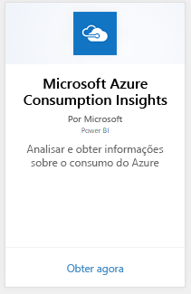
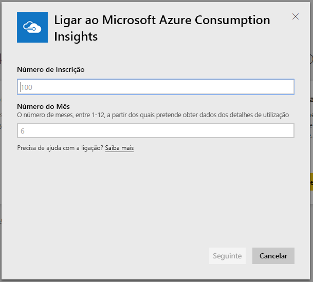
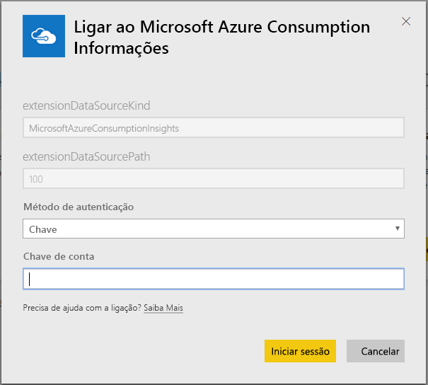
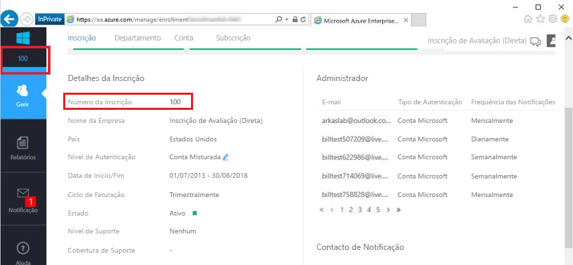
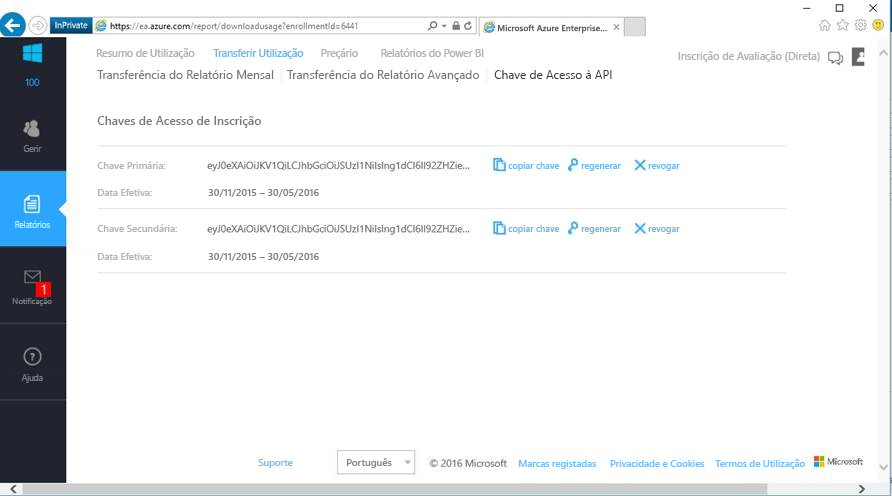

# Ligar ao Microsoft Azure Consumption Insights com o Power BI
Explore e monitorize os seus dados de consumo do Microsoft Azure no Power BI com o pacote de conteúdos do Power BI. Os dados serão atualizados automaticamente uma vez por dia.

Ligue-se ao [pacote de conteúdos Microsoft Azure Consumption Insights](https://app.powerbi.com/getdata/services/azureconsumption) para o Power BI.

## Como ligar
1. Selecione **Obter Dados** na parte inferior do painel de navegação esquerdo.
   
    
2. Na caixa **Serviços**, selecione **Obter**.
   
   
3. Selecione **Microsoft Azure Consumption Insights** \> **Obter**. 
   
   
4. Forneça o número de meses de dados que deseja importar e o seu número de registo do Azure Enterprise. Veja detalhes sobre [como encontrar estes parâmetros](#FindingParams) abaixo.
   
    
5. Forneça a sua Chave de Acesso para se ligar. A chave para a sua inscrição pode ser encontrada no Portal EA do Azure. 
   
    
6. O processo de importação será iniciado automaticamente. Quando concluído, um novo dashboard, relatório e modelo aparecerão no Painel de Navegação. Selecione o dashboard para ver os dados importados.
   
   

**E agora?**

* Tente [fazer uma pergunta na caixa de Perguntas e Respostas](service-q-and-a.md) na parte superior do dashboard
* [Altere os mosaicos](service-dashboard-edit-tile.md) no dashboard.
* [Selecione um mosaico](service-dashboard-tiles.md) para abrir o relatório subjacente.
* Embora o seu conjunto de dados seja agendado para atualizações diárias, pode alterar o agendamento de atualização ou tentar atualizá-lo a pedido através de **Atualizar Agora**

## O que está incluído
O pacote de conteúdos do Microsoft Azure Consumption Insights inclui dados de relatórios mensais para o intervalo de meses que fornece durante o fluxo de ligação. O intervalo é uma janela móvel, portanto as datas incluídas são atualizadas à medida que o conjunto de dados é atualizado.

## Requisitos de Sistema
O pacote de conteúdos exige acesso às funcionalidades do Enterprise no Portal do Azure. 

## Localizar parâmetros
Os relatórios do Power BI estão disponíveis para EA Direto, Parceiros e Clientes Indiretos que podem ver as informações de faturação. Leia abaixo para obter detalhes sobre a localização de cada um dos valores esperados pelo fluxo de ligação.

**Número de Meses**

* Deve ser um número entre 1 e 36, que representa o número de meses de dados (a partir de hoje) que quer importar.

**Número da Inscrição**

* Este é o número de inscrição do Azure Enterprise que pode ser encontrado no ecrã inicial do [Azure Enterprise Portal](https://ea.azure.com/) em "Detalhes da Inscrição".
  
    

**Chave de Acesso**

* A chave pode ser encontrada no portal do Azure Enterprise, em "Transferir Utilização" > "Chave de Acesso da API"
  
    

**Ajuda Adicional**

* Para ter ajuda adicional na configuração do pacote Power BI do Azure Enterprise, inicie a sessão no Azure Enterprise Portal para ver o ficheiro de ajuda da API em "Ajuda" e as instruções adicionais em Relatórios -> Transferir Utilização -> Chave de Acesso da API. 

## Passos seguintes
[Introdução ao Power BI](service-get-started.md)

[Obter dados no Power BI](service-get-data.md)

