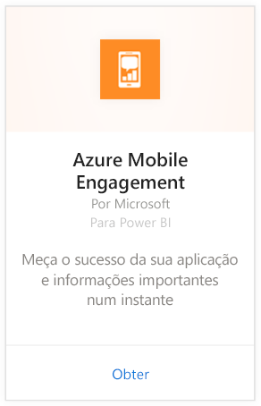
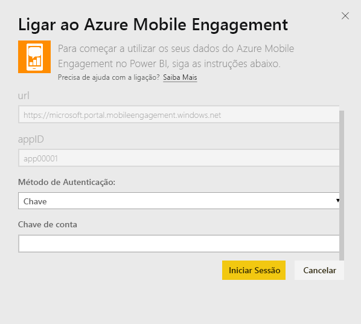
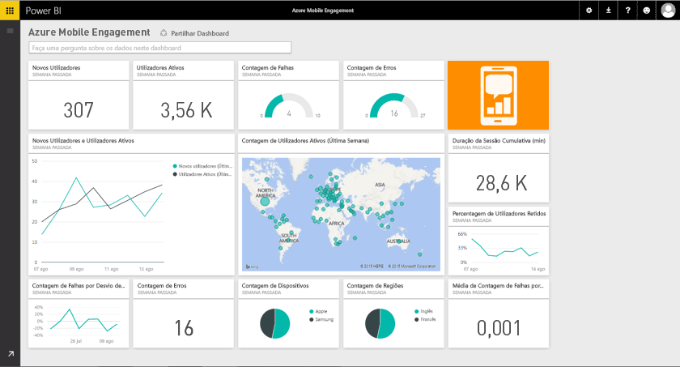

# Ligue-se ao Azure Mobile Engagement com o Power BI
O pacote de conteúdos do Azure Mobile Engagement para o Power BI permite que obtenha informações rapidamente sobre os dados da sua aplicação.

Ligue-se ao [pacote de conteúdo do Azure Mobile Engagement ](https://app.powerbi.com/groups/me/getdata/services/azme) para o Power BI.

## Como se ligar
1. Selecione **Obter Dados** na parte inferior do painel de navegação esquerdo.
   
    
2. Na caixa **Serviços**, selecione **Obter**.
   
    
3. Selecione **Azure Mobile Engagement** \> **Obter**.
   
     
4. Especifique a Coleção de Aplicações e o Nome da Aplicação. Essas informações podem ser encontradas na sua conta do Azure Mobile Engagement.
   
     
5. Para o Método de Autenticação, forneça a sua Chave e clique em Iniciar Sessão.
   
    
6. Após o Power BI importar os dados, verá novos elementos (dashboard, relatório e conjunto de dados) no painel de navegação esquerdo. O novos itens são marcados com um asterisco amarelo \* que desaparece quando selecionado:
   
    

## E agora?

* Experimente [fazer uma pergunta na caixa de Perguntas e Respostas](power-bi-q-and-a.md) na parte superior do dashboard
* [Altere os mosaicos](service-dashboard-edit-tile.md) no dashboard.
* [Selecione um mosaico](service-dashboard-tiles.md) para abrir o relatório subjacente.
* Embora o seu conjunto de dados seja agendado para atualizações diárias, pode alterar o agendamento de atualização ou tentar atualizá-lo a pedido através de **Atualizar Agora**

## Próximos passos
[Introdução ao Power BI](service-get-started.md)

[Obter dados no Power BI](service-get-data.md)

