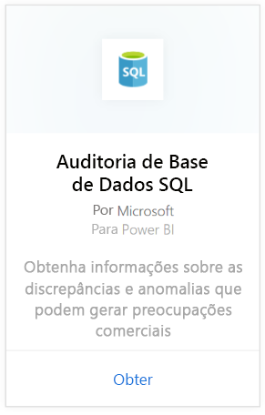
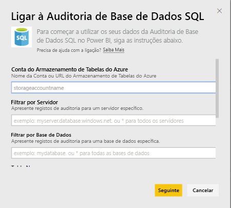
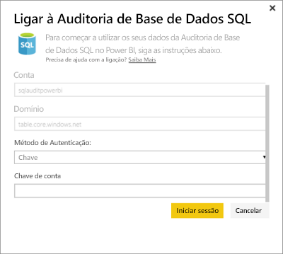
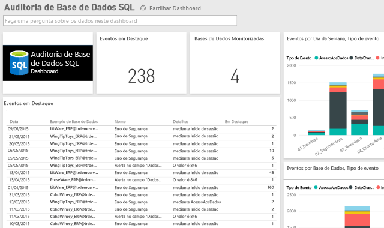

# Pacote de conteúdos de Auditoria de Base de Dados SQL para o Power BI

> [!IMPORTANT]
> O pacote de conteúdos de Auditoria de Base de Dados SQL foi preterido e já não está disponível.
 
O pacote de conteúdos do Power BI para a [Auditoria de Base de Dados SQL](/azure/sql-database/sql-database-auditing/) do Azure permite perceber a atividade da sua base de dados e obter informações sobre as discrepâncias e anomalias que podem gerar preocupações comerciais ou suspeitas de violações de segurança. 

Ligue-se ao [pacote de conteúdos da Auditoria de Base de Dados SQL](https://app.powerbi.com/getdata/services/sql-db-auditing) para o Power BI.

>[!NOTE]
>O pacote de conteúdos importa dados de todas as tabelas que contêm “AuditLogs” no nome e adiciona-os a uma tabela única de modelo de dados chamada “AuditLogs”. Os últimos 250 mil eventos serão incluídos e os dados serão atualizados diariamente.

## Como se ligar
1. Selecione **Obter Dados** na parte inferior do painel de navegação esquerdo.
   
    
2. Na caixa Serviços, selecione Obter.
   
    
3. Selecione **Auditoria de Base de Dados SQL** \> **Obter**.
   
   
4. Na janela Ligar à Auditoria de Base de Dados SQL:
   
   - Insira o nome da conta de Armazenamento de Tabelas do Azure ou o URL na qual os registos são armazenados.
   
   - Introduza o nome do SQL Server desejado. Introduza “\*” para carregar os registos de auditoria para todos os servidores.
   
   - Introduza o nome da base de dados SQL desejado. Introduza “\*” para carregar os registos de auditoria para todas as bases de dados.
   
   - Introduza o nome da tabela do Azure que contém os registos desejados. Introduza “\*” para carregar os registos de auditoria de todas as tabelas que contêm “AuditLogs” no nome.
   
   >[!IMPORTANT]
   >Por questões de desempenho, é recomendável especificar sempre um nome de tabela explícito, mesmo que todos os registos de auditoria sejam armazenados numa única tabela.
   
   - Introduza a data de início dos registos de auditoria desejados. Introduza “\*” para carregar os registos de auditoria sem um tempo limite inferior ou “1d” para carregar os registos de auditoria do último dia.
   
   - Introduza a data de término dos registos de auditoria desejados. Introduza “\*” para carregar os registos de auditoria sem um tempo limite superior.
   
   
5. Como o Método de Autenticação, selecione **Chave**, introduza a **Chave de Conta** \> **Iniciar Sessão**.
   
   
6. Depois de o Power BI importar os dados, verá um novo dashboard, relatório e conjunto de dados no painel de navegação esquerdo. Os novos itens estão marcados com um asterisco amarelo \*.
   
   

**O que se segue?**

* Experimente [fazer uma pergunta na caixa de Perguntas e Respostas](consumer/end-user-q-and-a.md) na parte superior do dashboard
* [Altere os mosaicos](service-dashboard-edit-tile.md) no dashboard.
* [Selecione um mosaico](consumer/end-user-tiles.md) para abrir o relatório subjacente.
* Embora o seu conjunto de dados seja agendado para atualizações diárias, pode alterar o agendamento das atualizações ou tentar atualizá-lo a pedido através da opção **Atualizar Agora**

## Próximos passos
[Obter dados para o Power BI](service-get-data.md)
[O que é o Power BI?](power-bi-overview.md)
