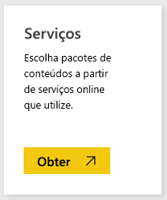
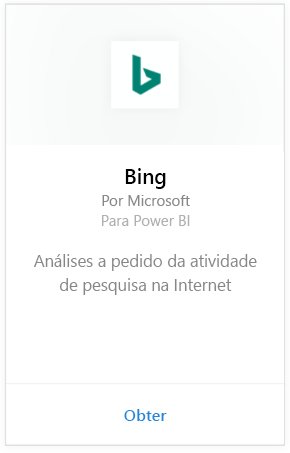
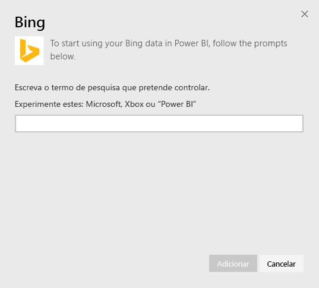
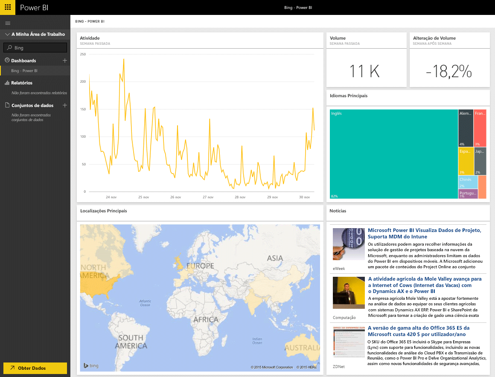

# Ligar ao Stripe com o Power BI
O pacote de conteúdos do Bing permite que veja a análise da atividade de pesquisa da Internet em relação a um termo da sua escolha.

Ligue-se ao [pacote de conteúdo do Bing](https://app.powerbi.com/groups/me/getdata/services/bing) para o Power BI.

>[!NOTE]
>Observações: os blocos do Bing serão atualizados automaticamente quase a cada cinco minutos e o único bloco que pode ser selecionado é o bloco de Notícias, que o levará para o artigo de notícias correspondente. 

>[!NOTE]
>Os mosaicos do pacote de conteúdo do Bing não são processados nas aplicações móveis. Estamos a trabalhar para resolver este problema.

1. Selecione **Obter Dados** na parte inferior do painel de navegação esquerdo.
   
    
2. Na caixa **Serviços**, selecione **Obter**.
   
    
3. Selecione **Bing** > **Obter**.
   
    
4. No diálogo de parâmetros, insira o termo de pesquisa que quer acompanhar e pressionar Adicionar.
   
        
5. À esquerda, pode uma nova entrada na lista de dashboards, com o nome de Bing e o termo de pesquisa que forneceu. Observe que não há conjuntos de dados ou relatórios associados a este dashboard. Os blocos podem levar algum tempo a carregar, mas depois disso, pode ver um layout semelhante ao mostrado abaixo.
   
    

Quando o carregamento estiver concluído, é possível começar a explorar os seus dados, incluindo a fixação de blocos deste painel a outros painéis no seu dashboard.

