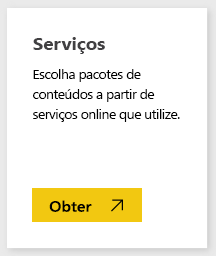
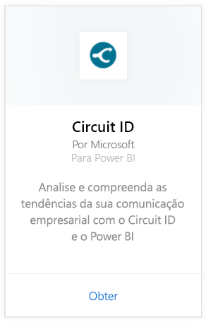
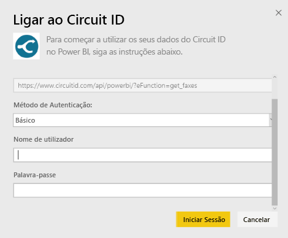
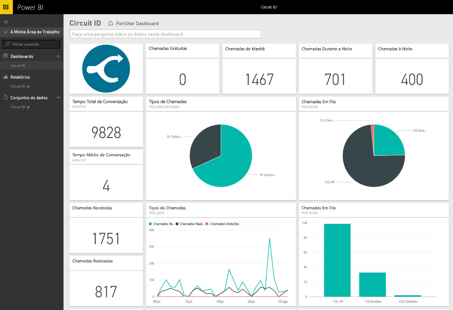

# Ligar ao Circuit ID com o Power BI
É fácil analisar os dados de comunicação do Circuit ID com o Power BI. O Power BI recupera seus dados e cria um dashboard predefinido e relatórios relacionados com base nesses dados. Após ter criado a ligação, pode explorar os dados e personalizar o dashboard para corresponder às suas necessidades. Os dados são atualizados automaticamente todos os dias.

[!INCLUDE [include-short-name](./includes/service-deprecate-content-packs.md)]

Ligue-se ao [pacote de conteúdos do Circuit ID](https://app.powerbi.com/getdata/services/circuitid) para o Power BI.

## Como se ligar
1. Selecione **Obter Dados** na parte inferior do painel de navegação esquerdo.
   
    
2. Na caixa **Serviços**, selecione **Obter**.
   
    
3. Selecione **Circuit ID** \> **Obter**.
   
    
4. Como o Método de Autenticação, selecione Básico e forneça o seu nome de utilizador e palavra-passe. Em seguida, pressione Entrar.
   
    
5. Após o Power BI importar os dados, pode ver novos elementos (dashboard, relatório e conjunto de dados) no painel de navegação esquerdo. Os itens novos são marcados com um asterisco amarelo.
   
    

**O que se segue?**

* Experimente [fazer uma pergunta na caixa de Perguntas e Respostas](consumer/end-user-q-and-a.md) na parte superior do dashboard
* [Altere os mosaicos](service-dashboard-edit-tile.md) no dashboard.
* [Selecione um mosaico](consumer/end-user-tiles.md) para abrir o relatório subjacente.
* Embora o seu conjunto de dados seja agendado para atualizações diárias, pode alterar o agendamento das atualizações ou tentar atualizá-lo a pedido através da opção **Atualizar Agora**

## Próximos passos
[O que é o Power BI?](fundamentals/power-bi-overview.md)

[Obter Dados para o Power BI](service-get-data.md)

