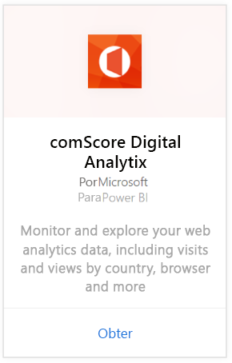
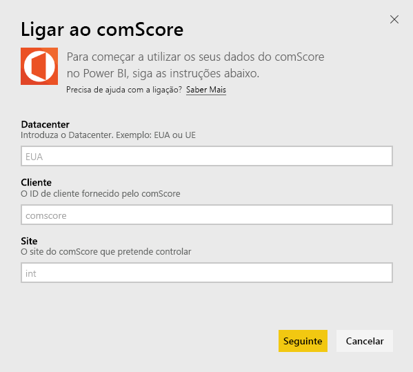
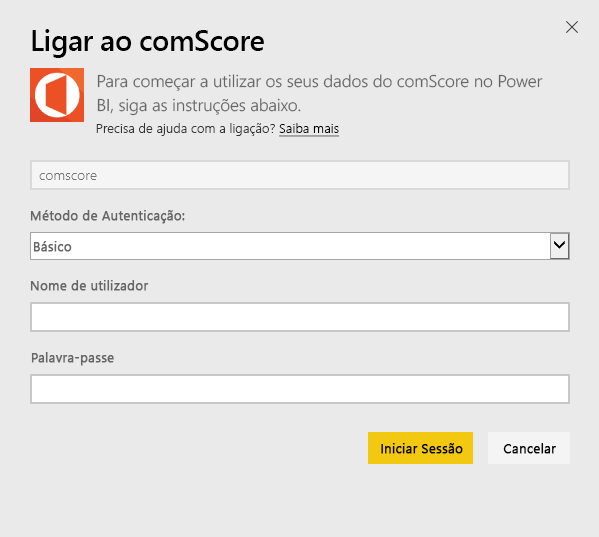
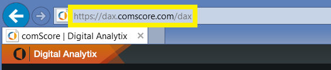
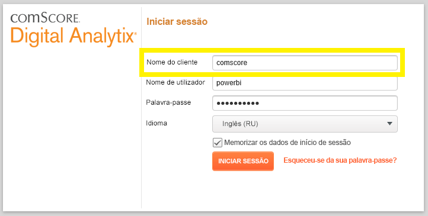
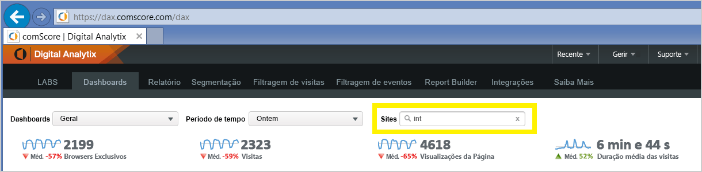

# Ligue-se a comScore Digital Analytix com o Power BI
Visualize e explore os seus dados do comScore Digital Analytix no Power BI com o pacote de conteúdos do Power BI. Os dados serão atualizados automaticamente uma vez por dia.

Ligue-se ao [pacote de conteúdos da comScore para o Power BI](https://app.powerbi.com/getdata/services/comscore).

>[!NOTE]
>Para se ligar ao pacote de conteúdos, precisa de uma conta de utilizador do comScore DAx e ter acesso à API da comScore. Mais [detalhes](#Requirements) abaixo.

## Como se ligar
1. Selecione Obter Dados na parte inferior do painel de navegação esquerdo.
   
   
2. Na caixa **Serviços**, selecione **Obter**.
   
   
3. Selecione **comScore Digital Analytix** \> **Obter**.
   
   
4. Forneça o datacenter, o ID de Cliente comScore e o Site aos quais gostaria de se ligar. Para obter mais detalhes sobre como encontrar estes valores, veja [Encontrar os parâmetros do comScore](#FindingParams) abaixo.
   
   
5. Forneça o seu nome de utilizador e palavra-passe comScore para se ligar. Veja detalhes sobre como encontrar este valor abaixo.
   
   
6. O processo de importação será iniciado automaticamente. Quando concluído, um novo dashboard, relatório e modelo aparecerão no Painel de Navegação. Selecione o dashboard para ver os seus dados importados.

**E agora?**

* Experimente [fazer uma pergunta na caixa de Perguntas e Respostas](service-q-and-a.md) na parte superior do dashboard
* [Altere os mosaicos](service-dashboard-edit-tile.md) no dashboard.
* [Selecione um mosaico](service-dashboard-tiles.md) para abrir o relatório subjacente.
* Embora o seu conjunto de dados seja agendado para atualizações diárias, pode alterar o agendamento de atualização ou tentar atualizá-lo a pedido através de **Atualizar Agora**

## Requisitos de sistema
São necessários uma conta de utilizador de DAx comScore e acesso ao comScore DAx API para estabelecer a ligação. Contacte o administrador do comScore DAx para confirmar a sua conta.

## Parâmetros de localização
Veja abaixo detalhes sobre como encontrar cada um dos parâmetros comScore.

**Data Center**

O datacenter ao qual se liga é determinado pelo URL para o qual navega no comScore.

Se utilizar https://dax.comscore.com, introduza "E.U.A.", se utilizar https://dax.comscore.eu, introduza "EU".

 

**Cliente**

O Cliente é o mesmo que forneceu ao entrar no comScore DAx.

 

**Site**

O site comScore determina o site cujos dados gostaria de ver. Pode encontrar a lista de sites a partir da sua conta comScore.

## Próximos passos
[Introdução ao Power BI](service-get-started.md)

[Obter dados no Power BI](service-get-data.md)

