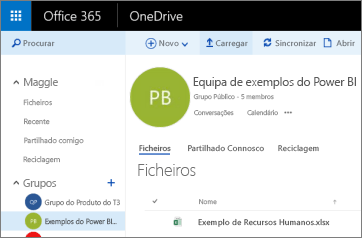
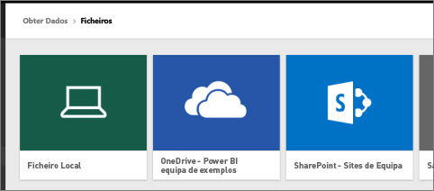
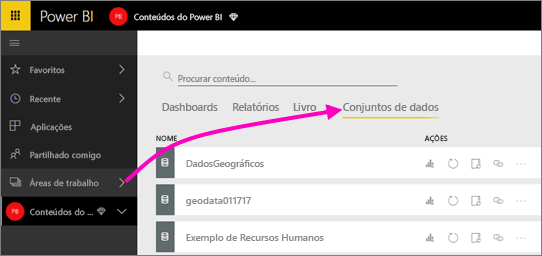
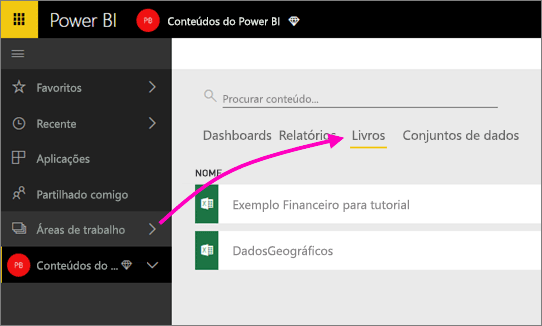

# Ligar a ficheiros armazenados no OneDrive para a sua área de trabalho do Power BI
Depois de [criar uma área de trabalho no Power BI](service-create-distribute-apps.md), pode armazenar os seus ficheiros do Excel, CSV e Power BI Desktop no OneDrive para Empresas para a sua área de trabalho do Power BI. Pode continuar a atualizar os ficheiros que armazena no OneDrive. Essas atualizações são automaticamente refletidas nos relatórios e dashboards do Power BI com base nos ficheiros. 

> [!NOTE]
> A nova experiência de área de trabalho muda a relação entre as áreas de trabalho do Power BI e os grupos do Office 365. Não cria automaticamente um grupo do Office 365 sempre que cria uma das novas áreas de trabalho. Leia mais sobre como [criar as novas áreas de trabalho](service-create-the-new-workspaces.md)

A adição de ficheiros à área de trabalho é um processo de dois passos: 

1. Primeiro, [carregue os ficheiros para o OneDrive para Empresas](service-connect-to-files-in-app-workspace-onedrive-for-business.md#1-upload-files-to-the-onedrive-for-business-for-your-workspace) para a sua área de trabalho.
2. Em seguida, [ligue a esses ficheiros a partir do Power BI](service-connect-to-files-in-app-workspace-onedrive-for-business.md#2-import-excel-files-as-datasets-or-as-excel-online-workbooks).

> [!NOTE]
> As áreas de trabalho estão disponíveis apenas no [Power BI Pro](service-features-license-type.md).
> 

## 1 Carregar ficheiros para o OneDrive para Empresas para a sua área de trabalho
1. No serviço Power BI, selecione a seta junto a Áreas de trabalho > selecione as reticências ( **…** ) junto ao nome da sua área de trabalho. 
   
   
2. Selecione **Ficheiros** para abrir o OneDrive para Empresas para a sua área de trabalho no Office 365.
   
   > [!NOTE]
   > Se não vir **Ficheiros** no menu da área de trabalho, selecione **Membros** para abrir o OneDrive para Empresas para a sua área de trabalho. Aí, selecione **Ficheiros**. O Office 365 configura uma localização de armazenamento do OneDrive para os ficheiros de área de trabalho de grupo da sua aplicação. Este processo pode demorar algum tempo. 
   > 
   > 
3. Aqui, pode carregar os seus ficheiros para o OneDrive para Empresas para a sua área de trabalho. Selecione **Carregar**e navegue até aos ficheiros.
   
   

## 2 Importar ficheiros do Excel como conjuntos de dados ou como livros do Excel Online
Agora que os seus ficheiros estão no OneDrive para Empresas para a sua área de trabalho, tem uma opção. Pode: 

* [Importe os dados do livro do Excel como um conjunto de dados](service-get-data-from-files.md). Em seguida, utilize os dados para criar relatórios e dashboards que pode ver num browser e em dispositivos móveis.
* Ou [ligar a um livro do Excel inteiro no Power BI](service-excel-workbook-files.md) e apresentá-lo exatamente como aparece no Excel Online.

### Importar ou ligar a ficheiros na sua área de trabalho
1. No Power BI, mude para a área de trabalho, de modo a que o nome da área de trabalho apareça no canto superior esquerdo. 
2. Selecione **Obter Dados** na parte inferior do painel de navegação. 
   
   
3. Na caixa **Ficheiros** , selecione **Obter**.
   
   
4. Selecione **OneDrive** - *O Nome da sua Área de Trabalho*.
   
    
5. Selecione o ficheiro desejado > **Ligar**.
   
    Neste momento, deve decidir se deseja [importar os dados do livro do Excel](service-get-data-from-files.md) ou [ligar-se a livros completos do Excel](service-excel-workbook-files.md).
6. Selecione **Importar** ou **Ligar**.
   
    
7. Se selecionar **Importar**, o livro aparece no separador **Conjuntos de dados**. 
   
    
   
    Se selecionar **Ligar**, o livro está no separador **Livros**.
   
    

## Próximos passos
* [Criar aplicações e áreas de trabalho no Power BI](service-create-distribute-apps.md)
* [Importar dados de livros do Excel](service-get-data-from-files.md)
* [Ligar a livros inteiros do Excel](service-excel-workbook-files.md)
* Mais perguntas? [Experimente a Comunidade do Power BI](https://community.powerbi.com/)
* Comentários? Visite [Ideias para o Power BI](https://ideas.powerbi.com/forums/265200-power-bi)

