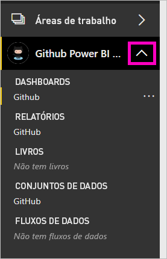
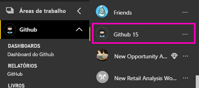
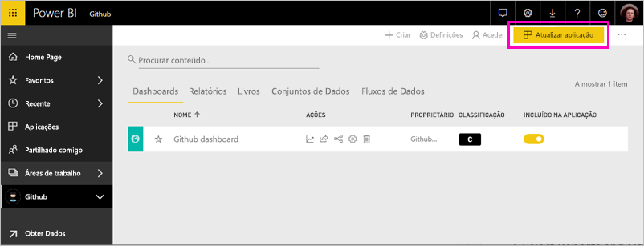

# Ligue-se ao GitHub com o Power BI
Este artigo orienta-o por meio de receber os seus dados da sua conta do GitHub com uma aplicação de modelo do Power BI. A aplicação de modelo gera uma área de trabalho com um dashboard, um conjunto de relatórios e um conjunto de dados para que possa explorar os seus dados do GitHub. A aplicação do GitHub para o Power BI mostra-lhe informações sobre o seu repositório do GitHub, também conhecido como repositório, com dados sobre contribuições, problemas, pedidos pull e utilizadores ativos.

Depois de instalar a aplicação de modelo, pode alterar o dashboard e relatório. Em seguida, pode distribuí-la como uma aplicação para os colegas na sua organização.

Ligar para o [aplicação de modelo do GitHub](https://app.powerbi.com/getdata/services/github) ou leia mais sobre o [integração do GitHub](https://powerbi.microsoft.com/integrations/github) com o Power BI.

Também pode tentar o [GitHub tutorial](service-tutorial-connect-to-github.md). Ele instala dados reais do GitHub sobre o repositório público para a documentação do Power BI.

>[!NOTE]
>A aplicação de modelo requer conta GitHub para ter acesso ao repositório. Mais detalhes sobre os requisitos abaixo.

## Como se ligar
[!INCLUDE [powerbi-service-apps-get-more-apps](./includes/powerbi-service-apps-get-more-apps.md)]
   
3. Selecione **GitHub** \> **obter agora**.
4. Na **instalar esta aplicação do Power BI?** selecionar **instalar**.
4. Na **aplicações** painel, selecione a **GitHub** mosaico.

    

6. Na **introdução à sua nova aplicação**, selecione **ligar a dados**.

    

5. Escreva o nome do repositório e também o seu proprietário. Veja detalhes sobre [como encontrar estes parâmetros](#FindingParams) abaixo.
   
    

5. Introduza as credenciais do GitHub (este passo pode ser ignorado se já estiver inscrito com o seu browser). 
6. Como **Método de Autenticação**, selecione **oAuth2** \> **Iniciar Sessão**. 
7. Siga os ecrãs de autenticação do GitHub. Conceda o GitHub para o Power BI permissão de aplicação de modelo para os dados do GitHub.
   
   
   
    O Power BI liga-se ao GitHub e os seus dados.  Os dados são atualizados uma vez por dia. Depois do Power BI importar os dados, verá o conteúdo da sua nova área de trabalho do GitHub.

## Modificar e distribuir a sua aplicação

Instalou a aplicação de modelo do GitHub. Isso significa que criou também a área de trabalho de aplicação do GitHub. Na área de trabalho, pode alterar o relatório e dashboard e, em seguida, distribuí-la como uma *aplicação* aos colegas na sua organização. 

1. Selecione a seta junto ao nome da área de trabalho na barra de navegação esquerdo. Ver a que área de trabalho contém um dashboard e um relatório.

    

8. Selecione a nova [dashboard do GitHub](https://powerbi.microsoft.com/integrations/github).    
    

3. Para ver todo o conteúdo do seu espaço de trabalho novas do GitHub, na barra de navegação esquerdo, selecione **áreas de trabalho** > **GitHub**.
 
   

    Esta vista é a lista de conteúdo para a área de trabalho. No canto superior direito, verá **atualizar aplicação**. Quando estiver pronto para distribuir a sua aplicação para os seus colegas, que é onde começar. 

    

2. Selecione **relatórios** e **conjuntos de dados** para ver os outros elementos na área de trabalho.

    Leia sobre [distribuir aplicações](service-create-distribute-apps.md) para os seus colegas.

## O que está incluído na aplicação
Os dados a seguir estão disponíveis no GitHub no Power BI:     

| Nome da tabela | Descrição |
| --- | --- |
| Contributions |A tabela de contribuições apresenta o total de adições, exclusões e confirmações criadas pelo colaborador agregadas por semana. Os 100 principais colaboradores são incluídos. |
| Problemas |Lista todos os problemas do repositório selecionado e contém cálculos como os tempos total e médio para encerramento de um problema, Total de problemas em aberto e Total de problemas encerrados. Esta tabela estará vazia quando não houver nenhum problema no repositório. |
| Solicitações pull |Esta tabela contém todas as Solicitações Pull para o repositório e quem realizou o pedido. Ela também contém cálculos de quantas solicitações pull abertas, fechadas e totais, quanto tempo demorou os pedidos pull e quanto tempo levou o pedido pull em média. Esta tabela estará vazia quando não houver nenhum problema no repositório. |
| Utilizadores |Esta tabela fornece uma lista de utilizadores do GitHub ou contribuidores que fizeram contribuições, arquivaram problemas ou resolveram solicitações Pull para o repositório selecionado. |
| Etapas |Contém todas as Etapas para o repositório selecionado. |
| DateTable |Esta tabela contém datas do presente e de anos no passado, que permitem-lhe analisar os seus dados GitHub por data. |
| ContributionPunchCard |Essa tabela pode ser usada como um cartão perfurado de colaborações para o repositório selecionado. Ele mostra as confirmações por dia da semana e horas do dia. Esta tabela não está conectada a outras tabelas presentes no modelo. |
| RepoDetails |Esta tabela fornece detalhes sobre o repositório selecionado. |

## Requisitos do sistema
* A conta do GitHub que tem acesso ao repositório.  
* Permissão concedida ao Power BI para o aplicativo GitHub durante o primeiro logon. Confira os detalhes abaixo para revogar o acesso.  
* Chamadas à API suficientes disponíveis para extrair e atualizar os dados.  

### Desautorizar Power BI
Para desautorizar Power BI de que está a ser ligado ao seu repositório do GitHub, pode revogar o acesso no GitHub. Ver isso [ajuda do GitHub](https://help.github.com/articles/keeping-your-ssh-keys-and-application-access-tokens-safe/#reviewing-your-authorized-applications-oauth) tópico para obter detalhes.

## Parâmetros de localização
Pode determinar o proprietário e o repositório ao consultar o repositório no próprio GitHub:

A primeira parte, "Azure", é o proprietário, enquanto a segunda parte, "azure-sdk-for-php", é o repositório em si.  Vê esses mesmos dois itens no URL do repositório:

    <https://github.com/Azure/azure-sdk-for-php> .

## Resolução de problemas
Se necessário, é possível verificar as suas credenciais do GitHub.  

1. Na outra janela do browser, aceda ao web site do GitHub e inicie sessão GitHub. Pode ver, no canto superior direito do site do GitHub que tem a sessão iniciar.    
2. No GitHub, navegue para o URL do repositório que quer aceder no Power BI. Por exemplo: https://github.com/dotnet/corefx.  
3. No Power BI, tente ligar-se ao GitHub. Na caixa de diálogo Configurar o GitHub, utilize os nomes e o proprietário desse mesmo repositório.  

## Próximos passos

* [Tutorial: Ligar a um repo do GitHub com o Power BI](service-tutorial-connect-to-github.md)
* [Criar novas áreas de trabalho no Power BI](service-create-the-new-workspaces.md)
* [Instalar e utilizar aplicações no Power BI](consumer/end-user-apps.md)
* [Ligar a aplicações do Power BI para serviços externos](service-connect-to-services.md)
* Perguntas? [Experimente perguntar à Comunidade do Power BI](http://community.powerbi.com/)

