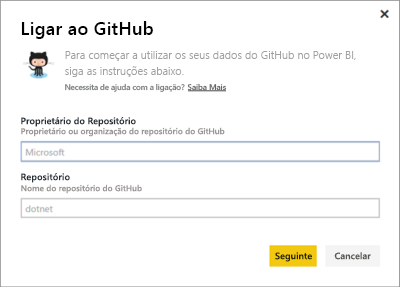
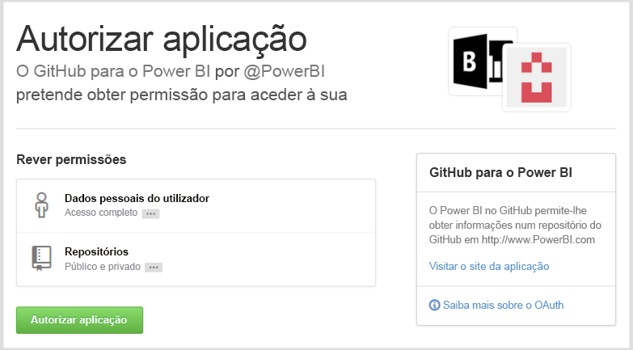
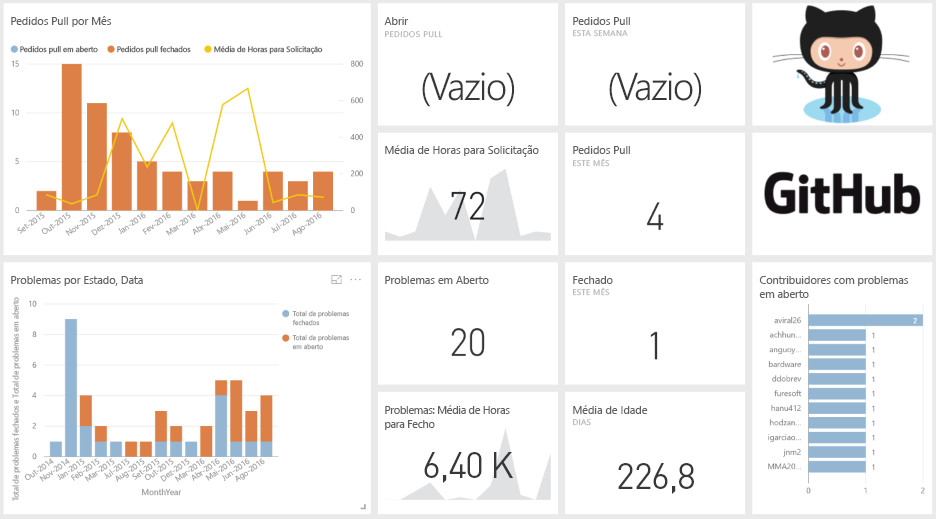
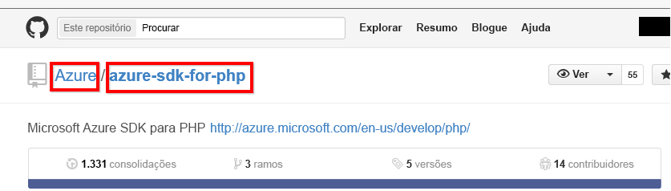

# Ligue-se ao GitHub com o Power BI
O pacote de conteúdos do GitHub para o Power BI permite obter ideias para um repositório GitHub com dados sobre contribuições, problemas, solicitações pull e utilizadores ativos.

Ligue-se ao [pacote de conteúdos do GitHub](https://app.powerbi.com/getdata/services/github) ou leia mais sobre a [Integração do GitHub](https://powerbi.microsoft.com/integrations/github) com o Power BI.

>[!NOTE]
>O pacote de conteúdo exige que a conta do GitHub tenha acesso ao repositório. Mais detalhes sobre os requisitos abaixo.

## Como se ligar
1. Selecione **Obter Dados** na parte inferior do painel de navegação esquerdo.
   
    
2. Na caixa **Serviços**, selecione **Obter**.
   
    
3. Selecione **GitHub** \> **Obter**.
   
   
4. Escreva o nome do repositório e também o seu proprietário. Veja detalhes sobre [como encontrar esses parâmetros](#FindingParams) abaixo.
   
   
5. Insira as suas credenciais do GitHub (este passo pode ser ignorado se já tiver iniciado a sessão com o seu browser). 
6. Como **Método de Autenticação**, selecione **oAuth2** \> **Iniciar Sessão**. 
7. Siga os ecrãs de autenticação do Github. Conceda ao pacote de conteúdos do GitHub para o Power BI permissão de acesso aos dados do GitHub.
   
   
   
   Isso liga o Power BI ao GitHub e permite que o Power BI se ligue aos dados.  Os dados são atualizados uma vez por dia.
8. Após ligar-se ao seu repositório, o Power BI importa os dados. Vai ver um novo [dashboard do GitHub](https://powerbi.microsoft.com/integrations/github), bem como um relatório e um conjunto de dados no painel de navegação à esquerda. Os novos itens são marcados com um asterisco amarelo \*.
   
   

**O que se segue?**

* Experimente [fazer uma pergunta na caixa de Perguntas e Respostas](consumer/end-user-q-and-a.md) na parte superior do dashboard
* [Altere os mosaicos](service-dashboard-edit-tile.md) no dashboard.
* [Selecione um mosaico](consumer/end-user-tiles.md) para abrir o relatório subjacente.
* Embora o seu conjunto de dados seja agendado para atualizações diárias, pode alterar o agendamento das atualizações ou tentar atualizá-lo a pedido através da opção **Atualizar Agora**

## O que está incluído
Os dados a seguir estão disponíveis no GitHub no Power BI:     

| Nome da tabela | Descrição |
| --- | --- |
| Contribuições |A tabela de contribuições apresenta o total de adições, exclusões e confirmações criadas pelo colaborador agregadas por semana. Os 100 principais colaboradores são incluídos. |
| Problemas |Lista todos os problemas do repositório selecionado e contém cálculos como os tempos total e médio para encerramento de um problema, Total de problemas em aberto e Total de problemas encerrados. Esta tabela estará vazia quando não houver nenhum problema no repositório. |
| Solicitações pull |Esta tabela contém todas as Solicitações Pull para o repositório e quem realizou o pedido. Também contém cálculos de quantas solicitações pull abertas, fechadas e totais existem, quanto tempo demorou para efetuar o pull das solicitações e quanto tempo levou cada solicitação pull em média. Esta tabela estará vazia quando não houver nenhum problema no repositório. |
| Utilizadores |Esta tabela fornece uma lista de colaboradores ou utilizadores do GitHub que fizeram contribuições, arquivaram problemas ou resolveram Solicitações pull para o repositório selecionado. |
| Etapas |Contém todas as Etapas para o repositório selecionado. |
| DateTable |Esta tabela contém datas do presente e de anos no passado, que permitem analisar seus dados GitHub por data. |
| ContributionPunchCard |Essa tabela pode ser usada como um cartão perfurado de colaborações para o repositório selecionado. Ele mostra as confirmações por dia da semana e horas do dia. Esta tabela não está conectada a outras tabelas presentes no modelo. |
| RepoDetails |Esta tabela fornece detalhes sobre o repositório selecionado. |

## Requisitos do sistema
* A conta do GitHub que tem acesso ao repositório.  
* Permissão concedida ao Power BI para o aplicativo GitHub durante o primeiro logon. Confira os detalhes abaixo para revogar o acesso.  
* Chamadas à API suficientes disponíveis para extrair e atualizar os dados.  

### Desautorizar Power BI
Para desautorizar a conexão do Power BI ao seu repositório do GitHub, pode revogar o acesso no GitHub. Para obter mais detalhes, confira este tópico da [ajuda do GitHub](https://help.github.com/articles/keeping-your-ssh-keys-and-application-access-tokens-safe/#reviewing-your-authorized-applications-oauth).

## A localizar parâmetros
Pode determinar o proprietário e o repositório ao consultar o repositório no próprio GitHub:

A primeira parte, "Azure", é o proprietário, enquanto a segunda parte, "azure-sdk-for-php", é o repositório em si.  Vê esses mesmos dois itens no URL do repositório:

    <https://github.com/Azure/azure-sdk-for-php> .

## Resolução de problemas
Se necessário, é possível verificar as suas credenciais do GitHub.  

1. Noutra janela do browser, vá para o site do GitHub e inicie a sessão no GitHub. Pode ver, no canto superior direito do site do GitHub que tem a sessão iniciar.    
2. No GitHub, navegue para o URL do repositório que quer aceder no Power BI. Por exemplo: https://github.com/dotnet/corefx.  
3. No Power BI, tente ligar-se ao GitHub. Na caixa de diálogo Configurar o GitHub, utilize os nomes e o proprietário desse mesmo repositório.  

## Próximos passos
* [O que é o Power BI?](power-bi-overview.md)
* [Obter Dados](service-get-data.md)
