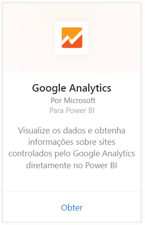
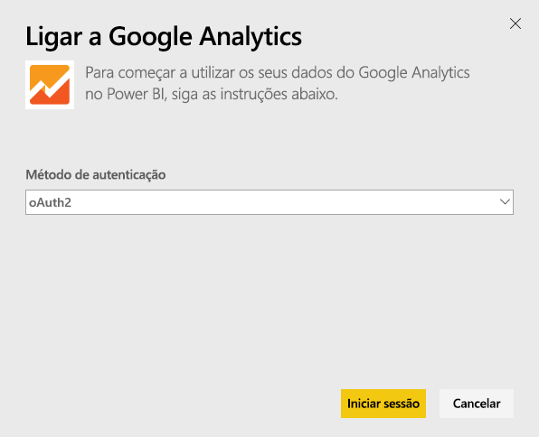
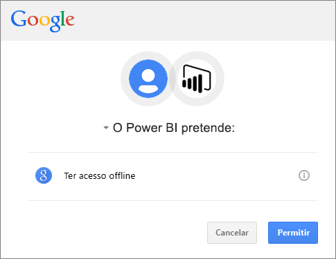
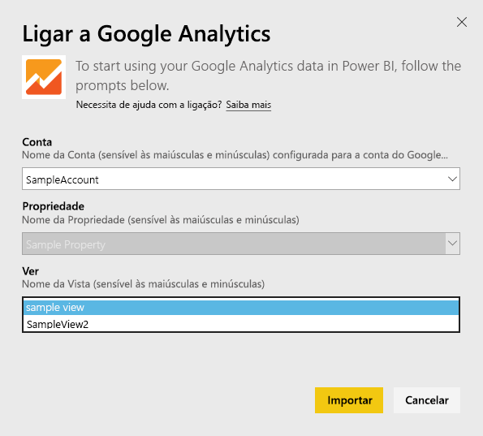
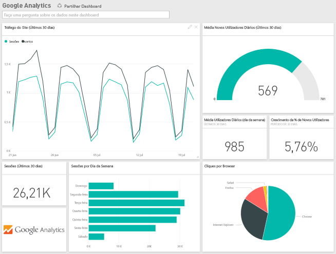
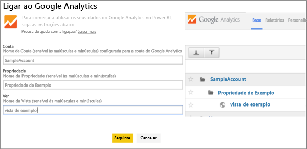

# Ligue ao Google Analytics com o Power BI
A ligação ao Google Analytics através do Power BI começa ao ligar-se à sua conta do Google Analytics. Irá obter um dashboard e um conjunto de relatórios do Power BI que apresentam informações sobre o tráfego do seu site e as dimensões dos utilizadores. Pode interagir com o dashboard e os relatórios, mas não é possível guardar as alterações. Os dados serão atualizados automaticamente uma vez por dia.

Ligue ao [Google Analytics](https://app.powerbi.com/getdata/services/google-analytics) para o Power BI. Leia mais sobre a [integração do Google Analytics](https://powerbi.microsoft.com/integrations/google-analytics) com o Power BI.

Pode criar dashboards e relatórios personalizados a partir do [conector do Google Analytics](service-google-analytics-connector.md) no Power BI Desktop. Basta ligar-se com a sua conta do Google Analytics e criar os seus relatórios personalizados, que poderá publicar no serviço Power BI.

## Como ligar
[!INCLUDE [powerbi-service-apps-get-more-apps](./includes/powerbi-service-apps-get-more-apps.md)]

1. Selecione **Google Analytics** \> **Obter**.
   
   
2. Quando pedido, introduza as suas credenciais do Google Analytics. Selecione **oAuth 2** como o Mecanismo de Autenticação e clique em **Iniciar Sessão**. Siga o fluxo de autenticação do Google, que pode incluir a autenticação de 2 fatores se tiver configurado essa opção.
   
   
3. Clique em **Aceitar** para permitir que o Power BI aceda aos seus dados do Google Analytics.
   
   
4. O Power BI liga a uma Vista do Google Analytics específica. Selecione o nome da conta, o nome da propriedade e nome da visualização aos quais gostaria de se ligar. Estas informações podem ser encontradas na sua conta do Google Analytics, no canto superior esquerdo ou no separador **Página Inicial** . Veja os detalhes abaixo. 
   
   
5. Clique em **Ligar** para iniciar o processo de importação. 

## Ver o dashboard e os relatórios do Google Analytics
[!INCLUDE [powerbi-service-apps-open-app](./includes/powerbi-service-apps-open-app.md)]

      

[!INCLUDE [powerbi-service-apps-open-app](./includes/powerbi-service-apps-what-now.md)]

## Requisitos de sistema
Para ligar através do Power BI, tem de ter uma do [Google Analytics](https://www.google.com/analytics/). Outras contas do Google que não têm uma conta do Google Analytics ligada ao mesmo irão encontrar um erro de autenticação.

## Resolução de problemas
**Credenciais** Se tiver várias contas Google, utilize um browser em modo incógnito ou uma janela de browser privada durante a ligação para garantir que a conta correta é utilizada.

Se receber um erro a indicar que as credenciais são inválidas, mas conseguiu entrar no Google, confirme que tem uma conta do [Google Analytics](https://www.google.com/analytics/).

**Parâmetros** São atualmente necessários nomes exclusivos para os parâmetros. Se receber um erro a indicar que o valor selecionado está duplicado, selecione outro valor ou altere os nomes no Google Analytics para torná-los exclusivos. Estamos a trabalhar ativamente para resolver este problema.

>[!NOTE]
>Os parâmetros são sensíveis às maiúsculas e minúsculas. Insira-os exatamente como aparecem na sua conta do Google Analytics.

Ainda está com problemas? Abra um pedido de suporte para entrar em contacto com a equipa do Power BI:

* Na aplicação do Power BI, selecione o ponto de interrogação \> **Contactar o Suporte.**
* No site de Suporte do Power BI (onde está a ler este artigo), selecione **Contactar o Suporte** no lado direito da página.

## Próximos passos
* [O que são aplicações no Power BI?](service-install-use-apps.md)
* [Obter dados no Power BI](service-get-data.md)
* Mais perguntas? [Experimente perguntar à Comunidade do Power BI](http://community.powerbi.com/)

