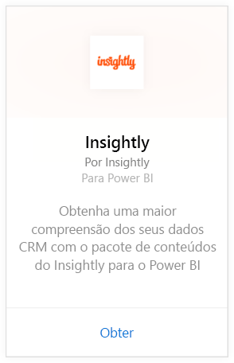
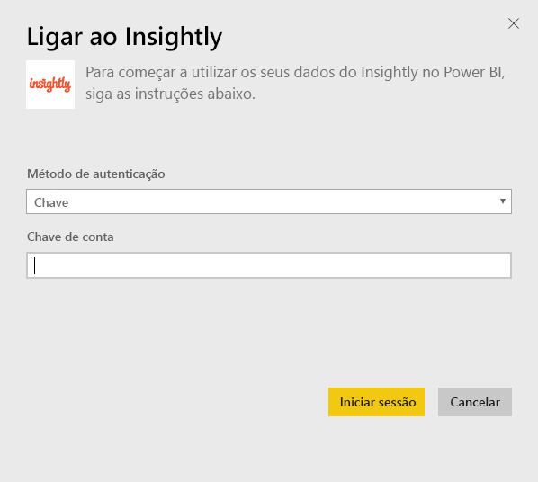
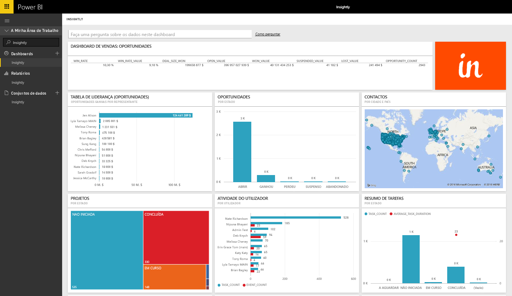
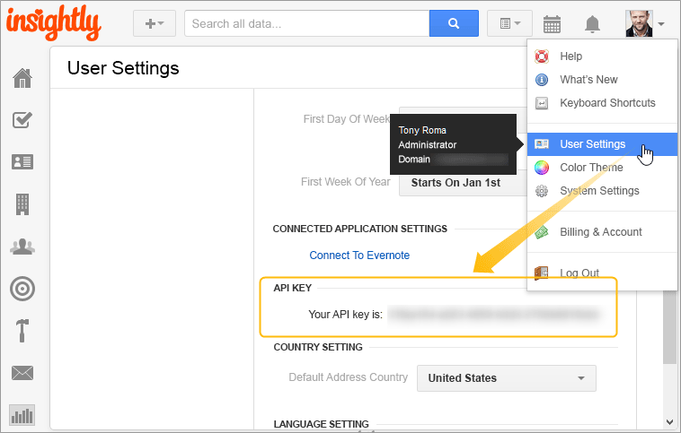

# Ligar ao Insightly com o Power BI
Visualize e partilhe os seus dados de CRM do Insightly no Power BI com o pacote de conteúdos do Insightly. Ligue-se ao Power BI usando a sua chave de API do Insightly para visualizar e criar relatórios e dashboards a partir dos seus dados de CRM. Com o Power BI pode analisar os dados de novas maneiras, criar gráficos poderosos e exibir contactos, clientes potenciais e organizações num mapa.

Ligue-se ao [pacote de conteúdos do Insightly](https://app.powerbi.com/getdata/services/insightly) para o Power BI.

## Como se ligar
1. Selecione **Obter Dados** na parte inferior do painel de navegação esquerdo.
   
   
2. Na caixa **Serviços**, selecione **Obter**.
   
   
3. Selecione **Insightly** \>  **Obter**.
   
   
4. Selecione **Chave** como o tipo de Autenticação e forneça a sua chave de API Insight. Em seguida, selecione **Iniciar Sessão**. Consulte os detalhes sobre como [encontrar este valor](#FindingParams) mais abaixo.
   
   
5. Após a aprovação, o processo de importação será iniciado automaticamente. Quando concluído, um novo dashboard, relatório e modelo aparecerão no Painel de Navegação. Selecione o dashboard para ver os seus dados importados.
   
     

**O que se segue?**

* Experimente [fazer uma pergunta na caixa de Perguntas e Respostas](power-bi-q-and-a.md) na parte superior do dashboard
* [Altere os mosaicos](service-dashboard-edit-tile.md) no dashboard.
* [Selecione um mosaico](service-dashboard-tiles.md) para abrir o relatório subjacente.
* Embora o seu conjunto de dados seja agendado para atualizações diárias, pode alterar o agendamento de atualização ou tentar atualizá-lo a pedido através de **Atualizar Agora**

## O que está incluído
O pacote de conteúdos inclui as seguintes tabelas com campos dos registos correspondentes:

| Tabelas |  |  |  |
| --- | --- | --- | --- |
| Contactos |Oportunidades |Estágios de Pipeline |Data de Conclusão da Tarefa |
| Campos Personalizados |Data de Fecho da Oportunidade |Data de Conclusão do Projeto |Tarefas |
| Eventos |Data de Previsão da Oportunidade |Projetos |Equipas/Membros |
| Clientes potenciais |Organizações |Etiquetas |Utilizadores |

Muitas tabelas e relatórios também incluem campos calculados exclusivos, como:  

* Tabelas com datas previstas de fecho de oportunidades, datas reais de fecho de oportunidades, datas de conclusão de projetos e datas de conclusão de tarefas "agrupadas" para análise por mês, trimestre ou ano.  
* Um campo de valor ponderado para oportunidades (valor da oportunidade * probabilidade de ganho).  
* Campos de duração média e total das tarefas, com base nas datas de início e conclusão.  
* Relatórios com campos calculados para taxa de ganhos de oportunidade (número de ganhos/número de oportunidades totais) e valor da taxa de ganhos (valor de ganhos/valor de oportunidades totais).  

## Requisitos de sistema
É necessária uma conta Insightly com acesso à API do Insightly. As permissões de visibilidade serão baseadas na chave de API usada para estabelecer a ligação com o Power BI. Quaisquer registos do Insightly visíveis para si também estarão visíveis nos relatórios e nos dashboards do Power BI que partilhar com outras pessoas.

## Parâmetros de localização
**Chave de API**

Para copiar a chave de API do Insightly, selecione as Definições de Utilizador no menu do perfil do Insightly e desloque o ecrã para baixo. Esta cadeia de caracteres será usada para ligar os seus dados ao Power BI.

## Resolução de problemas
Os dados são importados através da API do Insightly, que inclui um limite diário com base no nível de plano da sua subscrição do Insightly. Os limites são listados na secção Pedidos de Limitação/Limitação de Velocidade da nossa documentação da API: https://api.insight.ly/v2.2/Help#!/Overview/Introduction#ratelimit

Os relatórios fornecidos usam campos predefinidos do Insightly e podem não incluir as suas personalizações. Edite o relatório para ver todos os campos disponíveis.

## Próximos passos
[Introdução ao Power BI](service-get-started.md)

[Obter dados no Power BI](service-get-data.md)

