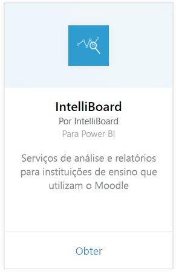
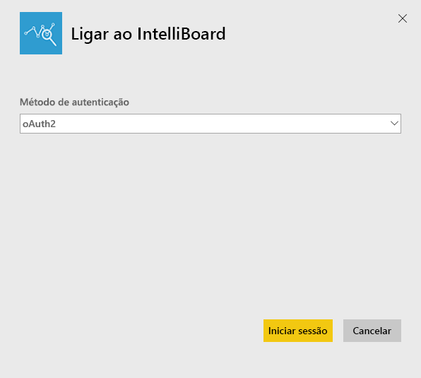
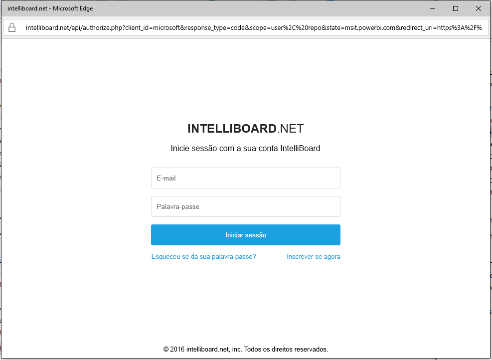
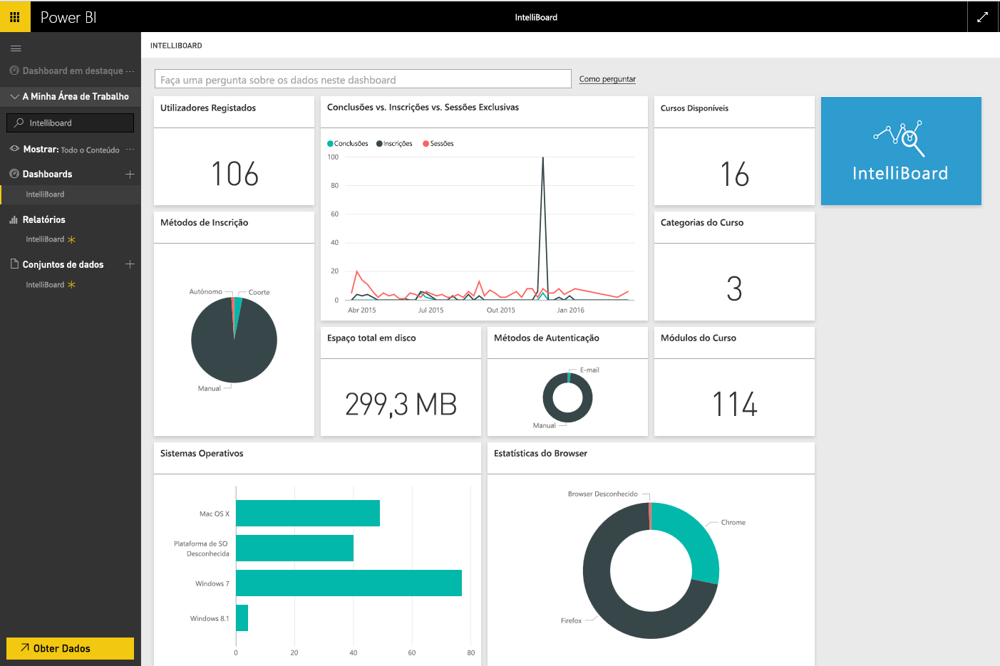

# Ligar ao IntelliBoard com o Power BI
O IntelliBoard fornece acesso simplificado aos dados do sistema de gestão de aprendizado Moodle por meio do Reporting Services. O pacote de conteúdo do IntelliBoard para o Power BI oferece análises adicionais, incluindo métricas sobre cursos, utilizadores registados, desempenho geral e atividade de LMS.

Conecte-se ao [pacote de conteúdo do IntelliBoard](https://app.powerbi.com/getdata/services/intelliboard) para o Power BI.

## Como se ligar
1. Selecione **Obter Dados** na parte inferior do painel de navegação esquerdo.  
   
    
2. Na caixa **Serviços**, selecione **Obter**.  
   
    
3. Selecione **IntelliBoard** e, em seguida **Obter**.  
   
    
4. Selecione **OAuth 2** e **Entrar**. Quando solicitado, forneça suas credenciais do IntelliBoard.
   
    
   
    
5. Depois de estar ligado, um dashboard, relatório e conjunto de dados são carregados automaticamente. Após a conclusão, os blocos são atualizados com os dados da sua conta do IntelliBoard.
   
    

**O que se segue?**

* Experimente [fazer uma pergunta na caixa de Perguntas e Respostas](power-bi-q-and-a.md) na parte superior do dashboard
* [Altere os mosaicos](service-dashboard-edit-tile.md) no dashboard.
* [Selecione um mosaico](service-dashboard-tiles.md) para abrir o relatório subjacente.
* Embora o seu conjunto de dados seja agendado para atualizações diárias, pode alterar o agendamento de atualização ou tentar atualizá-lo a pedido através de **Atualizar Agora**

## O que está incluído
O pacote de conteúdos inclui dados das seguintes tabelas:  

    - Atividade  
    - Agentes  
    - Autenticação  
    - Países  
    - Progresso dos Cursos  
    - Registos
    - Idioma  
    - Plataforma  
    - Totais  
    - Progresso dos Utilizadores    

## Requisitos do sistema
É necessário ter uma conta do IntelliBoard com permissões de acesso às tabelas acima para criar uma instância deste pacote de conteúdos.

## Próximos passos
[Introdução ao Power BI](service-get-started.md)

[Power BI - Conceitos Básicos](service-basic-concepts.md)

