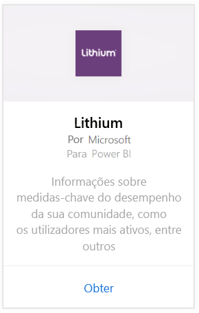
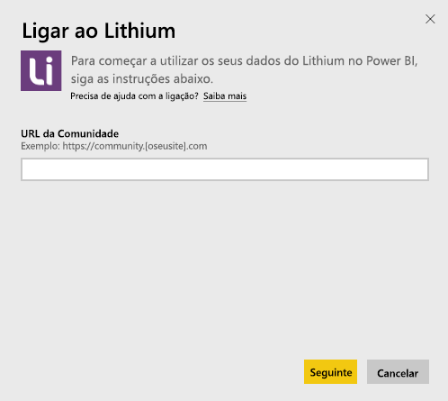
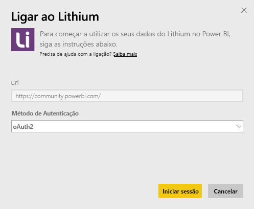
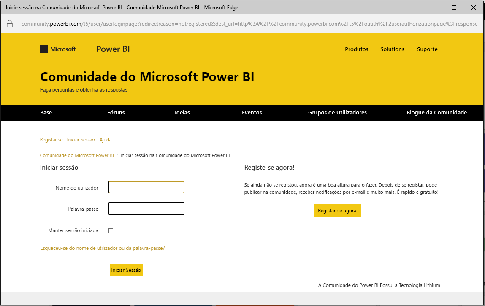
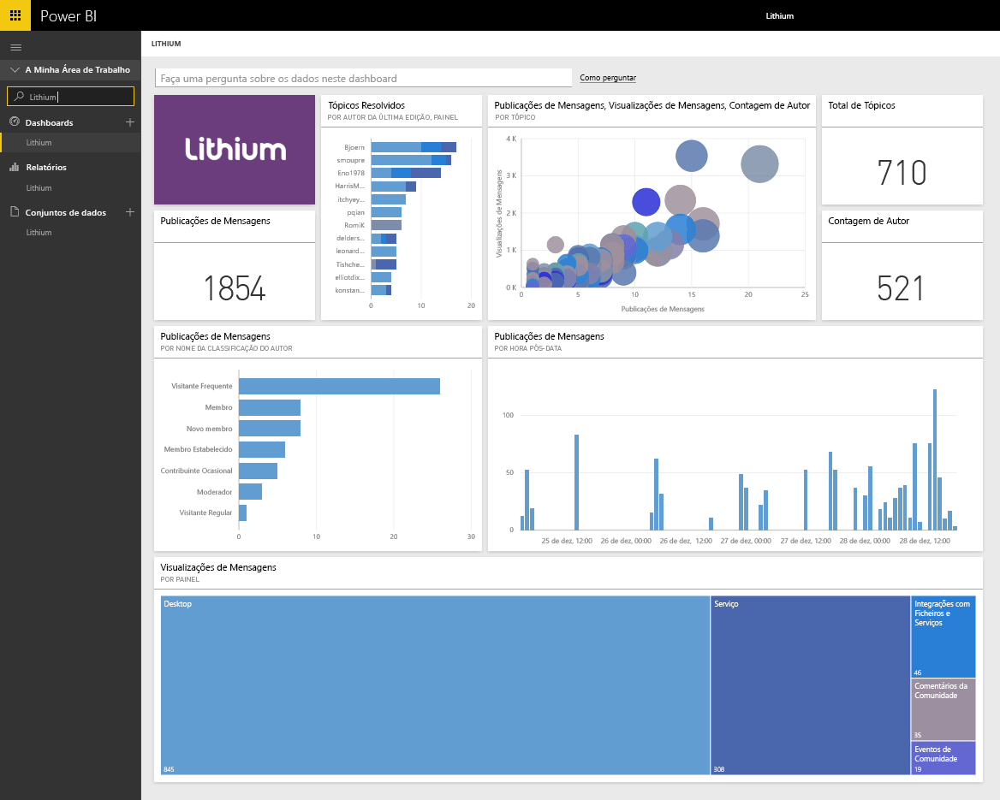

# Ligue-se ao Lithium com o Power BI
O Lithium cria relações de confiança entre marcas melhor do mundo e os seus clientes, ajudando as pessoas a obter respostas e partilhar as suas experiências. Ao ligar ao pacote de conteúdos do Lithium ao Power BI, pode medir as métricas-chave sobre a sua comunidade online para ajudar a estimular as vendas, reduzir os custos de serviço e aumentar a fidelidade. 

Ligue-se ao [pacote de conteúdo do Lithium](https://app.powerbi.com/getdata/services/lithium) para o Power BI.

>[!NOTE]
>O pacote de conteúdo do Power BI usa a API do Lithium. As chamadas excessivas à API podem resultar em despesas adicionais do Lithium. Confirme com o seu administrador do Lithium.

## Como se ligar
1. Selecione **Obter Dados** na parte inferior do painel de navegação esquerdo.
   
    
2. Na caixa **Serviços**, selecione **Obter**.
   
    
3. Selecione **Lithium** \> **Obter**.
   
   
4. Forneça o URL da sua comunidade do Lithium. O URL terá o formato *https://community.yoursite.com*.
   
   
5. Quando solicitado, insira as suas credenciais do Lithium. Selecione **oAuth 2** como mecanismo de autenticação, clique em **Iniciar Sessão** e siga o fluxo de autenticação do Lithium.
   
   
   
   
6. Quando o fluxo de início de sessão estiver concluído, o processo de importação será iniciado. Quando concluído, um novo dashboard, relatório e modelo aparecem no Painel de Navegação. Selecione o dashboard para ver os seus dados importados.
   
    

**O que se segue?**

* Experimente [fazer uma pergunta na caixa de Perguntas e Respostas](power-bi-q-and-a.md) na parte superior do dashboard
* [Altere os mosaicos](service-dashboard-edit-tile.md) no dashboard.
* [Selecione um mosaico](service-dashboard-tiles.md) para abrir o relatório subjacente.
* Embora o seu conjunto de dados seja agendado para atualizações diárias, pode alterar o agendamento de atualização ou tentar atualizá-lo a pedido através de **Atualizar Agora**

## Requisitos do sistema
O pacote de conteúdo do Lithium exige uma comunidade do Lithium v15.9 ou superior. Entre em contacto com seu administrador do Lithium para confirmar.

## Próximos passos
[Introdução ao Power BI](service-get-started.md)

[Power BI - Conceitos Básicos](service-basic-concepts.md)

