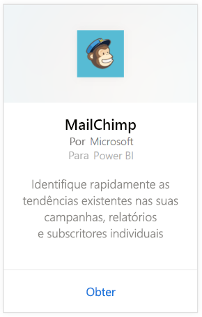
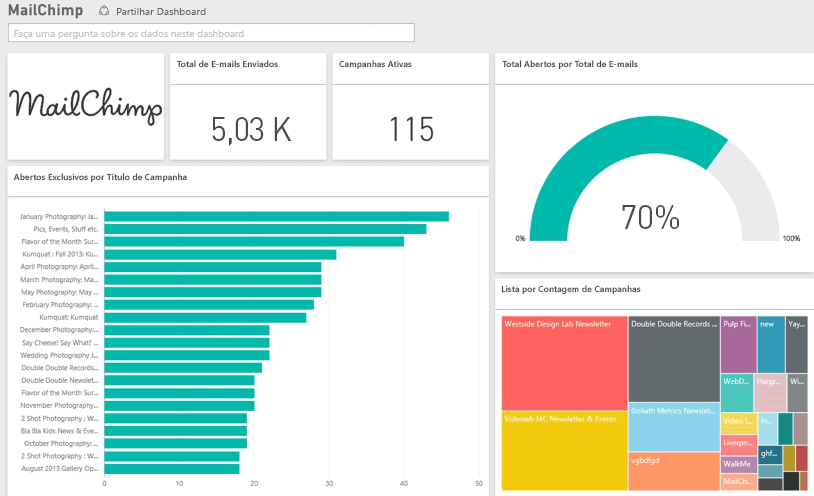

# Ligar ao MailChimp com o Power BI
O pacote de conteúdos do Power BI extrai dados da sua conta do MailChimp e gera um dashboard, um conjunto de relatórios e um conjunto de dados para permitir que explore os seus dados. Utilize a análise para [dashboards do MailChimp](https://powerbi.microsoft.com/integrations/mailchimp) para identificar rapidamente as tendências existentes nas suas campanhas, relatórios e subscritores individuais. Os dados são configurados para serem atualizados diariamente, o que garante que os dados que está a monitorizar são atuais.

Ligue-se ao [pacote de conteúdo do MailChimp](https://app.powerbi.com/getdata/services/mailchimp) para o Power BI.

## Como se ligar
1. Selecione **Obter Dados** na parte inferior do painel de navegação esquerdo.
   
    
2. Na caixa **Serviços**, selecione **Obter**.
   
   
3. Selecione **MailChimp** \> **Obter**.
   
   
4. Como Método de Autenticação, selecione **oAuth2** \> **Iniciar Sessão**.
   
    Quando solicitado, insira as suas credenciais do MailChimp e siga o processo de autenticação.
   
    Na primeira vez que se ligar, o Power BI solicita o acesso apenas de leitura à sua conta. Selecione **Permitir** para iniciar o processo de importação, que pode demorar alguns minutos dependendo do volume de dados na conta.
   
    
5. Após o Power BI importar os dados, verá novos elementos (dashboard, relatório e conjunto de dados) no painel de navegação esquerdo. Esse é o dashboard padrão criado pelo Power BI para exibir os seus dados. Pode alterar este dashboard para apresentar os dados da forma que quiser.
   
   

**O que se segue?**

* Experimente [fazer uma pergunta na caixa de Perguntas e Respostas](consumer/end-user-q-and-a.md) na parte superior do dashboard
* [Altere os mosaicos](service-dashboard-edit-tile.md) no dashboard.
* [Selecione um mosaico](consumer/end-user-tiles.md) para abrir o relatório subjacente.
* Embora o seu conjunto de dados seja agendado para atualizações diárias, pode alterar o agendamento das atualizações ou tentar atualizá-lo a pedido através da opção **Atualizar Agora**

## Passos seguintes
[O que é o Power BI?](power-bi-overview.md)

[Power BI - Conceitos Básicos](consumer/end-user-basic-concepts.md)

