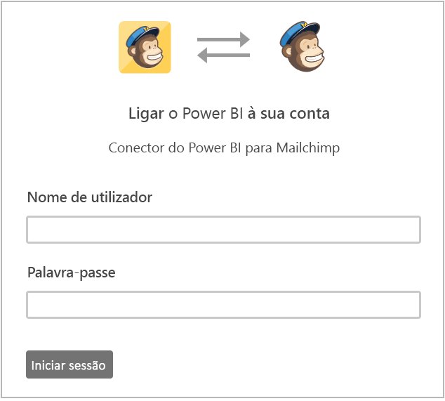
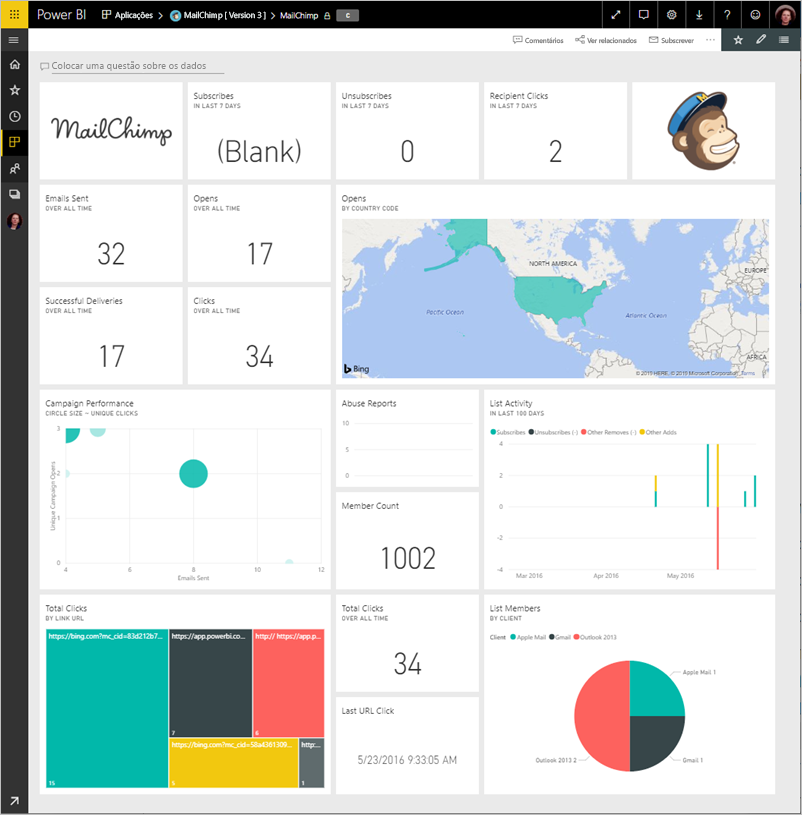
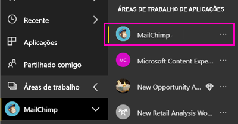
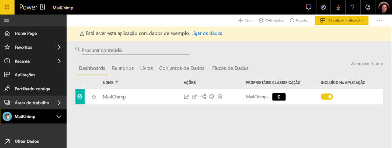

# Ligar ao MailChimp com o Power BI
Este artigo orienta-o por meio de receber os seus dados da sua conta do MailChimp com uma aplicação de modelo do Power BI. A aplicação de modelo gera uma área de trabalho com um dashboard, um conjunto de relatórios e um conjunto de dados para que possa explorar os seus dados do MailChimp. Utilize a análise para [dashboards do MailChimp](https://powerbi.microsoft.com/integrations/mailchimp) para identificar rapidamente as tendências existentes nas suas campanhas, relatórios e subscritores individuais. Os dados é atualizada diariamente, garantir que os dados que está a monitorizar estão atualizados.

Depois de instalar a aplicação de modelo, pode alterar o dashboard e relatório. Em seguida, pode distribuí-la como uma aplicação para os colegas na sua organização.

Ligar para o [aplicação de modelo do MailChimp](https://app.powerbi.com/getdata/services/mailchimp) para o Power BI.

## Como se ligar

[!INCLUDE [powerbi-service-apps-get-more-apps](./includes/powerbi-service-apps-get-more-apps.md)]

3. Selecione **MailChimp** \> **obter agora**.
4. Na **instalar esta aplicação do Power BI?** selecionar **instalar**.
4. Na **aplicações** painel, selecione a **MailChimp** mosaico.

    

6. Na **introdução à sua nova aplicação**, selecione **ligar a dados**.

    

1. Como Método de Autenticação, selecione **oAuth2** \> **Iniciar Sessão**.
   
    Quando solicitado, insira as suas credenciais do MailChimp e siga o processo de autenticação.
   
    Quando ligar pela primeira vez, o Power BI pede-lhe para permitir acesso só de leitura à sua conta. Selecione **Permitir** para iniciar o processo de importação. Pode demorar alguns minutos, dependendo do volume de dados na sua conta.
   
    

5. Depois do Power BI importar os dados, é aberto o dashboard do MailChimp.
   
    

## Modificar e distribuir a sua aplicação

Instalou a aplicação de modelo do MailChimp. Isso significa que criou também a área de trabalho de aplicação do MailChimp. Na área de trabalho, pode alterar o relatório e dashboard e, em seguida, distribuí-la como uma *aplicação* aos colegas na sua organização. 

1. Para ver todo o conteúdo do seu novo espaço de trabalho de MailChimp, na barra de navegação esquerdo, selecione **áreas de trabalho** > **MailChimp**. 

    

    Esta vista é a lista de conteúdo para a área de trabalho. No canto superior direito, verá **atualizar aplicação**. Quando estiver pronto para distribuir a sua aplicação para os seus colegas, que é onde começar.

    

2. Selecione **relatórios** e **conjuntos de dados** para ver os outros elementos na área de trabalho. 

    Leia sobre [distribuir aplicações](service-create-distribute-apps.md) para os seus colegas.

## Próximos passos

* [Criar novas áreas de trabalho no Power BI](service-create-the-new-workspaces.md)
* [Instalar e utilizar aplicações no Power BI](consumer/end-user-apps.md)
* [Aplicações do Power BI para serviços externos](service-connect-to-services.md)
* Perguntas? [Experimente perguntar à Comunidade do Power BI](http://community.powerbi.com/)

