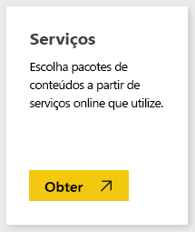
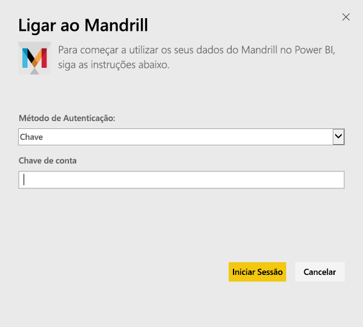
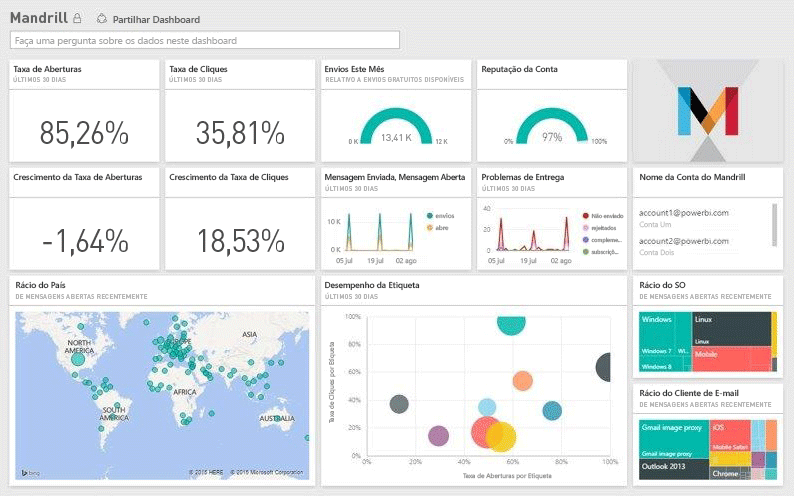

# Ligar-se ao Mandrill com o Power BI
O pacote de conteúdos do Power BI extrai dados da sua conta do Mandrill e gera um dashboard, um conjunto de relatórios e um conjunto de dados para permitir que explore seus dados. Utilize a análise do Mandrill para obter informações rapidamente sobre a sua campanha de newsletter e de marketing. Os dados são configurados para serem atualizados diariamente, o que garante que os dados que está a monitorizar são atuais.

Ligue-se ao [pacote de conteúdo do Mandrill para o Power BI.](http://app.powerbi.com/getdata/services/mandrill)

## Como se ligar
1. Selecione **Obter Dados** na parte inferior do painel de navegação esquerdo.
   
    
2. Na caixa **Serviços**, selecione **Obter**.
   
    
3. Selecione **Mandrill** > **Obter**.
   
    
4. Como **Método de Autenticação**, selecione **Chave** e forneça chave de API. Pode encontrar a chave no separador **Configurações** no dashboard do Mandrill. Selecione **Iniciar Sessão** para iniciar o processo de importação, que pode levar alguns minutos dependendo do volume de dados na conta.
   
    
5. Após o Power BI importar os dados, verá novos elementos (dashboard, relatório e conjunto de dados) no painel de navegação esquerdo. Esse é o dashboard padrão criado pelo Power BI para exibir os seus dados.
   
    

**O que se segue?**

* Experimente [fazer uma pergunta na caixa de Perguntas e Respostas](consumer/end-user-q-and-a.md) na parte superior do dashboard
* [Altere os mosaicos](service-dashboard-edit-tile.md) no dashboard.
* [Selecione um mosaico](consumer/end-user-tiles.md) para abrir o relatório subjacente.
* Embora o seu conjunto de dados seja agendado para atualizações diárias, pode alterar o agendamento das atualizações ou tentar atualizá-lo a pedido através da opção **Atualizar Agora**

## Passos seguintes
[O que é o Power BI?](power-bi-overview.md)

[Power BI - Conceitos Básicos](consumer/end-user-basic-concepts.md)

