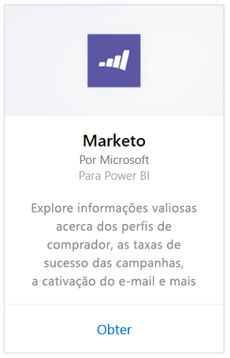
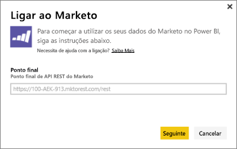
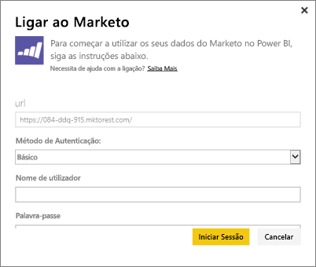

# Ligue-se ao Marketo com o Power BI
O pacote de conteúdos do Power BI para o Marketo permite que obtenha informações sobre a sua conta do Marketo com dados sobre clientes potenciais e as suas atividades. A criação dessa ligação recupera os seus dados e fornece automaticamente um dashboard e relatórios relacionados com base nesses dados.

Ligue-se ao [Pacote de conteúdos do Marketo](https://app.powerbi.com/getdata/services/marketo) para o Power BI.

## Como se ligar
1. Selecione **Obter Dados** na parte inferior do painel de navegação esquerdo.
   
   
2. Na caixa **Serviços**, selecione **Obter**.
   
    
3. Selecione **Marketo** \> **Obter**.
   
   
4. Insira o ponto de extremidade REST do Marketo, fornecido pelo próprio Marketo ou pelo administrador deste, e selecione Avançar.
   
   
   
   Leia mais sobre o ponto de extremidade REST do Marketo: [http://developers.marketo.com/documentation/rest/endpoint-url/](http://developers.marketo.com/documentation/rest/endpoint-url/).
5. Com o Método de Autenticação **Básico**, insira o ID do Cliente como o **Nome de Utilizador** e o Segredo do Cliente como a **Palavra-passe**. O ID do Cliente e o Segredo do Cliente estão disponíveis no Marketo ou com o seu administrador do Marketo ([http://developers.marketo.com/documentation/rest/custom-service/](http://developers.marketo.com/documentation/rest/custom-service/)). 
   
   
   
   Deste modo, dá ao pacote de conteúdo do *Marketo para o Power BI* acesso aos seus dados de [análise do Marketo](https://powerbi.microsoft.com/integrations/marketo), além de permitir que analise esses dados no Power BI. Os dados são atualizados uma vez por dia.
6. Uma vez ligado à sua conta do Marketo, um dashboard com todos os seus dados é carregado:
   
   

**O que se segue?**

* Experimente [fazer uma pergunta na caixa de Perguntas e Respostas](power-bi-q-and-a.md) na parte superior do dashboard
* [Altere os mosaicos](service-dashboard-edit-tile.md) no dashboard.
* [Selecione um mosaico](service-dashboard-tiles.md) para abrir o relatório subjacente.
* Embora o seu conjunto de dados seja agendado para atualizações diárias, pode alterar o agendamento de atualização ou tentar atualizá-lo a pedido através de **Atualizar Agora**

## O que está incluído
Os dados a seguir estão disponíveis no Marketo no Power BI em que a atividade ocorreu entre hoje e um ano atrás:

| Nome da tabela | Descrição |
| --- | --- |
| EmailActivities |Os dados de e-mail enviados aos clientes potenciais/contatos, com detalhes sobre dispositivos, categorias, contagem e percentual retornados, contagem e percentual clicados, contagem e percentual abertos e nome do programa. As Atividades de E-mail, como mostrado no Power BI, tratam-se de um relatório absoluto de entrega de e-mails, que não aplica nenhuma lógica adicional aos dados. Por causa disso, pode ver alguns resultados diferentes entre o cliente do Marketo e o Power BI. |
| ProgramActivites |Dados em programas que tiveram uma alteração de Estado. Inclui detalhes como: Razão, Sucesso, Percentual e contagem de aquisição de programa, Percentual e contagem de êxito do programa. |
| WebPageActivities |Dados de visitas do utilizador a páginas da Web, incluindo agente de pesquisa, agente do Utilizador, página da Web e hora do dia. |
| Datetable |Datas do ano passado e atuais.  Permite que analise seus dados do Marketo por data. |
| Clientes potenciais |Informações de clientes potenciais como empresa, tamanho da receita, número de funcionários, país, setor, pontuação e estado de Cliente Potencial. Os clientes potenciais são coletados com base na sua presença nos dados de atividades de e-mail, programas e páginas da Web. |

Todas as datas são em formato UTC. Dependendo do fuso horário em que está a conta, as datas podem variar (semelhante ao que é visto no cliente do Marketo)

## Requisitos do sistema
* A conta do Marketo que utiliza para ligar-se tem permissão para aceder a clientes potenciais e atividades.
* Chamadas à API suficientes disponíveis para se ligar aos dados.  O Marketo tem uma API para cada conta.  Quando o limite for atingido, não poderá carregar dados no Power BI. 

**Detalhes de Limites de API**

Importar dados do Marketo utiliza APIs do Marketo. Todos os clientes do Marketo têm um limite total de 10.000 chamadas de API por dia, que são partilhadas entre todas as aplicações que usam as APIs do Marketo. Pode utilizar as APIs para outras integrações, bem como a integração do Power BI. Para obter mais informações sobre APIs, veja: <http://developers.marketo.com/documentation/rest/>.

A quantidade de chamadas de API que o Power BI realiza para o Marketo depende da quantidade de dados na sua conta do Marketo. O Power BI importa todos os Clientes Potenciais e Atividades do último ano. Eis um exemplo de dados do Marketo e a quantidade de chamadas de API que são utilizadas pelo Power BI durante a importação:  

| Tipo de dados | Número de Linhas | Chamadas à API |
| --- | --- | --- |
| Informações de clientes potenciais |15.000 |50 |
| Atividades de e-mail |150.000 |1.000 |
| Atividades de programa |15.000 |100 |
| Atividades da Web |150.000 |1.000 |
| Alterações no programa |7.500 |50 |
| **Total de Chamadas à API** | |**2,200** |

## Próximos passos
[Introdução ao Power BI](service-get-started.md)

[Obter Dados para o Power BI](service-get-data.md)

[Blogue do Power BI: monitorize e analise os dados do Marketo com o Power BI](http://blogs.msdn.com/b/powerbi/archive/2015/03/19/monitor-and-analyze-your-marketo-data-with-power-bi.aspx)

