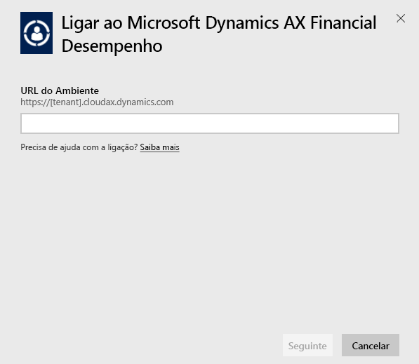
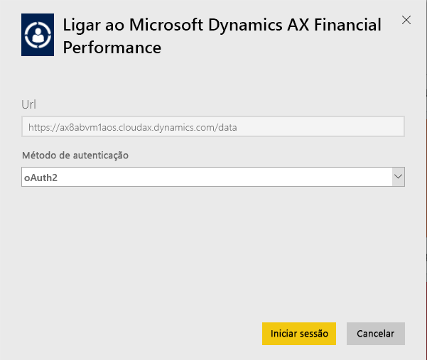
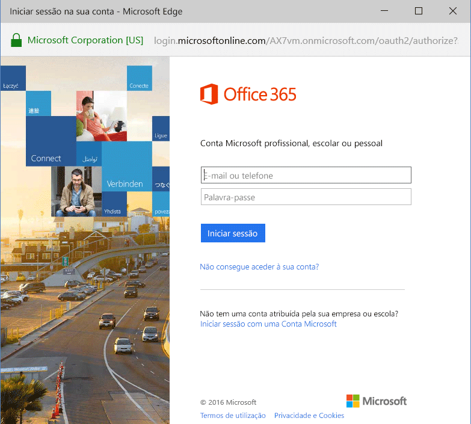
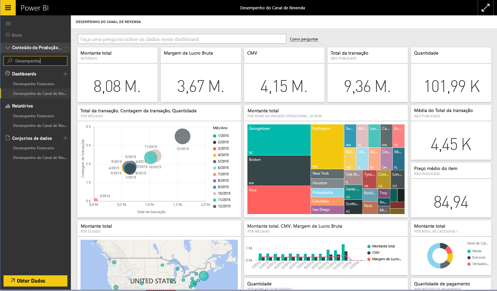

# Ligar ao pacote de conteúdos do Microsoft Dynamics AX com o Power BI
O Microsoft Dynamics AX tem três pacotes de conteúdos do Power BI destinados a diferentes utilizadores empresariais. O pacote de conteúdos de Desempenho Financeiro, concebido especificamente para CFOs (diretores financeiros), fornece acesso a informações sobre o desempenho financeiro da sua organização. O pacote de conteúdos de Desempenho do Canal de Revenda destina-se a gestores de canal com foco no desempenho de vendas para prever tendências e descobrir informações diretamente dos dados de Revenda e Comércio. A Gestão de Custo foi concebida para COOs e CFOs e fornece detalhes sobre o desempenho da operação.

Ligue-se ao pacote de conteúdos [Desempenho de Canal de Revenda](https://app.powerbi.com/getdata/services/dynamics-ax-retail-channel-performance), ao [Desempenho Financeiro](https://app.powerbi.com/getdata/services/dynamics-ax-financial-performance) ou à [Gestão de Custos](https://app.powerbi.com/getdata/services/dynamics-ax-cost-management) do Microsoft Dynamics AX para o Power BI.

## Como se ligar
1. Selecione **Obter Dados** na parte inferior do painel de navegação esquerdo.
   
   
2. Na caixa **Serviços**, selecione **Obter**.
   
   
3. Selecione um dos pacotes de conteúdos do Dynamics AX e escolha **Obter**.
   
   
4. Especifique o URL do seu ambiente do Dynamics AX 7. Veja detalhes sobre como [encontrar esses parâmetros](#FindingParams) abaixo.
   
   
5. Como **Método de Autenticação**, selecione **oAuth2** \> **Iniciar Sessão**. Quando solicitado, insira as suas credenciais do Dynamics AX.
   
    
   
    
6. Após a aprovação, o processo de importação será iniciado automaticamente. Quando concluído, um novo dashboard, relatório e modelo aparecerão no Painel de Navegação. Selecione o dashboard para ver os seus dados importados.
   
     

**O que se segue?**

* Experimente [fazer uma pergunta na caixa de Perguntas e Respostas](power-bi-q-and-a.md) na parte superior do dashboard
* [Altere os mosaicos](service-dashboard-edit-tile.md) no dashboard.
* [Selecione um mosaico](service-dashboard-tiles.md) para abrir o relatório subjacente.
* Embora o seu conjunto de dados seja agendado para atualizações diárias, pode alterar o agendamento de atualização ou tentar atualizá-lo a pedido através de **Atualizar Agora**

## O que está incluído
O pacote de conteúdos utiliza o feed OData do Dynamics AX 7 para importar dados relacionados com o desempenho do Canal de Revenda, Financeiro e de Gestão de Custos, respetivamente.

## Requisitos de sistema
Este pacote de conteúdos requer um URL de ambiente do Dynamics AX 7 e o utilizador deve ter acesso ao feed OData.

## Parâmetros de localização

O URL de ambiente do Dynamics AX 7 pode ser encontrado no browser quando o utilizador inicia sessão. Copie apenas o URL do ambiente do Dynamics AX raiz para a caixa de diálogo do Power BI.

## Resolução de problemas
Os dados podem levar algum tempo a carregar dependendo do tamanho da sua instância. Se estiver a ver relatórios vazios no Power BI, confirme se tem acesso às tabelas OData necessárias para os relatórios.

## Próximos passos
[Introdução ao Power BI](service-get-started.md)

[Obter dados no Power BI](service-get-data.md)

