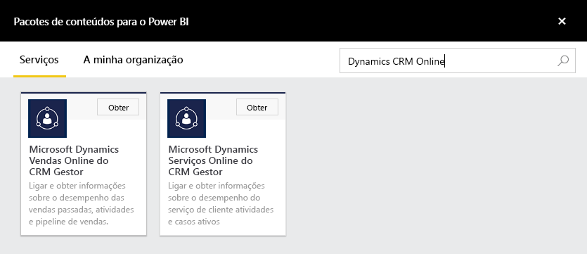
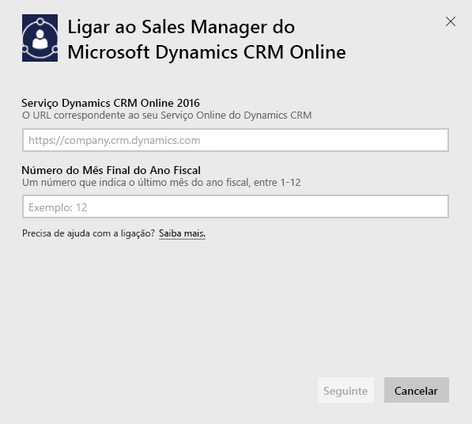
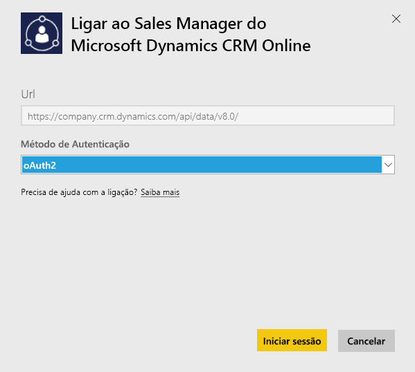
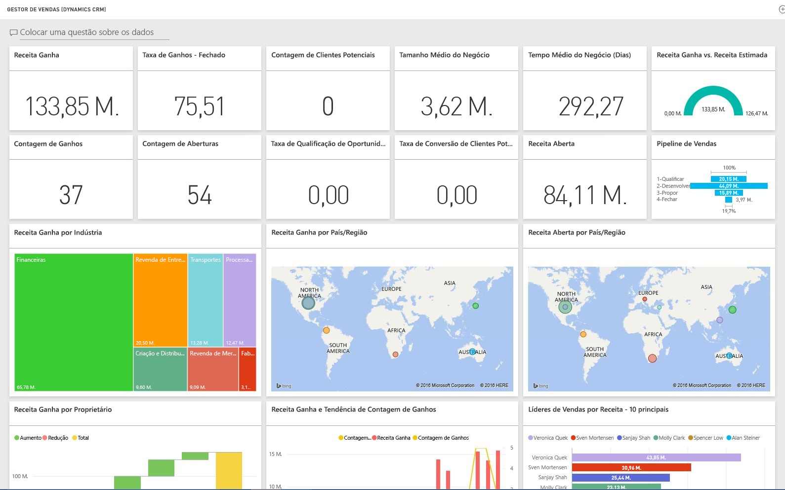

# Ligar ao Microsoft Dynamics CRM com o Power BI
O Microsoft Dynamics CRM para Power BI permite-lhe aceder facilmente e analisar os seus dados. O Power BI utiliza o feed OData para criar um modelo descritivo, com todas as entidades e medidas precisas como Contas, Atividades, Oportunidades, Produtos, Clientes Potenciais, Utilizadores e muito mais. Após instalar a aplicação, pode ver o dashboard e os relatórios no serviço Power BI ([https://powerbi.com](https://powerbi.com)) e nas aplicações móveis do Power BI. 

Ligue ao [Sales Manager](https://msit.powerbi.com/groups/me/getdata/services/dynamics-crm-sales-manager) ou ao [Service Manager](https://msit.powerbi.com/groups/me/getdata/services/dynamics-crm-customer-service) do Dynamics CRM Online. Leia mais sobre a [integração do Dynamics CRM Online](https://powerbi.microsoft.com/integrations/microsoft-dynamicscrm) com o Power BI.

Esta ligação necessita do **Microsoft Dynamics CRM Online 2016 ou posterior**. Mais detalhes sobre os [requisitos](#Requirements) abaixo.

## Como ligar
[!INCLUDE [powerbi-service-apps-get-more-apps](./includes/powerbi-service-apps-get-more-apps.md)]
3. Selecione **Microsoft Dynamics CRM Sales Manager** ou **Microsoft Dynamics CRM Service Manager** e clique em **Ligar**.
   
   
4. Indique o URL do Serviço associado à sua conta.  Este será no formato `https://company.crm.dynamics.com`, veja mais detalhes [abaixo](#FindingParams).
   
   
5. Quando solicitado, forneça as suas credenciais (este passo poderá ser ignorado se já tiver iniciado sessão com seu browser). Como Método de Autenticação, introduza **oAuth2** e clique em **Iniciar Sessão**:
   
   
6. Após a ligação, verá um dashboard personalizado para um Sales Manager ou Service Manager, preenchido com os seus próprios dados:
   
   

## Ver o dashboard e relatórios do Microsoft Dynamics CRM
[!INCLUDE [powerbi-service-apps-open-app](./includes/powerbi-service-apps-open-app.md)]

[!INCLUDE [powerbi-service-apps-open-app](./includes/powerbi-service-apps-what-now.md)]

## O que está incluído
As secções abaixo detalham o que está incluído nas pessoas fictícias do [Sales Manager](#Sales) e do [Service Manager](#Service).

Os dados são limitados com base na função de segurança atribuída ao utilizador do Dynamics CRM Online.

O dashboard e os relatórios destinam-se a apresentar relatórios operacionais em dados a curto prazo com foco numa equipa ou grupo. Cada consulta é limitada para obter um máximo de 100.000 registos do Dynamics CRM Online. O aprovisionamento irá falhar se este limite for excedido devido ao elevado volume de dados na sua organização, uma vez que a atualização de dados do Dynamics CRM online será terminada. Se a sua conta é demasiado grande, considere ligar através do Power BI Desktop para criar uma solução personalizada.

### Sales Manager
O dashboard e os relatórios contêm métricas-chave, como:  

* Receita Ganha   
* Taxa de Ganhos   
* Receita Aberta   
* Receita perdida   
* Receita Esperada  
* Tamanho Médio de Negócio e muito mais.  

Também contêm gráficos-chave, como:  

* Tendência de Receita Ganha e Perdida, Tendência de Receita Ganha Vs Receita Esperada  
* Receita Ganha por várias dimensões, como Setor, Região, Território   
* Líderes de Vendas por Receita, Atividades,   
* Principais Contas, Principais Negócios Ganhos/Perdidos,    
* Tendências de Novos Negócios, Pipeline de Vendas e muito mais.   

Estas métricas e gráficos ajudam a compreender o desempenho das vendas da organização e a analisar o pipeline de vendas da sua equipa de vendas.

A tabela seguinte lista as entidades CRM disponíveis para este serviço e oferece detalhes sobre os filtros aplicados a cada um dos registos de entidade.

| Entidade CRM | Filtros aplicados |
| --- | --- |
| Conta |Todas as contas que têm oportunidades relacionadas que foram modificadas nos últimos 365 dias. |
| Atividade |Todas as atividades modificadas nos últimos 90 dias   [modifiedon] > hoje - 90 dias |
| Unidade de Negócio |Todas as unidades de negócio que não se encontram desativadas   [isdisabled] = falso |
| Cliente potencial |Todos os clientes potenciais modificados nos últimos 180 dias   [modifiedon] > hoje - 180 dias |
| Oportunidade |Todas as oportunidades modificadas nos últimos 365 dias   [modifiedon] > hoje - 365 dias |
| Produto de Oportunidade |Todas os produtos de oportunidade modificados nos últimos 365 dias   [modifiedon] > hoje - 365 dias |
| Produto |Todos os produtos ativos   [statecode] <> 1 |
| Território |Todos os territórios |
| Utilizador |Todos os utilizadores ativos e administradores não delegados    [isdisabled] = falso e [accessmode] <> 4 |

### Service Manager
Estes dashboard e os relatórios contêm métricas-chave, como:  

* Percentagem CSAT   
* Percentagem SLA Met   
* Percentagem de Incidentes Encaminhados   
* Tempo Médio de Processamento   
* Total de Incidentes Resolvidos  
* Total de Incidentes Ativos  
* Número de Vezes do Artigo BDC Utilizado em incidentes e muito mais.    

Também contêm gráficos-chave, como:   

* Tendências de Volume de Incidentes para Incidentes de Entrada, Incidentes Resolvidos, Incidentes Encaminhados   
* Volume de Incidentes por várias dimensões, como Origem, Localização, Prioridade, Tipo  
* Líderes por percentagem CSAT, Percentagem de SLA cumprido, Atividades, Incidentes resolvidos  
* Artigos BDC Mais Utilizados e Mais Vistos e muito mais.  
    Estas métricas e gráficos ajudam a compreender o desempenho da sua organização de suporte e a analisar a carga de trabalho dos incidentes ativos na sua equipa e filas de serviço.

A tabela seguinte lista as entidades CRM disponíveis para este serviço e oferece detalhes sobre os filtros aplicados a cada um dos registos de entidade.

| Entidade CRM | Filtros aplicados |
| --- | --- |
| Conta |Todas as contas que têm incidentes relacionados que foram modificados nos últimos 90 dias. |
| Atividade |Todas as atividades modificadas nos últimos 90 dias   [modifiedon] > hoje - 90 dias |
| Incidente |Todos os incidentes modificados nos últimos 90 dias   [modifiedon] > hoje - 90 dias |
| Atividade de Resolução de Incidente |Todas as atividades resolução de incidentes modificadas nos últimos 90 dias   [modifiedon] > hoje - 90 dias |
| Contact |Todos os contactos que têm incidentes relacionados que foram modificados nos últimos 90 dias. |
| Artigo de Conhecimento |Todas as versões mais recentes dos artigos de conhecimento    [islatestversion] = verdadeiro |
| Incidente do Artigo de Conhecimento |Todos os incidentes do artigo de conhecimento que foram modificados nos últimos 90 dias   [modifiedon] > hoje - 90 dias |
| Fila |Todas as filas ativas    [statecode] = 0 |
| Item de Fila |Todos os itens de fila relacionados com incidentes criados nos últimos 365 dias    [createdon] > hoje - 365 dias e   [objecttypecode] = 112 |
| Utilizador |Todos os utilizadores ativos    [isdisabled] = falso |

## Requisitos de sistema
* Uma instância válida do Dynamics CRM Online 2016 ou posterior (o Power BI não irá funcionar com uma versão CRM no local). Se não tiver 2016 ou posterior:
* Um administrador deve ativar o ponto final OData nas definições do site.
* Uma conta com menos de 100.000 registos em qualquer uma das tabelas. Tenha em atenção que se a conta tem acesso a mais de 100.000 registos, a importação irá falhar.

## Localizar parâmetros
O endereço da instância pode ser encontrado na barra do URL do seu browser. Normalmente, ela tem o formato: `https://[instance_name].crm.dynamics.com`.

O Power BI suporta apenas pontos finais do Dynamics CRM 2016. A ligação não irá funcionar com versões anteriores do CRM Online. Utilize o Power BI Desktop para ligar diretamente à sua conta.

## Resolução de problemas
Se está a ter problemas em ligar, certifique-se de que:  

* está a indicar o URL de instância correto (confirme com o seu administrador)  
* a instância é CRM Online 2016  
* o ponto final de OData está ativado  

Além disso, tente ligar-se diretamente no Power BI Desktop, com o URL de OData `https://[instance_name].crm.dynamics.com/api/data/v8.0/`.

Se confirmar que tem o Dynamics CRM Online 2016, mas ainda está a sofrer problemas de ligação, contacte o Administrador de CRM para confirmar que tem todas as atualizações disponíveis.

Se não tiver o CRM Online 2016 ou posterior, utilize o Power BI Desktop para ligar diretamente à sua conta.

Se vir um erro "A atualização de dados falhou porque a consulta excedeu o limite máximo de 100.000 registos", considere ligar diretamente a partir do Power BI Desktop ou tirar partido do modelo de solução do CRM.

## Passos seguintes
* [O que são aplicações no Power BI?](service-create-distribute-apps.md)
* [Obter dados no Power BI](service-get-data.md)
* Mais perguntas? [Experimente perguntar à Comunidade do Power BI](http://community.powerbi.com/)

