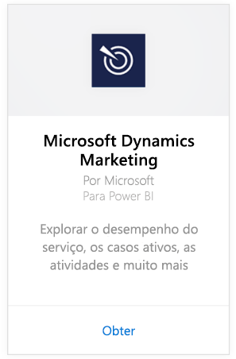
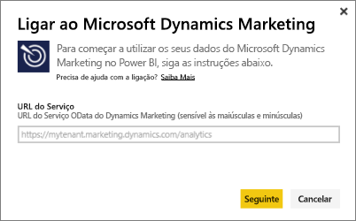
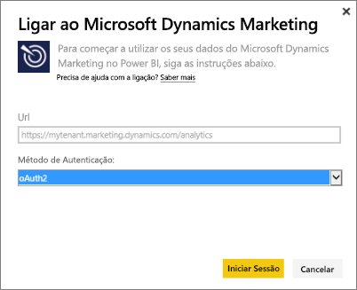
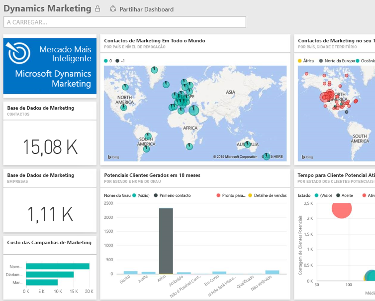

# Ligue-se ao Microsoft Dynamics Marketing com o Power BI
O pacote de conteúdos do Microsoft Dynamics Marketing para o Power BI permite-lhe aceder e analisar facilmente os seus dados no Dynamics Marketing. O pacote de conteúdos utiliza um modelo descritivo no feed OData, com todas as entidades e as medidas necessárias, como Programas, Campanhas, Empresas e Contactos de Marketing, Clientes Potenciais, Interações de Cliente Potencial e Pontuação de Cliente Potencial, Sites e Mensagens de Marketing por E-mail, observações comportamentais, orçamentos, transações financeiras, KPIs de desempenho e muito mais. 

Ligue-se ao [pacote de conteúdo do Dynamics Marketing](https://app.powerbi.com/getdata/services/microsoft-dynamics-marketing) para o Power BI.

>[!NOTE]
>Tem de especificar um URL do OData válido para uma instância do Dynamics Marketing (o pacote de conteúdos não funcionará com uma versão do CRM no local). Consulte os requisitos adicionais abaixo.

## Como se ligar
1. Selecione Obter Dados na parte inferior do painel de navegação esquerdo.
   
    
2. Na caixa **Serviços**, selecione **Obter**.
   
    
3. Selecione **Microsoft Dynamics Marketing** \> **Obter**.
   
   
4. Forneça o URL do OData associado à sua conta.  Terá o formato "https://[instance\_name].marketing.dynamics.com/analytics."
   
   
5. Quando solicitado, forneça as suas credenciais (este passo pode ser ignorado se já tiver iniciado sessão com seu browser). Como Método de Autenticação, introduza **oAuth2** e clique em **Iniciar Sessão**:
   
   
6. Após a ligação, verá um dashboard do Dynamics Marketing, preenchido com os seus próprios dados. Os asteriscos amarelos marcam os novos itens no painel de navegação esquerdo.
   
   

**E agora?**

* Tente [fazer uma pergunta na caixa de Perguntas e Respostas](service-q-and-a.md) na parte superior do dashboard
* [Altere os mosaicos](service-dashboard-edit-tile.md) no dashboard.
* [Selecione um mosaico](service-dashboard-tiles.md) para abrir o relatório subjacente.
* Embora o seu conjunto de dados seja agendado para atualizações diárias, pode alterar o agendamento de atualização ou tentar atualizá-lo a pedido através de **Atualizar Agora**

## Requisitos do sistema
* Tem de especificar um URL do OData válido para uma instância do Dynamics Marketing (o pacote de conteúdos não funcionará com uma versão do CRM no local).  
* Um administrador tem de ativar o ponto final OData nas definições do site. O endereço do ponto final do OData pode ser encontrado navegando até **Início \> Configurações \> Configurações de Site** na secção **Serviço de Dados da Organização**.  O URL do OData tem o formato:   https://[instance\_name].marketing.dynamics.com/analytics  
* A conta/identidade do utilizador utilizada para aceder ao Microsoft Dynamics Marketing tem ser a mesma na qual se inscreveu para utilizar o Power BI. Ao iniciar sessão no Microsoft Dynamics Marketing, o início de sessão será realizado automaticamente com a mesma identidade que utiliza para o Power BI. Se quiser iniciar sessão no Microsoft Dynamics Marketing com uma conta diferente, registe-se como um utilizador do Power BI através dessa outra conta. Esperamos resolver este problema numa versão futura.   

## Resolução de problemas
Se vir uma mensagem "Falha no início de sessão" ao tentar ligar à sua conta do Dynamics CRM, confirme que está a iniciar sessão no Power BI com a mesma conta que utiliza para aceder ao feed OData do CRM Online. Experimente iniciar sessão no feed também através do seu browser, para testá-lo lá.

Peça ao seu administrador para confirmar o URL correto do OData e que o ponto final do OData está ativado.

Verifique a versão do Dynamic Marketing que está a utilizar. Foram efetuadas correções adicionais nas versões 18.0 e 18.1. Se ainda estiver com problemas e estiver a utilizar uma versão anterior, considere atualizar.

Se ainda está com problemas, abra um pedido de suporte para contactar a equipa do Power BI:

* Na aplicação do Power BI, selecione o ponto de interrogação \> **Contactar o Suporte**.
* No site de Suporte do Power BI (onde está a ler este artigo), selecione **Contactar Suporte** no lado direito da página.

## Próximos passos
[Obter Dados para o Power BI](service-get-data.md)

[Introdução ao Power BI](service-get-started.md)

