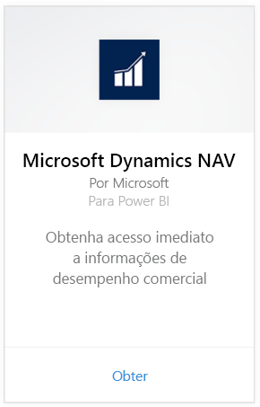
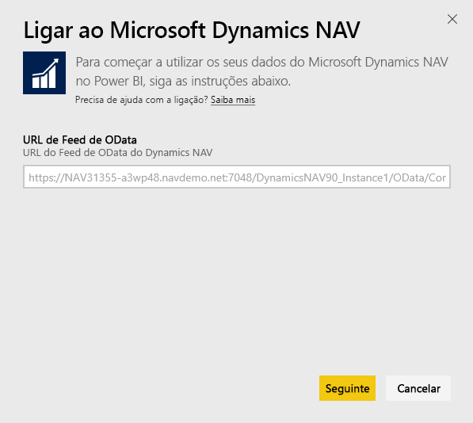
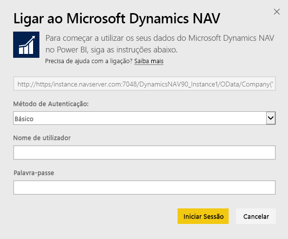
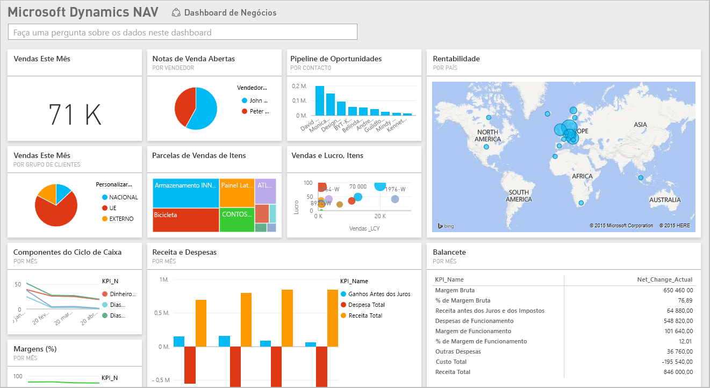

# Ligar ao Microsoft Dynamics NAV com o Power BI
É fácil obter informações sobre os dados do Microsoft Dynamics NAV com o Power BI. O Power BI obtém os dados, tanto de Vendas como Financeiros e, em seguida, cria uma aplicação com um dashboard e relatórios baseados nesses dados. O Power BI requer permissões para as tabelas das quais os dados são obtidos, neste caso, dados de vendas e financeiros. Mais detalhes sobre os requisitos abaixo. Após instalar a aplicação, pode ver o dashboard e os relatórios no serviço Power BI ([https://powerbi.com](https://powerbi.com)) e nas aplicações móveis do Power BI. 

[Ligue-se ao Microsoft Dynamics NAV para o Power BI](https://app.powerbi.com/getdata/services/microsoft-dynamics-nav) ou leia mais sobre a [integração do Dynamics NAV](https://powerbi.microsoft.com/integrations/microsoft-dynamics-nav) com o Power BI.

## Como se ligar
[!INCLUDE [powerbi-service-apps-get-more-apps](./includes/powerbi-service-apps-get-more-apps.md)]

1. Selecione **Microsoft Dynamics NAV** e **Ligar**.  
   
2. Quando pedido, introduza a sua URL do OData do Microsoft Dynamics NAV. A URL deve corresponder ao seguinte padrão:
   
    `https//instance.navserver.com:7048/DynamicsNAV90_Instance1/OData/Company('CRONUS%20International%20Ltd.')`
   
   * “instance.navserver.com” com o nome do Servidor NAV
   * "DynamicsNAV90\_Instance1" com o nome da Instância do Servidor NAV
   * “Company('CRONUS%20International%20Ltd.')” com o nome da Empresa NAV
     
     Uma forma simples de obter este URL é, no Dynamics NAV, ir até Serviços Web, encontrar o serviço Web powerbifinance e copiar o URL do OData, mas omitir “/powerbifinance” da cadeia de carateres do URL.  
     
3. Selecione **Básica** e insira as suas credenciais do Microsoft Dynamics NAV.
   
    Precisa de credenciais de administrador (ou, pelo menos, permissões para dados de vendas e financeiros) da sua conta do Microsoft Dynamics NAV.  No momento, apenas a autenticação Básica (Nome de Utilizador e Palavra-passe) é suportada.
   
    
4. O Power BI irá recuperar os seus dados do Microsoft Dynamics NAV e criar um dahboard e um relatório prontos a utilizar.   
   

## Ver o dashboard e relatórios
[!INCLUDE [powerbi-service-apps-open-app](./includes/powerbi-service-apps-open-app.md)]

[!INCLUDE [powerbi-service-apps-open-app](./includes/powerbi-service-apps-what-now.md)]

## O que está incluído
O dashboard e os relatórios contêm dados das tabelas seguintes (sensíveis às maiúsculas e minúsculas):  

* ItemSalesAndProfit  
* ItemSalesByCustomer  
* powerbifinance  
* SalesDashboard  
* SalesOpportunities  
* SalesOrdersBySalesPerson  
* TopCustomerOverview  

## Requisitos de sistema
Para importar dados do Microsoft Dynamics NAV para o Power BI, precisa de permissões para as tabelas de dados de vendas e financeiros, das quais os dados são recuperados (listadas acima). As tabelas também devem ter dados, uma vez que ocorre uma falha ao importar tabelas vazias.

## Resolução de problemas
O Power BI utiliza os serviços Web do Microsoft Dynamics NAV para obter os dados. Se tiver muitos dados na sua instância do Microsoft Dynamics NAV, uma sugestão para minimizar o impacto na utilização do serviço Web é alterar a frequência de atualização, dependendo das suas necessidades. Outra sugestão é fazer com que um administrador crie a aplicação e a partilhe em vez de fazer com que cada administrador tenha de criar uma própria.

**"Falha na validação do parâmetro. Verifique se todos os parâmetros são válidos"**  
Se receber este erro depois de escrever o URL do Microsoft Dynamics NAV. Verifique se que os requisitos a seguir foram atendidos:

* O URL segue exatamente este padrão:
  
    `https//instance.navserver.com:7048/DynamicsNAV90_Instance1/OData/Company('CRONUS%20International%20Ltd.')`
  
  * “instance.navserver.com” com o nome do Servidor NAV
  * "DynamicsNAV90\_Instance1" com o nome da Instância do Servidor NAV
  * “Company('CRONUS%20International%20Ltd.')” com o nome da Empresa NAV
* Verifique se todas as letras são minúsculas.  
* Verifique se o URL está em "https".  
* Verifique se que não há nenhuma barra invertida no final do URL.

**"Falha de início de sessão"**  
Se receber um erro de "falha no início de sessão" depois de utilizar as suas credenciais do Microsoft Dynamics NAV para iniciar sessão, talvez esteja a ocorrer um dos seguintes problemas:

* A conta que está a utilizar não tem permissões para recuperar os dados do Microsoft Dynamics NAV da sua conta. Verifique se é uma conta de administrador e tente novamente.
* A instância do Dynamics NAV que está a tentar ligar não tem um certificado SSL válido. Neste caso, verá uma mensagem de erro mais detalhada ("não é possível estabelecer a relação de confiança SSL"). Observe que não há suporte para os certificados autoassinados.

**"Ups"**  
Se vir uma caixa de diálogo de erro "Ups" depois de passar pela caixa de diálogo de autenticação, ocorreu um problema no Power BI durante o carregamento dos dados.

* Verifique se o URL segue o padrão especificado acima. Um erro comum é especificar:
  
    `https//instance.navserver.com:7048/DynamicsNAV90\_Instance1/OData`
  
    No entanto, tem de incluir a secção 'Company('CRONUS%20International%20Ltd.')' section ao nome da Empresa NAV:
  
    `https//instance.navserver.com:7048/DynamicsNAV90\_Instance1/OData/Company('CRONUS%20International%20Ltd.')`

## Próximos passos
* [O que são aplicações no Power BI?](consumer/end-user-apps.md)
* [Obter dados no Power BI](service-get-data.md)
* Mais perguntas? [Experimente perguntar à Comunidade do Power BI](http://community.powerbi.com/)

