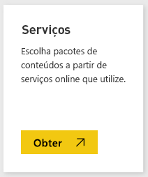
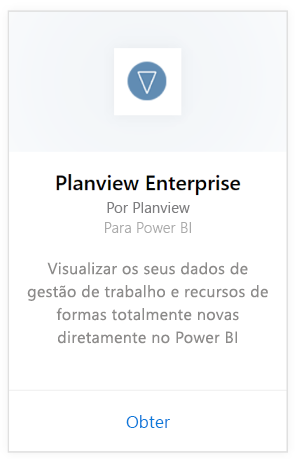
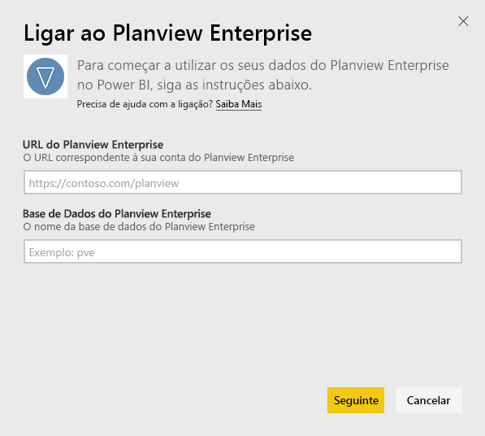
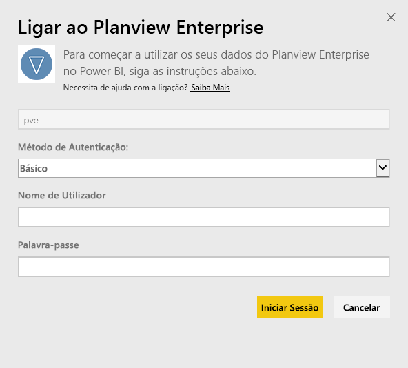
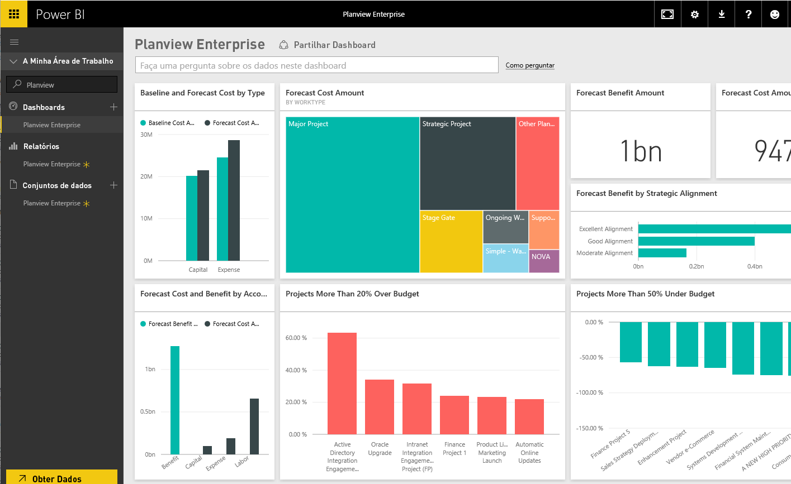

# Ligar ao Planview Enterprise com o Power BI
Com o pacote de conteúdos do Planview Enterprise, pode visualizar os seus dados de gestão de trabalho e recursos de formas totalmente novas diretamente no Power BI. Utilize as suas credenciais de início de sessão do Planview Enterprise para visualizar interativamente os seus gastos de investimento de portfólio, perceber em que pontos está acima e abaixo do orçamento e saber em que medida os seus projetos se alinham com as prioridades estratégicas empresariais. Também pode expandir o dashboard e os relatórios integrados para obter as informações que são mais importantes para si.

Ligue-se ao [pacote de conteúdos do Planview Enterprise no Power BI](https://app.powerbi.com/getdata/services/planview-enterprise)

>[!NOTE]
>Para importar dados do Planview Enterprise para o Power BI, tem de ser um utilizador do Planview Enterprise com a funcionalidade Visualizador de Portal de Relatório ativada na sua função. Veja os requisitos adicionais abaixo.

## Como se ligar
1. Selecione **Obter Dados** na parte inferior do painel de navegação esquerdo.
   
    
2. Na caixa **Serviços**, selecione **Obter**.
   
    
3. Na página do Power BI, selecione **Planview Enterprise** e, em seguida, selecione **Obter**:  
    
4. Na caixa de texto URL do Planview Enterprise, introduza o URL do servidor do Planview Enterprise que deseja usar. Na caixa de texto Planview Enterprise Database, introduza o nome da base de dados do Planview Enterprise e clique em Seguinte.  
    
5. Na lista Método de Autenticação, selecione **Básico** se essa opção ainda não estiver selecionada. Introduza o **Nome de utilizador** e a **Palavra-passe** da sua conta e selecione **Iniciar Sessão**.  
   
6. No painel esquerdo, selecione Planview Enterprise na lista de dashboards.  
     O Power BI importa os dados do Planview Enterprise para o dashboard. Tenha em atenção que os dados podem levar algum tempo a carregar.  
    

**E agora?**

* Experimente [fazer uma pergunta na caixa de Perguntas e Respostas](consumer/end-user-q-and-a.md) na parte superior do dashboard
* [Altere os mosaicos](service-dashboard-edit-tile.md) no dashboard.
* [Selecione um mosaico](consumer/end-user-tiles.md) para abrir o relatório subjacente.
* Embora o seu conjunto de dados seja agendado para atualizações diárias, pode alterar o agendamento das atualizações ou tentar atualizá-lo a pedido através da opção **Atualizar Agora**

## Requisitos de sistema
Para importar dados do Planview Enterprise para o Power BI, tem de ser um utilizador do Planview Enterprise com a funcionalidade Visualizador de Portal de Relatório ativada na sua função. Veja os requisitos adicionais abaixo.

Este procedimento pressupõe que já entrou na home page do Microsoft Power BI com uma conta do Power BI. Se não tiver uma conta do Power BI , aceda a [powerbi.com](https://powerbi.microsoft.com/get-started/) e, em **Power BI – Colaboração e partilha na cloud**, selecione **Experimentar gratuitamente**. Em seguida, clique em **Obter Dados**.

## Próximos passos:

[O que é o Power BI?](power-bi-overview.md)

[Obter Dados para o Power BI](service-get-data.md)