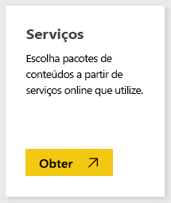
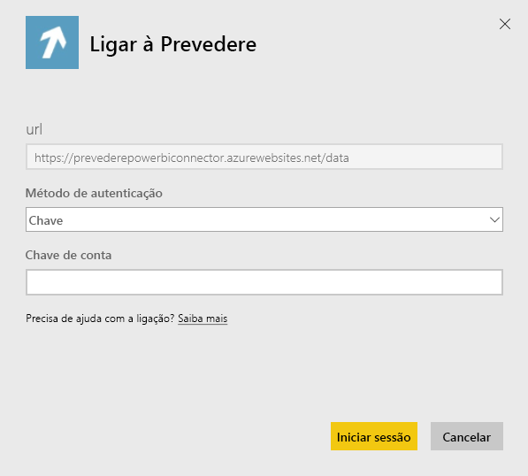
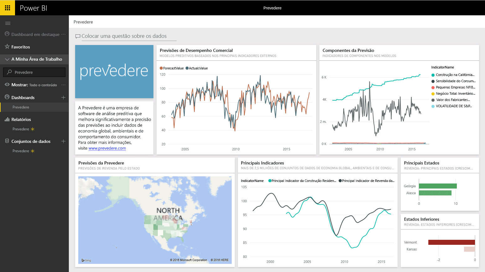

# Ligar ao Prevedere com o Power BI
Obtenha acesso a informações financeiras exclusivas e essenciais para fomentar o seu negócio com confiança e de forma proativa.

Ligue-se ao [pacote de conteúdos do Prevedere](https://app.powerbi.com/getdata/services/prevedere) para o Power BI.

>[!NOTE]
>Se ainda não for um utilizador Prevedere, utilize a [chave de exemplo](https://prevederepowerbiconnector.azurewebsites.net/static/learnmore.html) para experimentar.

## Como ligar
1. Selecione **Obter Dados** na parte inferior do painel de navegação esquerdo.
   
   
2. Na caixa **Serviços**, selecione **Obter**.
   
   
3. Selecione **Prevedere** e, em seguida, **Obter**.
   
   
4. Como **Método de Autenticação**, selecione **Chave** e forneça a sua chave de API.
   
    
5. Selecione **Iniciar sessão** para iniciar o processo de importação. Quando concluído, um novo dashboard, relatório e modelo aparecem no Painel de Navegação. Selecione o dashboard para ver os seus dados importados.
   
     

**O que se segue?**

* Experimente [fazer uma pergunta na caixa de Perguntas e Respostas](consumer/end-user-q-and-a.md) na parte superior do dashboard
* [Altere os mosaicos](service-dashboard-edit-tile.md) no dashboard.
* [Selecione um mosaico](consumer/end-user-tiles.md) para abrir o relatório subjacente.
* Embora o seu conjunto de dados seja agendado para atualizações diárias, pode alterar o agendamento de atualização ou tentar atualizá-lo a pedido através de **Atualizar Agora**

## O que está incluído
O pacote de conteúdos obtém informações aprofundadas sobre as previsões de revenda, os modelos de previsão, os principais indicadores e muito mais.

## Requisitos de sistema
Este pacote de conteúdos requer acesso a uma chave de API do Prevedere (ver abaixo).

## A localizar parâmetros

Os clientes existentes podem aceder aos seus dados utilizando a respetiva chave de API. Se ainda não é um cliente, pode ver um exemplo dos dados e da análise utilizando a [chave de exemplo](https://prevederepowerbiconnector.azurewebsites.net/static/learnmore.html).

## Resolução de problemas
Os dados podem levar algum tempo a carregar, dependendo do tamanho da sua instância.

## Próximos passos
[Introdução ao Power BI](service-get-started.md)

[Obter dados no Power BI](service-get-data.md)

