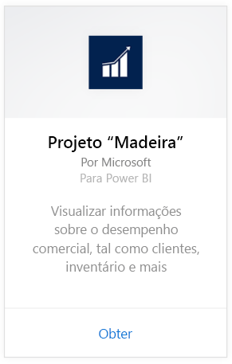
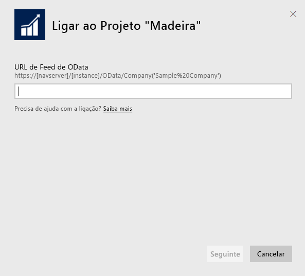
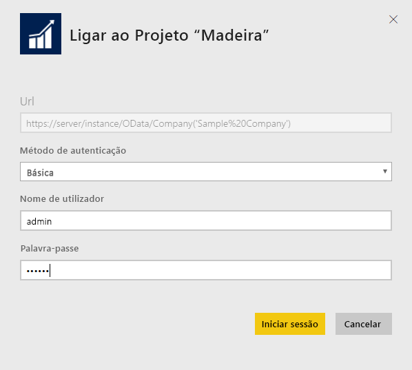
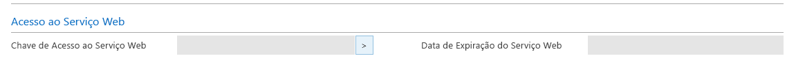
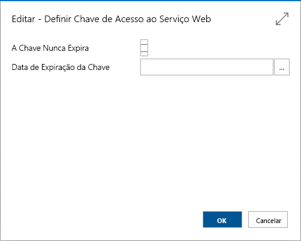
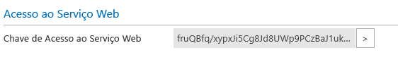

# Ligar ao Projeto "Madeira" com o Power BI
Obter informações sobre os dados do Projeto "Madeira" é fácil com o Power BI e o pacote de conteúdos do Projeto "Madeira". O Power BI obtém tanto os seus dados de Vendas quanto Financeiros e, em seguida, compila um dashboard inicial e relatórios com base nesses dados.
Ligue-se ao Projeto "Madeira" para o Power BI ou leia mais sobre a integração do Projeto "Madeira" com o Power BI.

>[!NOTE]
>Este pacote de conteúdo requer permissões para as tabelas das quais os dados são obtidos, neste caso, dados de vendas e de finanças. Mais informações sobre requisitos [abaixo](#Requirements).

Ligue-se ao [pacote de conteúdos Project "Madeira" Analytics](https://app.powerbi.com/getdata/services/project-madeira) para o Power BI.

## Como ligar
1. Selecione **Obter Dados** na parte inferior do painel de navegação esquerdo.  
    
2. Na caixa **Serviços** , selecione **Obter**.  
    
3. Selecione **Projeto "Madeira"**, e, em seguida, selecione **Obter**.  
    
4. Quando lhe for pedido, introduza o URL do Projeto "Madeira". O URL precisa de seguir exatamente o seguinte padrão <https://mycronusus.projectmadeira.com:7048/NAV/OData/Company('CRONUS%20US>'), com o nome da empresa do seu Projeto "Madeira". Note que não existe nenhuma barra no final e a ligação tem de ser https. Consulte os detalhes sobre como encontrar este URL [abaixo](#FindingParams).  
   
    
5. Quando lhe for pedido, selecione o Método de Autenticação Básico, introduza o seu endereço de e-mail do Projeto "Madeira" como nome de utilizador e, em seguida, introduza a chave de acesso ao serviço Web para a sua conta do Projeto "Madeira" como palavra-passe. Se já tiver sessão iniciada no Projeto "Madeira" no seu browser, poderão não lhe ser pedidas credenciais. Consulte os detalhes sobre gerar esta chave de acesso [abaixo](#FindingParams).  
   
    >[!NOTE]
    >Tem de ser um superutilizador no Projeto "Madeira".
   
   
6. Uma vez ligado, um dashboard, relatório e conjunto de dados serão carregados automaticamente. Quando a operação estiver concluída, os mosaicos serão atualizados com os dados da sua conta.  
   
    

**O que vem em seguida?**

* Experimente [fazer uma pergunta na caixa de Perguntas e Respostas](power-bi-q-and-a.md) na parte superior do dashboard
* [Altere os mosaicos](service-dashboard-edit-tile.md) no dashboard.
* [Selecione um mosaico](service-dashboard-tiles.md) para abrir o relatório subjacente.
* Embora o seu conjunto de dados seja agendado para atualizações diárias, pode alterar o agendamento de atualização ou tentar atualizá-lo a pedido através de **Atualizar Agora**

## Requisitos de sistema
Para importar dados do Projeto "Madeira" para o Power BI, precisa de ter permissões para as tabelas de dados de vendas e finanças, das quais os dados são obtidos. Todas as tabelas (sensíveis às maiúsculas e minúsculas) necessárias para o pacote de conteúdos incluem:  
 
    ´´´ 
    - ItemSalesAndProfit  
    - ItemSalesByCustomer  
    - powerbifinance  
    - SalesDashboard  
    - SalesOpportunities  
    - SalesOrdersBySalesPerson  
    - TopCustomerOverview  
    ´´´ 

## A localizar Parâmetros
**Obter o URL certo** Uma forma fácil de obter este URL é, no Projeto "Madeira", aceder aos Serviços Web, procurar o serviço Web powerbifinance e copiar o URL do Odata (clique com o botão direito do rato e selecione Copiar Atalho), mas não incluir a parte "/powerbifinance…" na cadeia do URL.

**Chaves de Acesso ao Serviço Web** Para utilizar os dados do Projeto "Madeira", terá de criar uma chave de acesso ao serviço Web para a sua conta de utilizador. No Projeto "Madeira", procure a página Utilizadores e, em seguida, abra o cartão da sua conta de utilizador. Aqui, pode gerar uma nova chave de acesso aos serviços Web e copiá-la para o campo Palavra-passe na página de ligação do Power BI.

Quando começar a utilizar as Chaves de Acesso ao serviço Web, terá de as utilizar futuramente. Selecione OK na mensagem apresentada.
Ao criar a chave, pode selecionar se esta expira numa data específica ou não.

Quando selecionar OK, será criada uma chave, para que possa copiá-la para o campo Palavra-passe na página de ligação do Power BI.

## Resolução de problemas
O dashboard do Power BI recorre aos serviços Web publicados que se encontram listados acima e irá mostrar os dados da empresa de demonstração ou da sua empresa, se importar dados da sua atual solução financeira. No entanto, se ocorrer algum problema, esta secção fornece uma solução para a maioria dos problemas comuns.

**“Falha na validação do parâmetro. Verifique se todos os parâmetros são válidos”**

Se vir este erro após introduzir o URL do Projeto “Madeira”, garanta que os seguintes requisitos são cumpridos:  

- O URL segue exatamente o seguinte padrão: https://*mycronusus*.projectmadeira.com:7048/NAV/OData/Company('<em>CRONUS%20US</em>')  
- Elimine todo o texto após o nome da empresa entre parênteses  
- Verifique se que não há nenhuma barra no final do URL.  
- Certifique-se de que o URL utiliza uma ligação segura, conforme indicado pelo URL que começa por https.  

**"O início de sessão falhou"** Se receber um erro a indicar "o início de sessão falhou" quando iniciar sessão no seu dashboard com as credenciais do Projeto "Madeira", tal poderá dever-se a um dos seguintes problemas:  

   - A conta que está a utilizar não tem permissões para ler os dados do Projeto "Madeira" da sua conta. Verifique a sua conta de utilizador no Projeto "Madeira" e certifique-se de que utilizou a chave de acesso ao serviço Web correta como a palavra-passe. Em seguida, tente novamente.  
   - A instância do Projeto "Madeira" à qual se está a tentar ligar não tem um certificado SSL válido. Neste caso, verá uma mensagem de erro mais detalhada (“Não é possível estabelecer a relação de confiança SSL”). Note que os certificados autoassinados não são suportados.  

**"Ups"** Se vir uma caixa de diálogo de erro "Ups" após passar pela caixa de diálogo de autenticação, o motivo mais frequente é um problema ao ligar os dados do pacote de conteúdos. Confirme se o URL segue o padrão anteriormente especificado:  
    https://*mycronusus*.projectmadeira.com:7048/NAV/OData/Company('<em>CRONUS%20US</em>')

Um erro comum é especificar o URL completo de um serviço Web específico:  
    https://*mycronusus*.projectmadeira.com:7048/NAV/OData/Company('<em>CRONUS%20US</em>')/powerbifinance

Pode também ter-se esquecido de especificar o nome da empresa:   
    https://<em>mycronusus</em>.projectmadeira.com:7048/NAV/OData/

## Próximos passos
[O que é o Power BI?](power-bi-overview.md)

[Power BI - Conceitos Básicos](service-basic-concepts.md)

