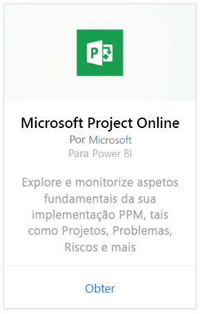
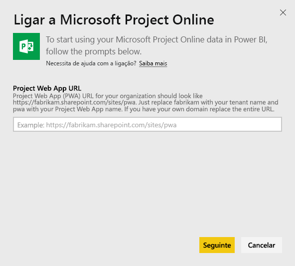
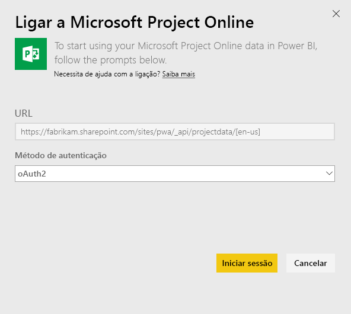
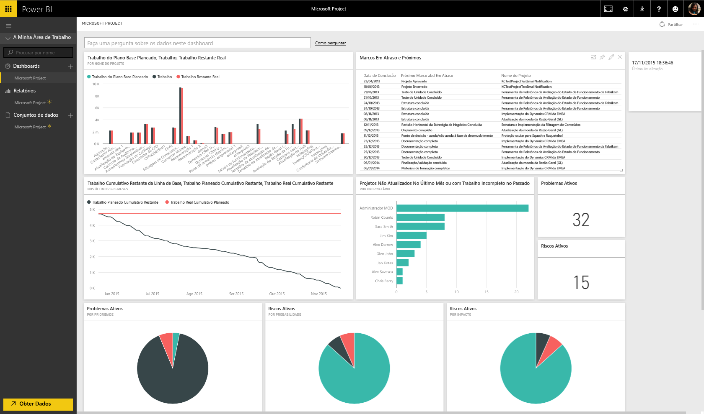

# Ligue-se ao Project Online com o Power BI
Microsoft Project Online é uma solução online flexível para PPM (gestão de portefólios de projetos) e para o trabalho quotidiano. O Project Online permite que as organizações comecem, atribuam prioridades a investimentos de portefólio de projetos e entreguem o valor comercial pretendido. O pacote de conteúdos do Project Online para o Power BI permite que explore os seus dados de projetos com métricas prontas para uso, como estado do portefólio e conformidade do projeto.

Ligue-se ao [pacote de conteúdo do Project Online](https://app.powerbi.com/getdata/services/project-online) para o Power BI.

## Como se ligar
1. Selecione **Obter Dados** na parte inferior do painel de navegação esquerdo.
   
    
2. Na caixa **Serviços**, selecione **Obter**.
   
   
3. Selecione **Microsoft Project Online** \> **Obter**.
   
   
4. Na caixa de texto **URL do Project Web App**, introduza o URL para o PWA (Project Web Add) ao qual pretende ligar-se e clique em **Avançar**. Observe que isso pode ser diferente do exemplo, caso tenha um domínio personalizado.
   
    
5. Como Método de Autenticação, selecione **oAuth2** \> **Iniciar Sessão**. Quando solicitado, insira as suas credenciais do Project Online e siga o processo de autenticação.
   
    
    
Tenha em atenção que é necessário ter permissões de Visualizador de Portefólio, Gestor de Portefólio ou Administrador para o Project Web App ao qual se está a ligar.

6. Vai ver uma notificação a indicar que os dados estão a ser carregados. Dependendo do tamanho da sua conta, pode levar algum tempo. Após o Power BI importar os dados, verá novos elementos (dashboard, relatório e conjunto de dados) no painel de navegação esquerdo. Esse é o dashboard padrão criado pelo Power BI para exibir os seus dados. Pode alterar este dashboard para ver os seus dados de qualquer modo que queira.
   
   

**E agora?**

* Experimente [fazer uma pergunta na caixa de Perguntas e Respostas](power-bi-q-and-a.md) na parte superior do dashboard
* [Altere os mosaicos](service-dashboard-edit-tile.md) no dashboard.
* [Selecione um mosaico](service-dashboard-tiles.md) para abrir o relatório subjacente.
* Embora o seu conjunto de dados seja agendado para atualizações diárias, pode alterar o agendamento de atualização ou tentar atualizá-lo a pedido através de **Atualizar Agora**

## Próximos passos
[Introdução ao Power BI](service-get-started.md)

[Obter dados no Power BI](service-get-data.md)

