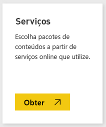
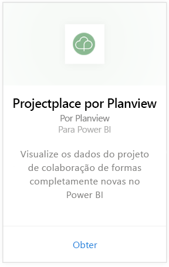
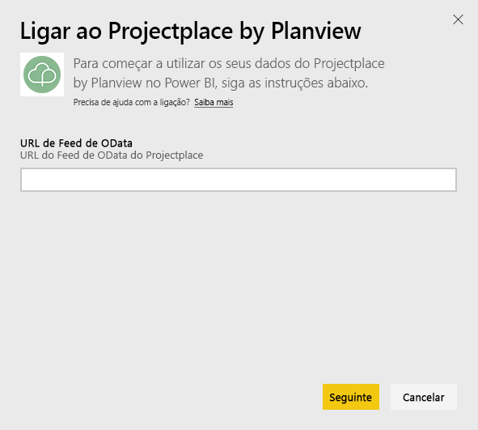
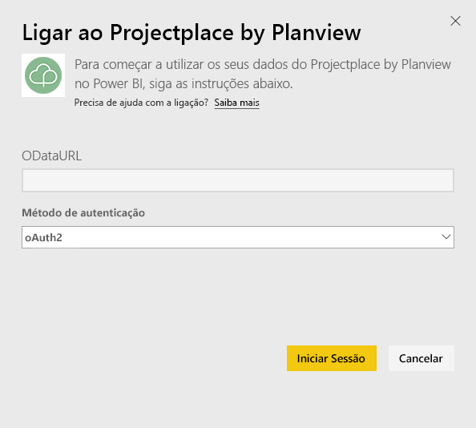
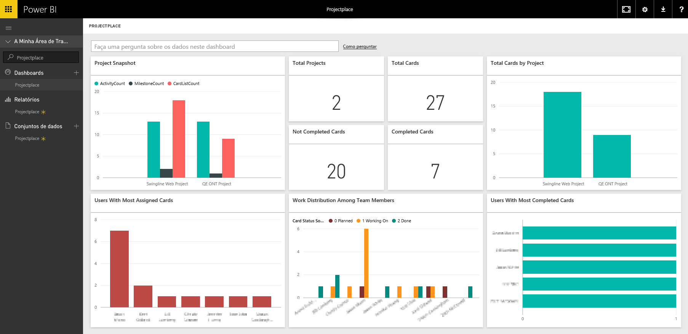

# Ligar ao Projectplace by Planview com o Power BI
Com o pacote de conteúdos do Projectplace by Planview, é possível visualizar os dados do projeto colaborativo de formas totalmente novas diretamente no Power BI. Utilize as suas credenciais de sessão do Projectplace para ver as principais estatísticas do projeto de maneira interativa, descubra quem são os membros da equipa mais ativos e produtivos e identifique atividades e cartões de risco nos projetos da sua conta do Projectplace. Também é possível estender o dashboard e os relatórios prontos para utilização para obter as informações mais importantes.

[Ligue-se ao pacote de conteúdo do Projectplace no Power BI](https://app.powerbi.com/getdata/services/projectplace)

>[!NOTE]
>Para importar os dados do Projectplace para o Power BI, deve ser um utilizador do Projectplace. Consulte os requisitos adicionais abaixo.

## Como se ligar
1. Selecione **Obter Dados** na parte inferior do painel de navegação esquerdo.
   
    
2. Na caixa **Serviços**, selecione **Obter**.
   
    
3. Na página do Power BI, selecione **Projectplace by Planview** e, em seguida, selecione **Obter**:  
   
    
4. Na caixa de texto de URL do Feed OData, insira o URL para o feed OData do Projectplace que quer utilizar, como mostrado na seguinte imagem:
   
    
5. Na lista Método de Autenticação, selecione **OAuth** se a opção ainda não estiver selecionada. Clique em **Iniciar Sessão** e siga o fluxo de inicio de sessão.  
   
   
6. No painel esquerdo, selecione **Projectplace** a partir da lista de dashboards. O Power BI importa os dados do Projectplace para o dashboard. Observe que os dados podem levar algum tempo para carregar.  
   
    O dashboard contém blocos que mostram dados da base de dados do Projectplace. A imagem a seguir mostra um exemplo do dashboard predefinido do Projectplace no Power BI.
   
    

**E agora?**

* Experimente [fazer uma pergunta na caixa de Perguntas e Respostas](power-bi-q-and-a.md) na parte superior do dashboard
* [Altere os mosaicos](service-dashboard-edit-tile.md) no dashboard.
* [Selecione um mosaico](service-dashboard-tiles.md) para abrir o relatório subjacente.
* Embora o seu conjunto de dados seja agendado para atualizações diárias, pode alterar o agendamento de atualização ou tentar atualizá-lo a pedido através de **Atualizar Agora**

## Requisitos do sistema
Para importar os dados do Projectplace para o Power BI, deve ser um utilizador do Projectplace. Este procedimento pressupõe que já iniciou a sessão na home page do Microsoft Power BI com uma conta do Power BI. Se não tiver uma conta do Power BI, crie uma nova conta gratuita do Power BI na home page do Power BI e clique em Obter Dados.

## Próximos passos
[Introdução ao Power BI](service-get-started.md)

[Power BI - Conceitos Básicos](service-basic-concepts.md)

