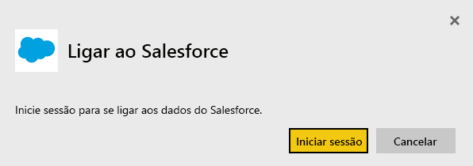
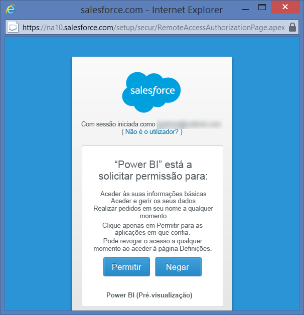
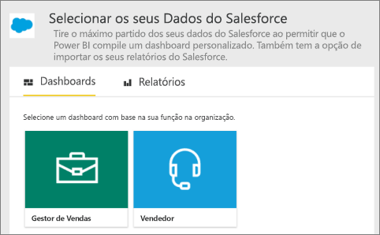
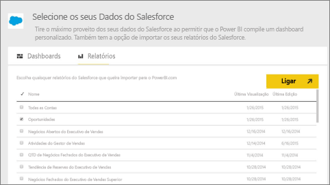
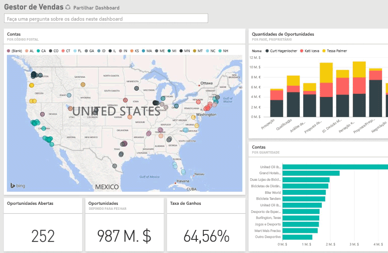

# Ligar-se ao Salesforce com o Power BI
Com o Power BI, pode ligar-se facilmente à sua conta do Salesforce.com. A criação dessa ligação devolver os dados, além de fornecer automaticamente um dashboard e relatórios relacionados com base nesses dados.

Ligue-se ao [pacote de conteúdos do Salesforce](https://app.powerbi.com/getdata/services/salesforce) para o Power BI ou leia mais sobre a [integração do Salesforce](https://powerbi.microsoft.com/integrations/salesforce) com o Power BI.

## Como se Ligar
1. Selecione **Obter Dados** na parte inferior do painel de navegação esquerdo.
   
    
2. Na caixa **Serviços**, selecione **Obter**.
   
    
3. Clique em **Salesforce** e selecione **Obter**.  
   
   
4. Selecione **Iniciar Sessão** para iniciar o fluxo de início de sessão.
   
    
5. Quando pedido, insira as suas credenciais do Salesforce. Clique em **Permitir** para que o Power BI possa aceder às suas informações e dados básicos do Salesforce.
   
   
6. Configure o que deseja importar para o Power BI com a opção de lista pendente:
   
   * **Dashboard**
     
     Selecione um dashboard predefinido com base numa persona (como **Gestor de Vendas**). Esses dashboards trazem um conjunto específico de dados standard do Salesforce e não incluem nenhum campo personalizado.
     
     
   * **Relatórios**
     
     Selecione um ou mais relatórios personalizados da conta do Salesforce. Esses relatórios correspondem às visualizações no Salesforce, podendo incluir dados de objetos ou campos personalizados.
     
     
     
     Se não vir quaisquer relatórios, adicione ou crie-os em sua conta do Salesforce e tente ligar-se novamente.
7. Clique em **Conectar** para iniciar o processo de importação. Durante a importação, verá uma notificação a mostrar que a importação está em andamento. Depois de concluída a importação, verá um dashboard, relatório e conjunto de dados para os dados do Salesforce listados no painel de navegação esquerdo.
   
   

Pode alterar esse dashboard para mostrar os dados de qualquer modo que desejar. É possível fazer perguntas com Perguntas e Respostas ou clicar num bloco para [abrir o relatório subjacente](consumer/end-user-tiles.md) e [alterar os blocos](service-dashboard-edit-tile.md) no dashboard.

**O que se segue?**

* Tente [fazer uma pergunta na caixa de Perguntas e Respostas](consumer/end-user-q-and-a.md) na parte superior do dashboard
* [Alterar os blocos](service-dashboard-edit-tile.md) no dashboard
* [Selecionar um bloco](service-dashboard-tiles.md) para abrir o relatório subjacente
* Embora o seu conjunto de dados seja agendado para atualizações diárias, pode alterar o agendamento das atualizações ou tentar atualizá-lo a pedido através da opção **Atualizar Agora**

## Requisitos de sistema e considerações
- Estar conectado a uma conta do Salesforce que tenha acesso ativado à API
- Permissão concedida à aplicação Power BI durante o início de sessão
- A conta ter chamadas à API suficientes disponíveis para efetuar pull dos dados e atualizá-los
- Um token de autenticação válido é necessário para a atualização. Certifique-se de que importou no máximo cinco conjuntos de dados do Salesforce, já que o Salesforce tem um limite de cinco tokens de autenticação por aplicação
- A API Relatórios do Salesforce tem uma restrição para suportar até 2000 linhas de dados.

## Resolução de problemas
Se encontrar algum erro, reveja os requisitos acima. Observe também que não há suporte para a capacidade de início de sessão num domínio personalizado de área atualmente restrita.

### Mensagem "Não é possível ligar ao servidor remoto"

Se receber a mensagem "Não é possível ligar ao servidor remoto" ao tentar ligar à sua conta do Salesforce, veja esta solução no fórum da Outsystems: [Salesforce Connector Log In Error Message: Unable to connect to the remote server](https://www.outsystems.com/forums/Forum_TopicView.aspx?TopicId=17674&TopicName=log-in-error-message-unable-to-connect-to-the-remote-server&) (Mensagem de erro de início de sessão do Conector do Salesforce: não é possível ligar ao servidor remoto).

## Próximos passos
[O que é o Power BI?](power-bi-overview.md)

[Obter Dados](service-get-data.md)

