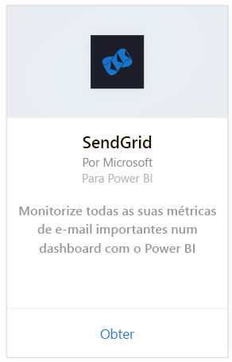
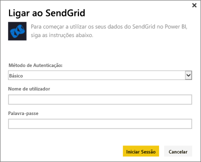
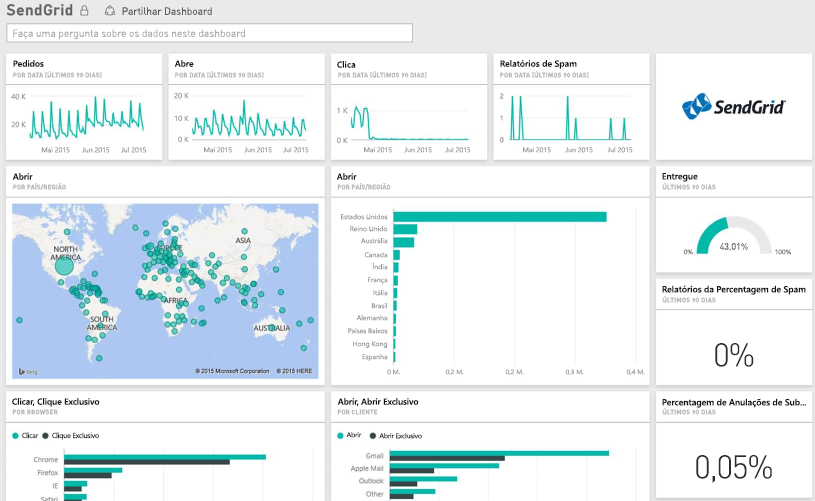

# Ligar-se ao SendGrid com o Power BI
O pacote de conteúdos do SendGrid para o Power BI permite que possa extrair informações e estatísticas da sua conta do SendGrid. Com o pacote de conteúdos do SendGrid, é possível ver as estatísticas do SendGrid num dashboard.

Ligue-se ao [pacote de conteúdos do SendGrid](https://app.powerbi.com/getdata/services/sendgrid) para o Power BI.

## Como se ligar
1. Selecione **Obter Dados** na parte inferior do painel de navegação esquerdo.
   
    
2. Na caixa **Serviços**, selecione **Obter**.
   
    
3. Selecione o pacote de conteúdos do **SendGrid** e clique em **Obter**.
   
    
4. Quando solicitado, forneça o seu nome de utilizador e palavra-passe do SendGrid. Selecione **Entrar**.
   
   
5. Depois do Power BI importar os dados, vai ver um dashboard, relatório e conjunto de dados novos no painel de navegação esquerdo, preenchidos com as suas estatísticas de e-mail correspondentes aos últimos 90 dias. Os novos itens são marcados com um asterisco amarelo \*.
   
   

**O que se segue?**

* Experimente [fazer uma pergunta na caixa de Perguntas e Respostas](power-bi-q-and-a.md) na parte superior do dashboard
* [Altere os mosaicos](service-dashboard-edit-tile.md) no dashboard.
* [Selecione um mosaico](service-dashboard-tiles.md) para abrir o relatório subjacente.
* Embora o seu conjunto de dados seja agendado para atualizações diárias, pode alterar o agendamento de atualização ou tentar atualizá-lo a pedido através de **Atualizar Agora**

## O que está incluído
As métricas a seguir estão disponíveis no dashboard do SendGrid:

* Estatísticas globais de e-mail - Solicitações, Entregues, Devolvidos, Bloqueados por Spam, Relatório de Spam, etc.
* Estatísticas de e-mail por categoria
* Estatísticas de e-mail por geografia
* Estatísticas de e-mail por ISP
* Estatísticas de e-mail por dispositivo, cliente ou browser

## Próximos passos
[Introdução ao Power BI](service-get-started.md)

[Obter Dados](service-get-data.md)

