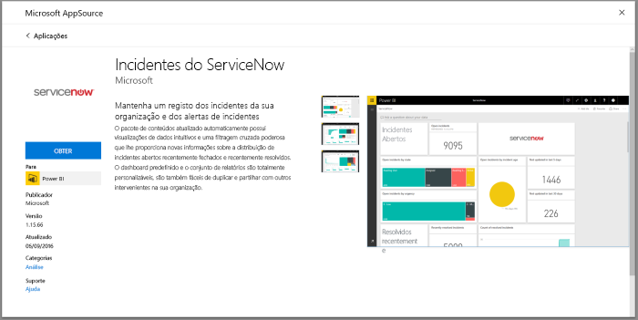
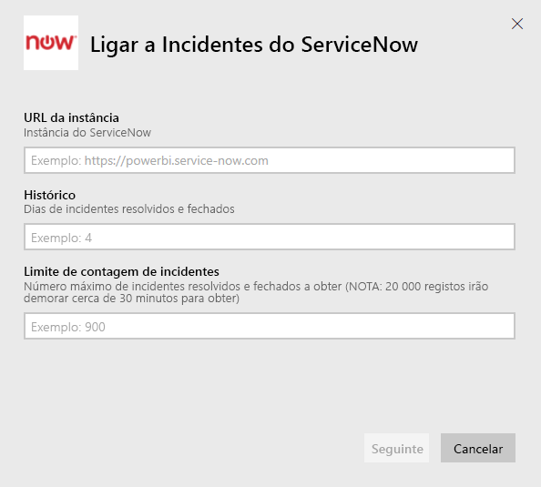
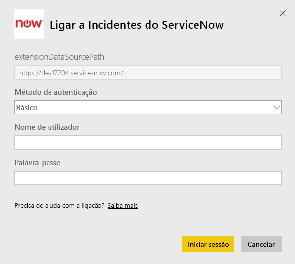
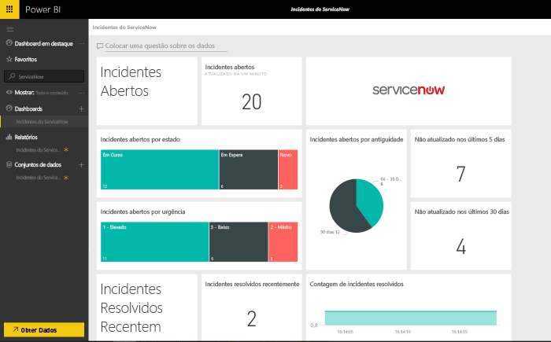

# Ligar ao ServiceNow com o Power BI para relatórios de incidentes
O ServiceNow oferece vários produtos e soluções, incluindo gestão de empresas, operações e TI para melhorar o seu negócio. Este pacote de conteúdos inclui vários relatórios e informações sobre os seus incidentes abertos, resolvidos recentemente e fechados recentemente.  

Ligue ao pacote de conteúdos do Power BI para obter os [Incidentes do ServiceNow](https://app.powerbi.com/getdata/services/servicenow).

## Como ligar
1. Selecione **Obter Dados** na parte inferior do painel de navegação esquerdo.
   
    
2. Na caixa **Serviços**, selecione **Obter**.
   
    
3. Selecione **Incidentes do ServiceNow** \>  **Obter**.
   
   
4. Forneça o URL da sua instância do ServiceNow e o intervalo de dias/registos a obter. Tenha em atenção que a importação irá parar assim que um limite for atingido.
   
   
5. Quando solicitado, introduza as suas credenciais **Básicas** do ServiceNow. Tenha em atenção que o início de sessão único não é suportado atualmente. Pode obter mais detalhes sobre os requisitos de sistema abaixo.
   
   
6. Quando o fluxo de início de sessão estiver concluído, o processo de importação será iniciado. Quando concluído, um novo dashboard, relatório e modelo aparecem no Painel de Navegação. Selecione o dashboard para ver os seus dados importados.
   
    

**O que se segue?**

* Experimente [fazer uma pergunta na caixa de Perguntas e Respostas](power-bi-q-and-a.md) na parte superior do dashboard
* [Altere os mosaicos](service-dashboard-edit-tile.md) no dashboard.
* [Selecione um mosaico](service-dashboard-tiles.md) para abrir o relatório subjacente.
* Embora o seu conjunto de dados seja agendado para atualizações diárias, pode alterar o agendamento de atualização ou tentar atualizá-lo a pedido através de **Atualizar Agora**

## Requisitos de sistema
Para ligar, irá precisar de:  

* Uma conta que possa aceder a yourorganization.service-now.com, com autenticação básica (o Início de Sessão Único não é suportado nesta versão)  
* A conta deve ter a função rest_service e acesso de leitura à tabela de incidentes  

## Resolução de Problemas
Se estiver a obter um erro de credenciais durante o carregamento, consulte os requisitos de acesso acima. Se tiver as permissões corretas e continuar a ter problemas, consulte o seu administrador do ServiceNow para garantir que tem quaisquer permissões adicionais que possam ser necessárias para a instância personalizada.

Se estiver a ver tempos de carregamento longos, reveja o número de incidentes e o número de dias que especificou durante a ligação, e considere a respetiva redução.

## Passos seguintes
[Introdução ao Power BI](service-get-started.md)

[Power BI - Conceitos Básicos](service-basic-concepts.md)

