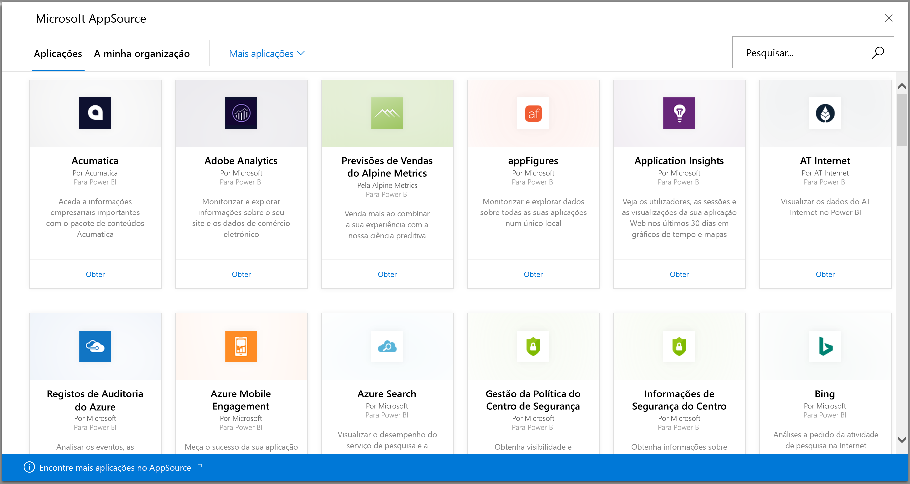
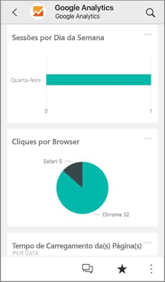
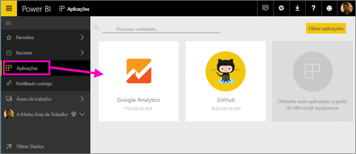
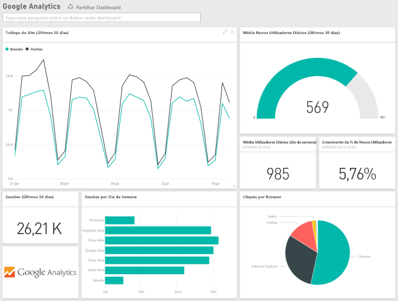
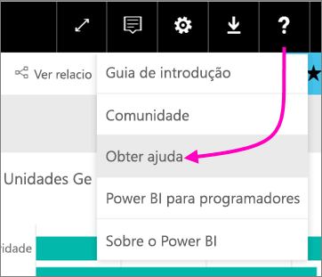

# Ligar aos serviços que utiliza com o Power BI
Com o Power BI, pode ligar a muitos dos serviços que utiliza para gerir a sua empresa, como o Salesforce, Microsoft Dynamics e Google Analytics. Começa com as suas credenciais para ligar ao serviço Power BI. Ele cria um Power BI *área de trabalho* com um dashboard e um conjunto de relatórios do Power BI que automaticamente mostrar os seus dados e fornecem informações visuais sobre a sua empresa.

Inicie sessão no Power BI para ver todas as [serviços pode ligar a](https://app.powerbi.com/getdata/services). 

Depois de instalar a aplicação, pode ver o dashboard e relatórios na aplicação e a área de trabalho no serviço Power BI ([https://app.powerbi.com](https://app.powerbi.com)). Também pode visualizá-los nas aplicações móveis do Power BI. Na área de trabalho, pode modificar o dashboard e relatórios para satisfazer as necessidades da sua organização e, em seguida, distribuí-los para os seus colegas como um *aplicação*. 

## Introdução
[!INCLUDE [powerbi-service-apps-get-more-apps](./includes/powerbi-service-apps-get-more-apps.md)]

## Editar o dashboard e relatórios
Quando a importação estiver concluída, a nova aplicação aparecerá na página Aplicações.

1. Selecione **Aplicações** no painel de navegação à esquerda > selecione a aplicação.
   
     
2. Pode fazer uma pergunta ao escrever na caixa de Perguntas e Respostas ou clicar num mosaico para abrir o relatório subjacente. 
   
    
   
    Altere o dashboard e relatório para atender às necessidades da sua organização. Em seguida, [distribua a sua aplicação para os seus colegas](service-create-distribute-apps.md)

## O que está incluído
Depois de ligar a um serviço, verá uma aplicação criada recentemente e a área de trabalho com um dashboard, relatórios e conjunto de dados. Os dados do serviço focam-se num cenário específico e podem não abranger todas as informações do serviço. Os dados são agendados para atualização automática uma vez por dia. Pode controlar a agenda ao selecionar o conjunto de dados.

Também pode [ligar a vários serviços no Power BI Desktop](desktop-data-sources.md), como o Google Analytics e criar seus próprios dashboards e relatórios personalizados.  

Para obter mais detalhes sobre como ligar a serviços específicos, consulte as páginas de ajuda individuais.

## Resolução de problemas
**Mosaicos vazios**  
Apesar de o Power BI começar por se ligar ao serviço, poderá ver um conjunto vazio de mosaicos no seu dashboard. Se ainda vir um dashboard vazio após 2 horas, é provável que tenha havido uma falha de ligação. Se não vir uma mensagem de erro com informações sobre como corrigir o problema, envie um pedido de suporte.

* Selecione o ícone de ponto de interrogação ( **?** ) no canto superior direito >  **Obter ajuda**.
  
    

**Informações em falta**  
O dashboard e os relatórios incluem o conteúdo do serviço que se concentrou num cenário específico. Se estiver à procura de uma métrica específica na aplicação e não o vir, adicione uma ideia sobre o [suporte do Power BI](https://support.powerbi.com/forums/265200-power-bi) página.

## Sugestão de serviços
Utiliza um serviço que pretende sugerir para uma aplicação do Power BI? Vá para a página [Suporte do Power BI](https://support.powerbi.com/forums/265200-power-bi) e envie os seus comentários.

Se estiver interessado em criar aplicações de modelo para distribuição própria, veja [Create a template app in Power BI](service-template-apps-create.md) (Criar uma aplicação de modelo no Power BI). Parceiros do Power BI podem criar aplicações do Power BI com pouca ou nenhuma codificação e implementá-las em clientes do Power BI. 

## Próximos passos
* [Distribuir aplicações para os seus colegas](service-create-distribute-apps.md)
* [Criar novas áreas de trabalho no Power BI](service-create-the-new-workspaces.md)
* Perguntas? [Experimente perguntar à Comunidade do Power BI](http://community.powerbi.com/)
* Mais perguntas? [Experimente perguntar à Comunidade do Power BI](http://community.powerbi.com/)

