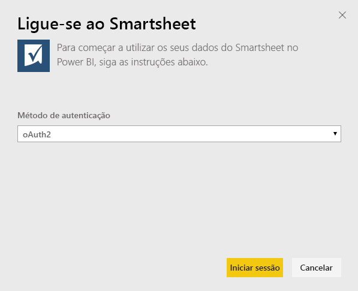
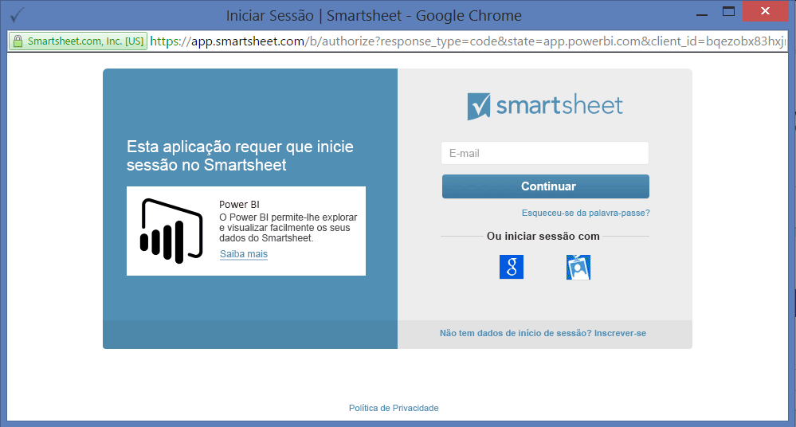
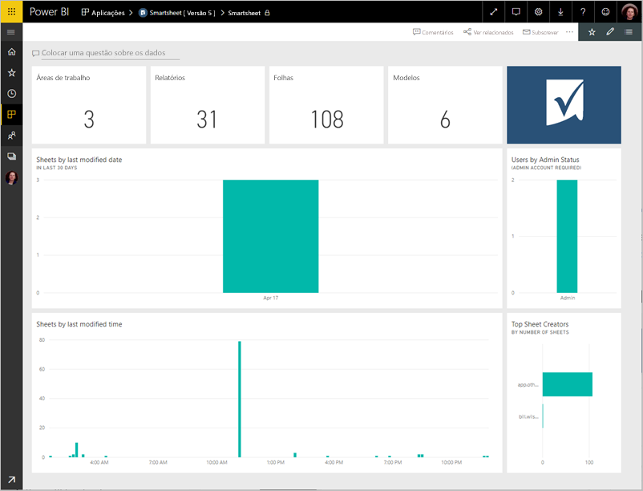
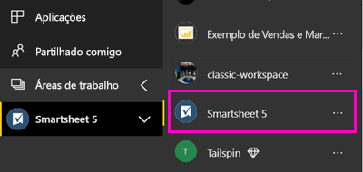
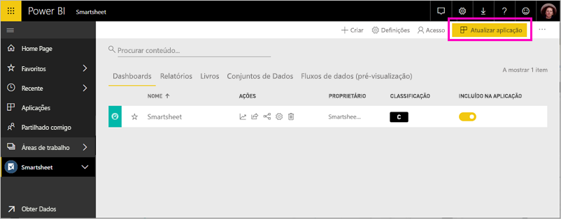

# Ligue-se ao Smartsheet com o Power BI
Este artigo orienta-o por meio de extrair os dados da sua conta de Smartsheet com uma aplicação de modelo do Power BI. O Smartsheet oferece uma plataforma fácil para colaboração e partilha de ficheiros. A aplicação de modelo do Smartsheet para Power BI fornece um dashboard, relatórios e conjunto de dados que mostra uma descrição geral da sua conta de Smartsheet. Também pode utilizar [Power BI Desktop](desktop-connect-to-data.md) para ligar diretamente às folhas individuais na sua conta. 

Depois de instalar a aplicação de modelo, pode alterar o dashboard e relatório. Em seguida, pode distribuí-la como uma aplicação para os colegas na sua organização.

Ligar para o [aplicação de modelo do Smartsheet](https://app.powerbi.com/groups/me/getdata/services/smartsheet) para o Power BI.

>[!NOTE]
>Uma conta de administrador Smartsheet é preferida para ligar e carregar a aplicação de modelo do Power BI, à medida que tem acesso adicional.

## Como se ligar

[!INCLUDE [powerbi-service-apps-get-more-apps](./includes/powerbi-service-apps-get-more-apps.md)]

3. Selecione **Smartsheet** \> **obter agora**.
4. Na **instalar esta aplicação do Power BI?** selecionar **instalar**.
4. Na **aplicações** painel, selecione a **Smartsheet** mosaico.

    

6. Na **introdução à sua nova aplicação**, selecione **ligar a dados**.

    

4. Para o Método de Autenticação, selecione **oAuth2 \> Iniciar Sessão**.
   
   Quando solicitado, insira as suas credenciais do Smartsheet e siga o processo de autenticação.
   
   
   
   

5. Depois do Power BI importar os dados, é aberto o dashboard do Smartsheet.
   
   

## Modificar e distribuir a sua aplicação

Instalou a aplicação de modelo do Smartsheet. Isso significa que criou também a área de trabalho de aplicação do Smartsheet. Na área de trabalho, pode alterar o relatório e dashboard e, em seguida, distribuí-la como uma *aplicação* aos colegas na sua organização. 

1. Para ver todo o conteúdo do seu novo espaço de trabalho de Smartsheet, na barra de navegação esquerdo, selecione **áreas de trabalho** > **Smartsheet**. 

    

    Esta vista é a lista de conteúdo para a área de trabalho. No canto superior direito, verá **atualizar aplicação**. Quando estiver pronto para distribuir a sua aplicação para os seus colegas, que é onde começar. 

    

2. Selecione **relatórios** e **conjuntos de dados** para ver os outros elementos na área de trabalho.

    Leia sobre [distribuir aplicações](service-create-distribute-apps.md) para os seus colegas.

## O que está incluído
O Smartsheet, aplicação de modelo para o Power BI inclui uma descrição geral da sua conta de Smartsheet, como o número de áreas de trabalho, relatórios e os livros tem, em que são modificados etc. Os utilizadores administradores veem também algumas informações sobre os utilizadores no seu sistema, como principais criadores de folhas.  

Para se ligar diretamente a planilhas livros na sua conta, é possível utilizar o conector do Smartsheet no [Power BI Desktop](desktop-connect-to-data.md).  

## Próximos passos

* [Criar novas áreas de trabalho no Power BI](service-create-the-new-workspaces.md)
* [Instalar e utilizar aplicações no Power BI](consumer/end-user-apps.md)
* [Ligar a aplicações do Power BI para serviços externos](service-connect-to-services.md)
* Perguntas? [Experimente perguntar à Comunidade do Power BI](http://community.powerbi.com/)