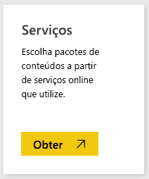
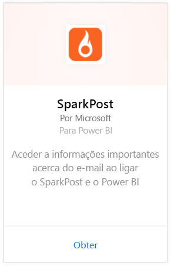
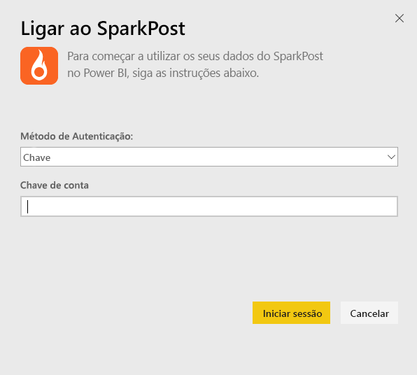
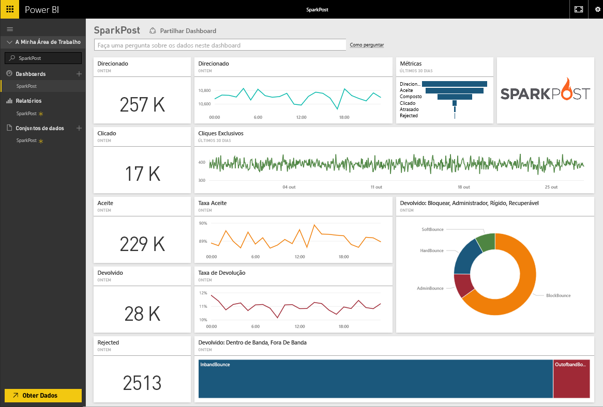
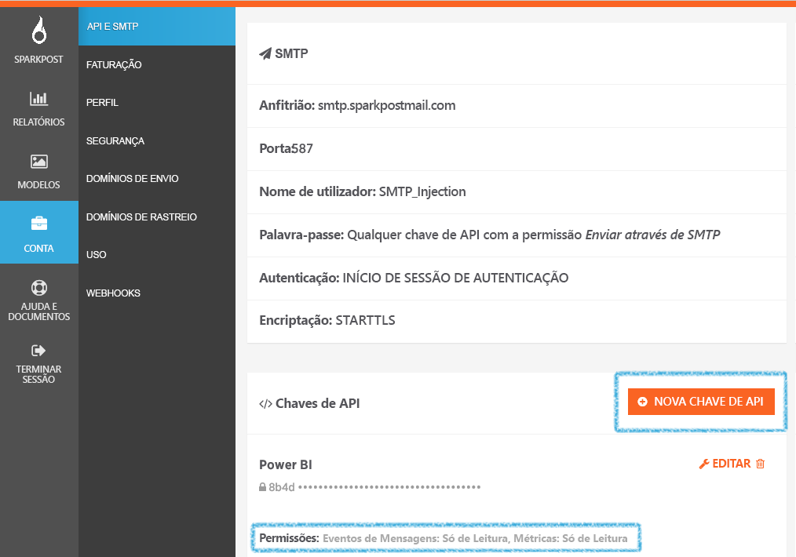

# Ligar-se ao SparkPost com o Power BI
O pacote de conteúdos do Power BI para SparkPost permite extrair conjuntos de dados valiosos da sua conta do SparkPost para um dashboard de informações. Com o pacote de conteúdos do SparkPost, é possível visualizar as estatísticas gerais de e-mail, incluindo domínios, campanhas e envolvimento por ISP.

Conecte-se ao [pacote de conteúdo do SparkPost para o Power BI](https://app.powerbi.com/getdata/services/spark-post).

## Como se ligar
1. Selecione **Obter Dados** na parte inferior do painel de navegação esquerdo.
   
   
2. Na caixa **Serviços**, selecione **Obter**.
   
   
3. Selecione o pacote de conteúdo do **SparkPost** e clique em **Obter**. 
   
   
4. Quando solicitado, forneça a sua chave de API do SparkPost e selecione Entrar. Veja detalhes sobre como [encontrar esses parâmetros](#FindingParams) abaixo.
   
   
5. Seus dados começarão a ser carregados; dependendo do tamanho de sua conta, isso poderá levar algum tempo. Depois do Power BI importar os dados, vê o dashboard predefinido, o relatório e o conjunto de dados predefinido no dashboard de navegação esquerdo, preenchidos com as suas estatísticas de e-mail correspondentes aos últimos 90 dias. Os novos itens são marcados com um asterisco amarelo \*.
   
   

**O que se segue?**

* Tente [fazer uma pergunta na caixa de Perguntas e Respostas](service-q-and-a.md) na parte superior do dashboard
* [Altere os blocos](service-dashboard-edit-tile.md) no dashboard.
* [Selecione um bloco](service-dashboard-tiles.md) para abrir o relatório subjacente.
* Enquanto o seu conjunto de dados vai ser agendado para ser atualizado diariamente, pode alterar o agendamento de atualização ou tentar atualizá-lo sob pedido em **Atualizar Agora**

## O que está incluído
O pacote de conteúdo do SparkPost para o Power BI inclui informações como cliques exclusivos, taxas aceitas, taxas de devolução, taxas atrasadas, taxas de rejeição e muito mais.

## A procurar parâmetros
O pacote de conteúdos utiliza uma chave de API para ligar a sua conta do SparkPost ao Power BI. É possível encontrar a chave de API em sua conta sob Conta \> API & SMTP (mais detalhes [aqui](https://support.sparkpost.com/customer/portal/articles/1933377-create-api-keys)). Sugerimos que utilize uma chave de API com permissões para `Message Events: Read-only ` e `Metrics: Read-only`

