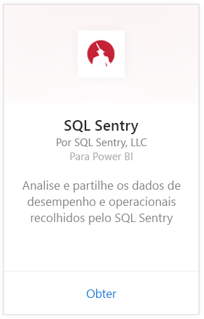
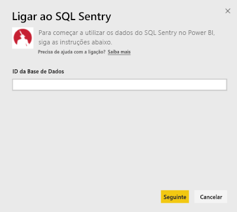
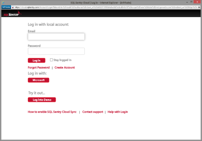
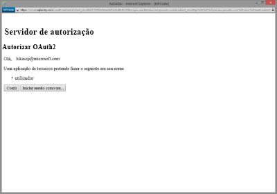
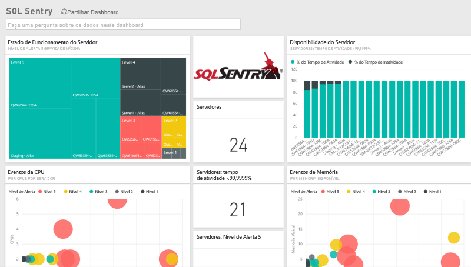
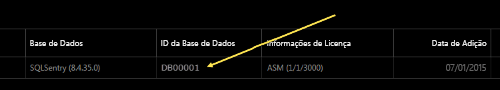
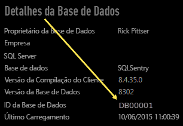

# Ligar ao SQL Sentry com o Power BI
É fácil analisar os dados de desempenho recolhidos pelo SQL Sentry com o Power BI. O Power BI obtém os dados e cria um dashboard predefinido e relatórios relacionados com base nesses dados.

Ligue-se ao [pacote de conteúdos do SQL Sentry](https://app.powerbi.com/groups/me/getdata/services/sql-sentry) para o Power BI.

>[!NOTE]
>O acesso a uma conta do SQL Sentry usada para ligar com o http://cloud.sqlsentry.com e um ID de base de dados que monitoriza são necessários para se ligar.  Veja abaixo as instruções sobre onde encontrar o ID de Base de Dados.

## Como ligar
1. Selecione **Obter Dados** na parte inferior do painel de navegação esquerdo.
   
   
2. Na caixa **Serviços**, selecione **Obter**.
   
    
3. Selecione **SQL Sentry \> Obter**.
   
   
4. Forneça o **ID da Base de Dados** da base de dados que gostaria de monitorizar no Power BI. Veja mais detalhes sobre como [encontrar isto](#FindingParams) abaixo.
   
   
5. Para o Método de Autenticação, selecione **oAuth2 \> Iniciar Sessão**.
   
   Quando solicitado, introduza as credenciais do cloud.sqlsentry.com e siga o processo de autenticação do SQL Sentry.
   
   
   
   Quando ligar pela primeira vez, o Power BI pede-lhe para permitir acesso só de leitura à sua conta. Selecione Conceder para iniciar o processo de importação.  O processo de importação pode demorar alguns minutos, dependendo do volume de dados na sua conta.
   
   
6. Depois de o Power BI importar os dados, verá um novo dashboard, relatório e conjunto de dados no dashboard de navegação esquerdo. Os novos itens são marcados com um asterisco amarelo \*:
   
   
7. Selecione o dashboard do SQL Sentry.
   
   Este é o dashboard predefinido criado pelo Power BI para apresentar os seus dados. Pode alterar este dashboard para apresentar os dados da forma que quiser.
   
   

**E agora?**

* Experimente [fazer uma pergunta na caixa de Perguntas e Respostas](power-bi-q-and-a.md) na parte superior do dashboard
* [Altere os mosaicos](service-dashboard-edit-tile.md) no dashboard.
* [Selecione um mosaico](service-dashboard-tiles.md) para abrir o relatório subjacente.
* Embora o seu conjunto de dados seja agendado para atualizações diárias, pode alterar o agendamento de atualização ou tentar atualizá-lo a pedido através de **Atualizar Agora**

## O que está incluído
Os seguintes dados estão disponíveis no SQL Sentry no Power BI:

| Nome da tabela | Descrição |
| --- | --- |
| Ligação |Esta tabela fornece informações sobre as ligações definidas do SQL Sentry. |
| Data  |Esta tabela contém as datas de hoje até à primeira data a partir da qual os dados de desempenho foram recolhidos e mantidos. |
| Tempo de inatividade  |Esta tabela contém informações relacionadas com o tempo de inatividade e o tempo de atividade para cada servidor monitorizado no seu ambiente. |
| Utilização de Memória  |Esta tabela contém dados sobre a quantidade de memória está disponível ou livre em cada um dos seus servidores.  |
| Servidor  |Esta tabela contém registos para cada servidor no seu ambiente. |
| Estado de Funcionamento do Servidor  |Esta tabela contém dados para todos os eventos gerados por condições personalizadas no seu ambiente, incluindo gravidade e contagem. |

## A localizar Parâmetros
O **ID da Base de Dados** pode ser encontrado ao iniciar sessão em <https://cloud.sqlsentry.com> numa nova janela de browser.  O **ID de Base de Dados** está listado na página de visão geral principal:

    

O **ID de Base de Dados** está também mostrado no ecrã de Detalhes de Base de Dados:

    

## Resolução de problemas
Se os dados de algumas das suas aplicações não estiverem a aparecer no Power BI, certifique-se de que está a utilizar o ID de Base de Dados correta e tem autoridade para ver os dados. 

Se não é o proprietário da base de dados do SQL Sentry que está a ser sincronizada com <https://cloud.sqlsentry.com>, entre em contacto com o seu administrador para verificar se tem direitos para ver os dados recolhidos.

## Próximos passos
[Introdução ao Power BI](service-get-started.md)

[Obter Dados para o Power BI](service-get-data.md)

