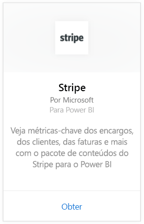
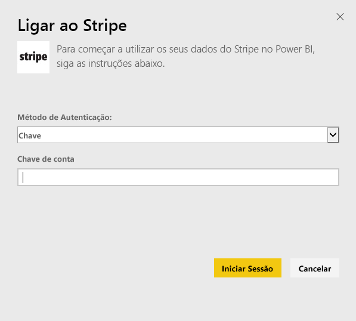
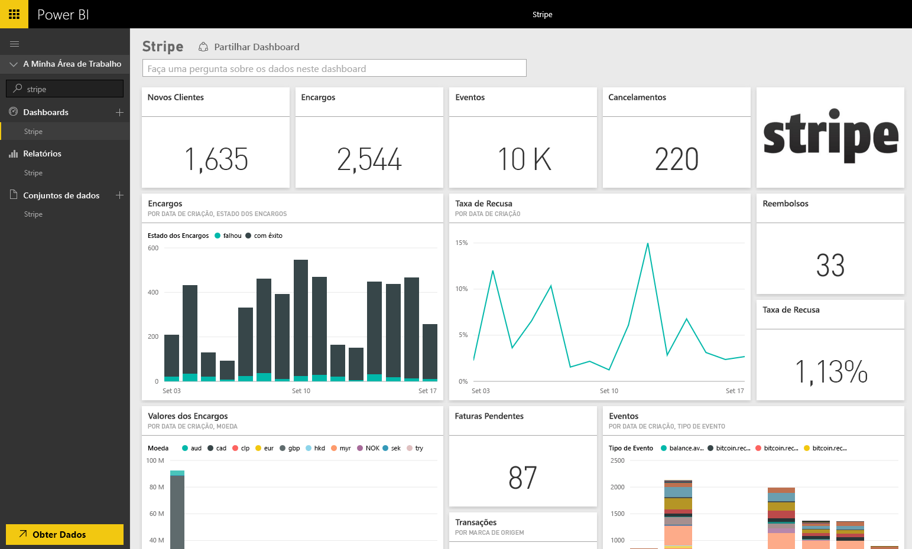

# Ligue ao Stripe com o Power BI
Visualize e explore os seus dados do Stripe para o Power BI com o pacote de conteúdos para o Power BI. O pacote de conteúdos do Stripe para o Power BI recebe dados por pull sobre Clientes, Encargos, Eventos e Recibos. Os dados incluem os dez mil eventos e as cinco mil despesas mais recentes nos últimos 30 dias. O conteúdo é atualizado automaticamente uma vez por dia numa agenda que controle. 

[!INCLUDE [include-short-name](./includes/service-deprecate-content-packs.md)]

Conecte-se ao [pacote de conteúdo do Stripe para o Power BI](https://app.powerbi.com/getdata/services/stripe).

## Como se ligar
1. Selecione Obter Dados na parte inferior do painel de navegação esquerdo.  
   
    
2. Na caixa **Serviços**, selecione **Obter**.  
   
      
3. Selecione **Stripe** &gt; **Obter**.  
   
      
4. Forneça sua [chave de API](https://dashboard.stripe.com/account/apikeys) do Stripe para se conectar.  
   
    
5. O processo de importação é iniciado automaticamente. Quando concluído, um novo dashboard, relatório e modelo aparecerão no Painel de Navegação, marcados com um asterisco. Selecione o dashboard para ver os seus dados importados.
   
    

**O que se segue?**

* Experimente [fazer uma pergunta na caixa de Perguntas e Respostas](consumer/end-user-q-and-a.md) na parte superior do dashboard
* [Altere os mosaicos](service-dashboard-edit-tile.md) no dashboard.
* [Selecione um mosaico](consumer/end-user-tiles.md) para abrir o relatório subjacente.
* Embora o seu conjunto de dados seja agendado para atualizações diárias, pode alterar o agendamento das atualizações ou tentar atualizá-lo a pedido através da opção **Atualizar Agora**

## Próximos passos
[O que é o Power BI?](fundamentals/power-bi-overview.md)

[Obter Dados para o Power BI](service-get-data.md)

