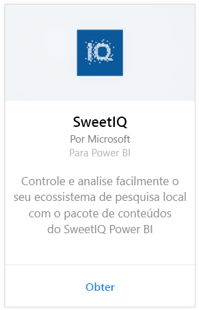
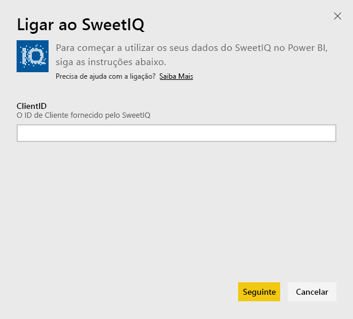
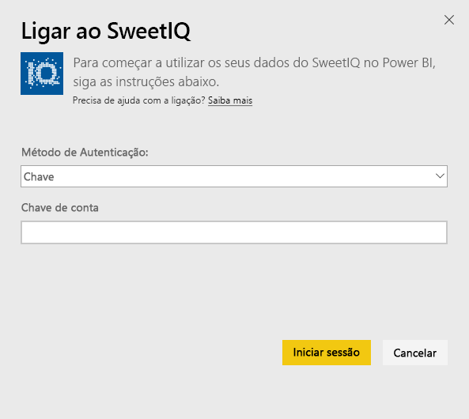
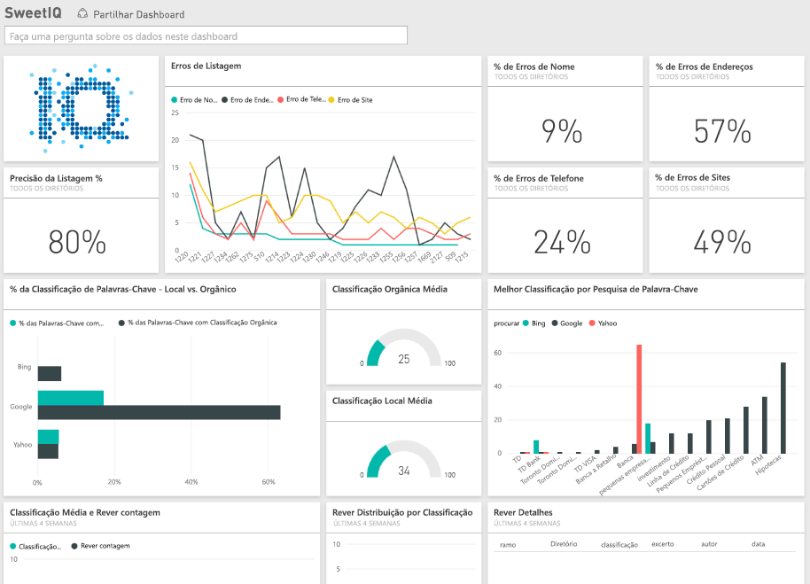

# Ligue-se ao SweetIQ com o Power BI
O pacote de conteúdos para o Power BI extrai dados da sua conta do SweetIQ e gera um conjunto de conteúdos pronto a utilizar, o que permite que explore os seus dados com facilidade. Utilize o pacote de conteúdos do SweetIQ para analisar dados sobre os seus locais, listas, classificações e análises. Os dados são configurados para serem atualizados diariamente, o que garante que os dados que está a monitorizar são atuais.

Conecte-se ao [pacote de conteúdo do SweetIQ](https://app.powerbi.com/groups/me/getdata/services/sweetiq) para o Power BI.

## Como se ligar
1. No painel de navegação à esquerda, clique em **Obter Dados.**
   
    
2. Selecione **SweetIQ** e clique em **Obter.**
   
    
3. Forneça o ID do Cliente do SweetIQ. Isso é geralmente um valor alfanumérico. Para obter mais detalhes sobre como encontrar esse valor, veja abaixo.
   
    
4. Selecione o tipo de autenticação de **Chave** e forneça a Chave de API do SweetIQ. Isso é geralmente um valor alfanumérico. Para obter mais detalhes sobre como encontrar esse valor, veja abaixo.
   
    
5. O Power BI inicia o carregamento de dados, o que poderá demorar um pouco dependendo do tamanho dos dados na sua conta. Depois de concluído o carregamento, verá um novo dashboard, relatório e conjunto de dados no painel de navegação esquerdo.
   
    

**O que se segue?**

* Experimente [fazer uma pergunta na caixa de Perguntas e Respostas](consumer/end-user-q-and-a.md) na parte superior do dashboard
* [Altere os mosaicos](service-dashboard-edit-tile.md) no dashboard.
* [Selecione um mosaico](consumer/end-user-tiles.md) para abrir o relatório subjacente.
* Embora o seu conjunto de dados seja agendado para atualizações diárias, pode alterar o agendamento das atualizações ou tentar atualizá-lo a pedido através da opção **Atualizar Agora**

## Parâmetros de localização
O ID do Cliente e a Chave de API para esse pacote de conteúdo não são as mesmas que seu nome de utilizador e palavra-passe do SweetIQ.

Selecione um ID do Cliente de um dos clientes aos quais a sua conta tem acesso. Pode encontrar a lista de clientes em “Gestão de Clientes” na sua conta do SweetIQ.

Fale com o seu administrador para obter sua chave de API, para aceder os dados de um cliente específico.

## Próximos passos
[O que é o Power BI?](power-bi-overview.md)

[Obter Dados para o Power BI](service-get-data.md)

