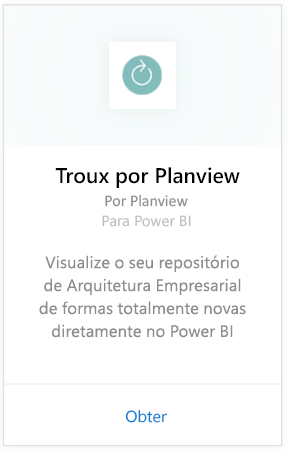
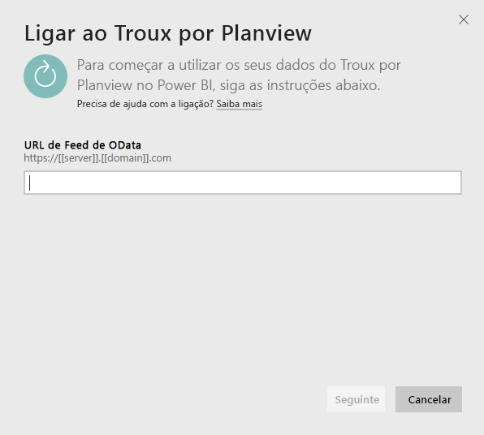
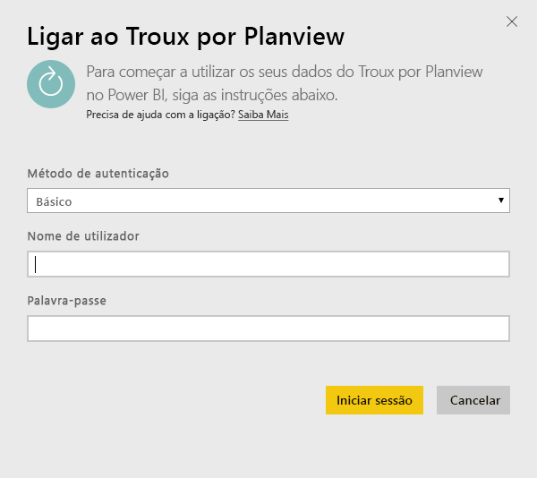
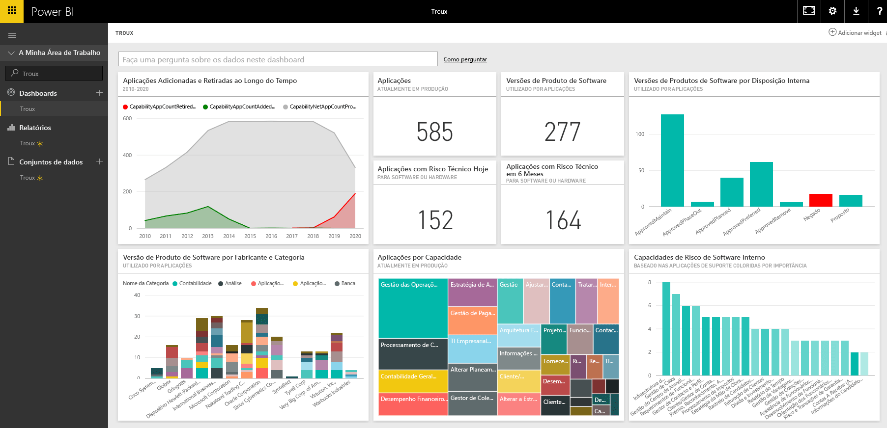

# Ligar ao Troux para o Power BI
Com o pacote de conteúdos do Troux, pode visualizar o seu repositório de Arquitetura Empresarial de formas totalmente novas diretamente no Power BI. O pacote de conteúdos fornece um conjunto de informações sobre as suas capacidades de negócios, as aplicações que fornecem essas funcionalidades e as tecnologias que suportam essas aplicações que podem ser totalmente personalizadas com o Power BI.

Conecte-se ao [pacote de conteúdos do Troux](https://app.powerbi.com/getdata/services/troux) para o Power BI.

## Como se ligar
1. Selecione **Obter Dados** na parte inferior do painel de navegação esquerdo.
   
   
2. Na caixa **Serviços**, selecione **Obter**.
   
   
3. Selecione **Troux** \> **Obter**.
   
   
4. Especifique o URL do OData do Troux. Veja detalhes sobre como [encontrar os parâmetros](#FindingParams) abaixo.
   
   
5. Para o **Método de Autenticação**, selecione **Básico** e forneça o seu nome de utilizador e palavra-chave (diferencia maiúsculas de minúsculas) e selecione **Entrar**.
   
    
6. Após a aprovação, o processo de importação será iniciado automaticamente. Quando concluído, um novo dashboard, relatório e modelo aparecem no Painel de Navegação. Selecione o dashboard para ver os seus dados importados.
   
     

**O que se segue?**

* Tente [fazer uma pergunta na caixa de Perguntas e Respostas](service-q-and-a.md) na parte superior do dashboard
* [Altere os blocos](service-dashboard-edit-tile.md) no dashboard.
* [Selecione um bloco](service-dashboard-tiles.md) para abrir o relatório subjacente.
* Enquanto o seu conjunto de dados vai ser agendado para ser atualizado diariamente, pode alterar o agendamento de atualização ou tentar atualizá-lo sob pedido em **Atualizar Agora**

## Requisitos do sistema
É necessário o acesso ao feed OData do Troux e o Troux 9.5.1 ou posterior.

## A procurar parâmetros
A sua equipa de Atendimento ao Cliente pode fornecer o URL do feed OData do Troux exclusivo para si

## Resolução de problemas
Se vir um erro de tempo limite depois de fornecer as credenciais, tente ligar-se novamente.

## Próximos passos
[Introdução ao Power BI](service-get-started.md)

[Obter dados no Power BI](service-get-data.md)

