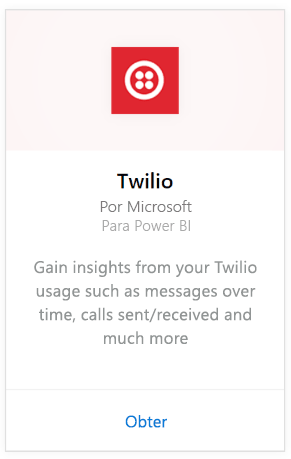
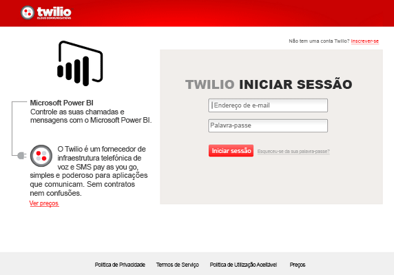
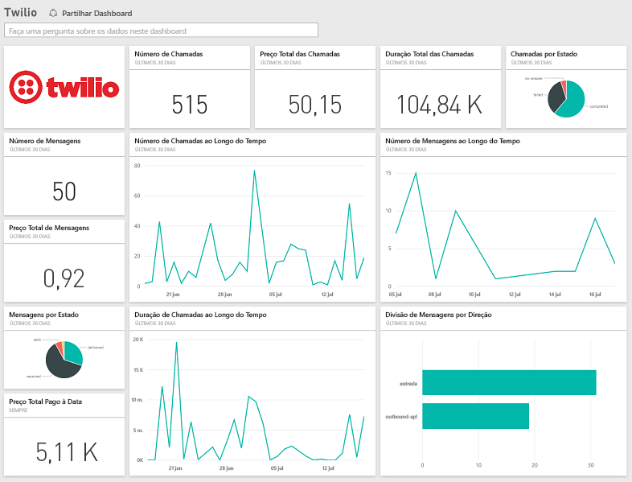

# Ligar ao Twilio com o Power BI
O pacote de conteúdo do Microsoft Twilio para o Power BI permite recuperar os dados do Twilio para o Power BI e cria um relatório e um [dashboard do Twilio](https://powerbi.microsoft.com/integrations/twilio) prontos para utilização que mostram informações sobre os dados. Também é possível criar os seus relatórios e dashboards personalizados com base no conjunto de dados criado pelo Power BI. Os dados são atualizados uma vez por dia, para que veja sempre os dados mais recentes.

Ligue-se ao [pacote de conteúdo do Twilio](https://app.powerbi.com/getdata/services/twilio) para o Power BI.

## Como se ligar
1. Selecione **Obter Dados** na parte inferior do painel de navegação esquerdo.
   
    
2. Na caixa **Serviços**, selecione **Obter**.
   
    
3. Selecione **Twilio** \> **Obter**.
   
   
4. Como **Método de Autenticação**, selecione **oAuth2** \> Iniciar Sessão. Quando solicitado, forneça as suas credenciais do Twilio e autorize a aplicação Power BI a aceder aos seus dados.
   
   
5. Isso inicia a importação de dados da sua conta do Twilio e terá o seu dashboard preenchido com sa ua utilização de chamadas e mensagens dos últimos 30 dias. 
   
   

**E agora?**

* Experimente [fazer uma pergunta na caixa de Perguntas e Respostas](power-bi-q-and-a.md) na parte superior do dashboard
* [Altere os mosaicos](service-dashboard-edit-tile.md) no dashboard.
* [Selecione um mosaico](service-dashboard-tiles.md) para abrir o relatório subjacente.
* Embora o seu conjunto de dados seja agendado para atualizações diárias, pode alterar o agendamento de atualização ou tentar atualizá-lo a pedido através de **Atualizar Agora**

## O que está incluído
Os detalhes de todas as transações de mensagens e chamadas dos últimos 30 dias. Pode fazer todos os tipos de agregação e análise desses dados.

Um conjunto de estatísticas já agregadas, que talvez queira monitorizar. Este conjunto inclui:

        All Time Calls Count  
        All Time Calls Duration  
        All Time Calls Price  
        All Time Messages Price  
        All Time Messages Count  
        All Time Count of Phone Numbers  
        All Time Price of Phone Numbers  
        All Time Twilio Client Calls Price  
        All Time Twilio Client Calls Duration  
        All Time Twilio Client Calls Count  
        All Time Total Price  
        All Time Inbound Calls Price  
        All Time Inbound Calls Duration  
        All Time Inbound Calls Count  
        All Time Outbound Calls Price  
        All Time Outbound Calls Duration  
        All Time Outbound Calls Count  
        This Month Calls Price  
        This Month Calls Duration  
        This Month Calls Count  
        This Month Messages Count  
        This Month Messages Price  
        This Month Count of Phone Numbers  
        This Month Price of Phone Numbers  
        This Month Twilio Client Calls Price  
        This Month Twilio Client Calls Duration  
        This Month Twilio Client Calls Count  
        This Month Total Price  
        This Month Inbound Calls Price  
        This Month Inbound Calls Duration  
        This Month Inbound Calls Count  
        This Month Outbound Calls Price  
        This Month Outbound Calls Duration  
        This Month Outbound Calls Count  
        This Month Inbound Messages Price  
        This Month Inbound Messages Count  
        This Month Outbound Messages Price  
        This Month Outbound Messages Count

## Resolução de problemas
Se tiver uma grande quantidade de dados nos últimos 30 dias (centenas de milhares de transações), o passo de obtenção de dados pode falhar. Estamos cientes do problema e a trabalhar para solucioná-lo. Enquanto isso, caso tenha esse problema, utilize a ligação de suporte na parte superior da página do Power BI para nos informar e vamos contatá-lo para averiguações adicionais.

## Próximos passos
[Introdução ao Power BI](service-get-started.md)

[Obter dados no Power BI](service-get-data.md)

