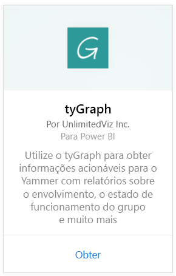
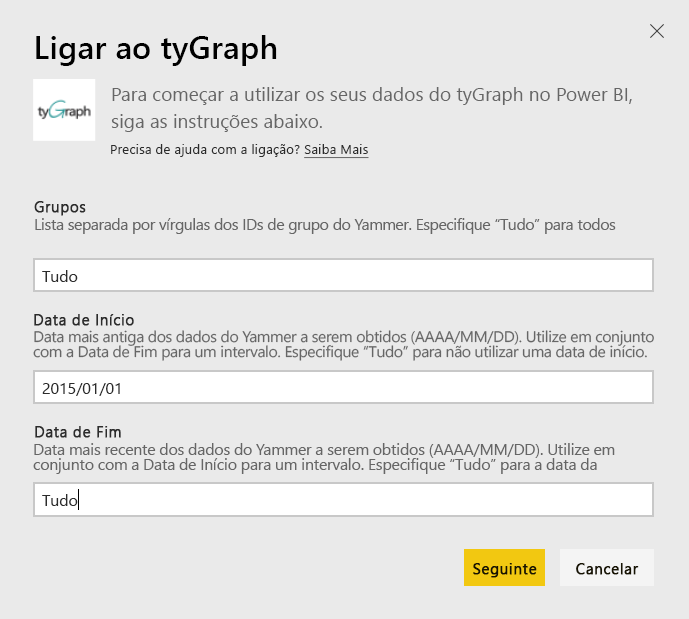
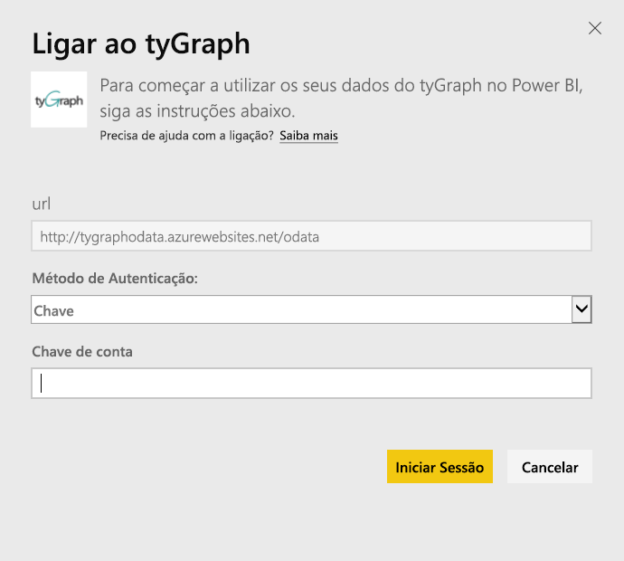
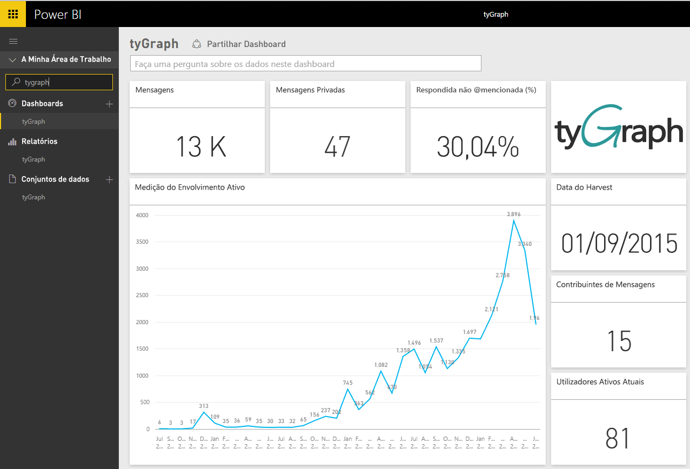
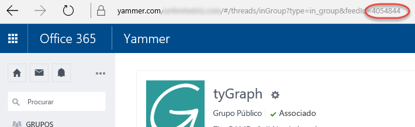

# Ligue-se ao tyGraph com o Power BI
Visualize e explore os seus dados do tyGraph no Power BI com o pacote de conteúdos do Power BI. Comece por ligar-se à sua conta do tyGraph e por carregar o dashboard, os relatórios e o conjunto de dados. O conteúdo pronto para utilização inclui informações, como a pontuação MAE (Medida de Envolvimento Ativo) e Principais Colaboradores. Personalize ainda mais de modo a realçar as informações mais importantes para si.  Os dados serão atualizados automaticamente de acordo com um agendamento definido por si.

Ligue-se ao [tyGraph para o Power BI](https://app.powerbi.com/getdata/services/tygraph).

## Como se ligar
1. Selecione **Obter Dados** na parte inferior do painel de navegação esquerdo.
   
   
2. Na caixa **Serviços**, selecione **Obter**.
   
   
3. Selecione **tyGraph** \> **Obter**.
   
   
4. Especifique os grupos e o intervalo de tempo aos quais pretende ligar-se; caso contrário, especifique “Tudo” para exibir todos os dados. Observe o formato de data esperado (AAAA/MM/DD). Veja detalhes sobre [como encontrar os parâmetros](#FindingParams) abaixo.
   
   
5. Forneça a chave do tyGraph para se ligar. Veja detalhes sobre como encontrar este valor abaixo.
   
    **Se é um Administrador Verificado do Yammer**  
    A chave de API será enviada num e-mail quando a conta do tyGraph for criada com êxito. Se não encontra a sua chave, solicite uma nova enviando um e-mail para support@unlimitedviz.com. Se ainda não tiver uma conta do tyGraph, pode iniciar uma versão de avaliação em [http://www.tygraph.com/](http://www.tygraph.com/). 
   
    **Se não é um Administrador Verificado do Yammer**
   
    O pacote de conteúdos do tyGraph requer uma conta do tyGraph criada por um administrador verificado do Yammer. Uma vez criadas, podem ser emitidas chaves suplementares para utilizadores na mesma organização. Se o seu administrador verificado ainda não tiver criado uma conta do tyGraph, contacte-o para criar uma. Se este tiver criado uma conta, pode pedir uma chave ao enviar um e-mail para <support@unlimitedviz.com>.
   
    
6. Após a autenticação com êxito, o processo de importação será iniciado automaticamente. Quando concluído, um novo dashboard, relatório e modelo aparecerão no Painel de Navegação. Selecione o dashboard para ver os seus dados importados.
   
    

**O que se segue?**

* Experimente [fazer uma pergunta na caixa de Perguntas e Respostas](consumer/end-user-q-and-a.md) na parte superior do dashboard
* [Altere os mosaicos](service-dashboard-edit-tile.md) no dashboard.
* [Selecione um mosaico](consumer/end-user-tiles.md) para abrir o relatório subjacente.
* Embora o seu conjunto de dados seja agendado para atualizações diárias, pode alterar o agendamento das atualizações ou tentar atualizá-lo a pedido através da opção **Atualizar Agora**

## Encontrar parâmetros
Pode importar dados em todos os grupos aos quais tem acesso ou pode optar por especificar um subconjunto. Também pode criar um subconjunto de dados por data. Pode criar vários dashboards do tyGraph para monitorizar conjuntos específicos de grupos e/ou datas. Veja abaixo os detalhes sobre estes parâmetros.

**Grupos**

A API do tyGraph pode filtrar dados por um ID de grupo específico. Estes são fornecidos para o pacote de conteúdos numa lista separada por vírgulas. 

    Example: 2427647,946595,1154464

Pode identificar o ID de grupo de um grupo específico no Yammer navegando até ao feed do grupo e examinando o URL.

No exemplo acima, o ID de Grupo do Yammer é 4054844

**Data de Início**

A Data de Início permite restringir o valor mais antigo para os dados devolvidos. Somente os dados criados nessa data ou numa posterior serão carregados no pacote de conteúdos. O formato da Data de Início é AAAA/MM/DD. 

    Example: 2013/10/29

No exemplo acima, todos os dados de 29 de outubro de 2013 ou após essa data serão carregados no pacote de conteúdos. 

**Data de Término** A Data de Término permite restringir o valor mais recente para os dados devolvidos. Pode ser usada em conjunto com a Data de Início para carregar dados de um intervalo de datas. Somente os dados criados nessa data ou numa anterior serão carregados no pacote de conteúdos. O formato da Data de Término é AAAA/MM/DD. 

    Example: 2014/10/20

No exemplo acima, todos os dados de 20 de outubro de 2014 ou data anterior serão carregados no pacote de conteúdos. 

## Passos seguintes
[Introdução ao Power BI](service-get-started.md)

[Obter dados no Power BI](service-get-data.md)

