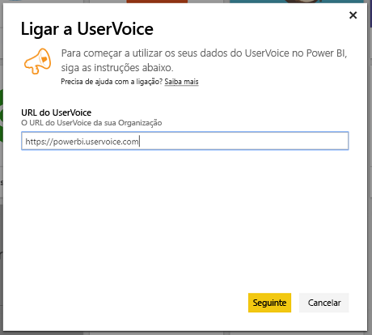
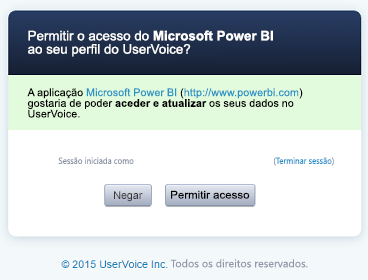

# Ligue-se ao UserVoice com o Power BI
É fácil acompanhar e explorar dados do UserVoice com o Power BI e o pacote de conteúdos do UserVoice. O Power BI obtem os seus dados, incluindo pedidos de suporte, sugestões e classificações de satisfação, e cria um dashboard pronto a usar e relatórios com base nesses dados.

[!INCLUDE [include-short-name](./includes/service-deprecate-content-packs.md)]

Ligue-se ao [pacote de conteúdos do UserVoice](https://app.powerbi.com/getdata/services/uservoice) para o Power BI.

>[!NOTE]
>É necessária uma conta de administrador para se ligar ao pacote de conteúdos do Power BI. O pacote de conteúdos também aproveita a API do UserVoice e contribui com utilização relativamente aos limites do UserVoice. Mais detalhes abaixo.

## Como se ligar
1. Selecione **Obter Dados** na parte inferior do painel de navegação esquerdo.
   
   
2. Na caixa **Serviços**, selecione **Obter**.
   
    
3. Selecione **UserVoice** e, em seguida, **Obter**.
   
   
4. Quando solicitado, escreva o URL do UserVoice. O URL deve seguir exatamente o padrão indicado abaixo `https://fabrikam.uservoice.com`, ao substituir "fabrikam" pelo nome do produto ou serviço.
   
   >[!NOTE]
   >Não há nenhuma barra no final e a ligação está em http**s**.
   
   
5. Quando solicitado, insira as suas credenciais do UserVoice e siga o respetivo processo de autenticação. Se já tiver sessão iniciada no UserVoice no seu browser, podem não ser solicitadas credenciais. Conceda à aplicação Power BI acesso aos seus dados clicando em “Permitir Acesso”.
   
   >[!NOTE]
   >É necessário ter credenciais de administrador para a conta do UserVoice.
   
   
6. O Power BI irá obter os seus dados do UserVoice e criar um relatório e dashboard prontos a usar. O Power BI irá obter os seguintes dados: todas as suas sugestões, todos os seus pedidos de suporte em aberto, todos os pedidos de suporte criados nos últimos 30 dias incluindo os encerrados e todas as classificações de satisfação do utilizador.
   
   

**E agora?**

* Experimente [fazer uma pergunta na caixa de Perguntas e Respostas](consumer/end-user-q-and-a.md) na parte superior do dashboard
* [Altere os mosaicos](service-dashboard-edit-tile.md) no dashboard.
* [Selecione um mosaico](consumer/end-user-tiles.md) para abrir o relatório subjacente.
* Embora o seu conjunto de dados seja agendado para atualizações diárias, pode alterar o agendamento das atualizações ou tentar atualizá-lo a pedido através da opção **Atualizar Agora**

## Resolução de problemas
**“Falha na validação do parâmetro. Verifique se todos os parâmetros são válidos”**

Se vir este erro depois de escrever o URL do UserVoice. Verifique se os requisitos seguintes foram satisfeitos:

* O URL segue exatamente este padrão `https://fabrikam.uservoice.com`, ao substituir "fabrikam" pelo seu prefixo do URL do UserVoice correto.
* Verifique se todas as letras são minúsculas.
* Verifique se o URL está em "http**s**".
* Verifique se não há nenhuma barra invertida no final do URL.

**“Falha no logon”**

Se receber um erro “Falha no inicio de sessão” depois de usar as suas credenciais do UserVoice para iniciar sessão, isso significa que a conta que está a usar não tem permissões para obter dados do UserVoice da sua conta. Verifique se é uma conta de administrador e tente novamente.

"**Ups, ocorreu um problema**"

Se receber esta mensagem de erro quando os dados estiverem a ser carregados, verifique se a sua conta do UserVoice não excedeu a cota mensal de utilização de APIs. Se tudo estiver correto, tente ligar novamente. Se o problema persistir, contacte o suporte do Power BI em [https://community.powerbi.com](https://community.powerbi.com/).

**Outros**  

O pacote de conteúdos do UserVoice para o Power BI usa APIs do UserVoice para obter os seus dados. Lembre-se de monitorizar a sua utilização da API para não exceder o limite. Se tiver muitos dados na sua conta do UserVoice, uma sugestão para minimizar o impacto na sua utilização da API é alterar a frequência de atualização atualmente predefinida, que é uma vez por dia, para atualizar somente em dias da semana ou em dias intercalados, dependendo das suas necessidades. Outra sugestão é um administrador criar o pacote de conteúdos e partilhá-lo com a equipa em vez de todos os administradores na sua organização criarem os seus próprios pacotes, colocando uma carga adicional desnecessária sobre as APIs

## Próximos passos
[Introdução ao Power BI](service-get-started.md)

[Obter dados no Power BI](service-get-data.md)

