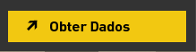
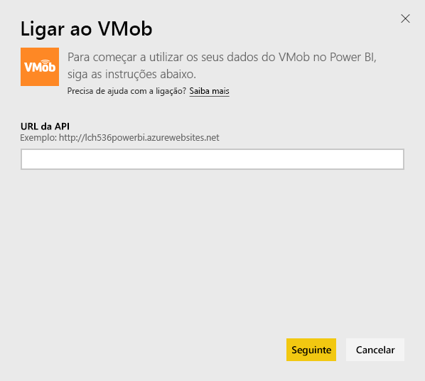
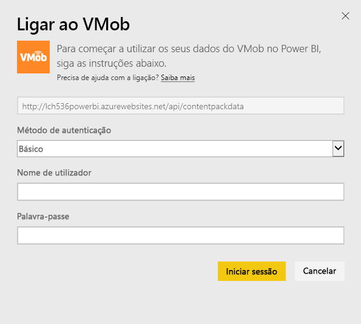
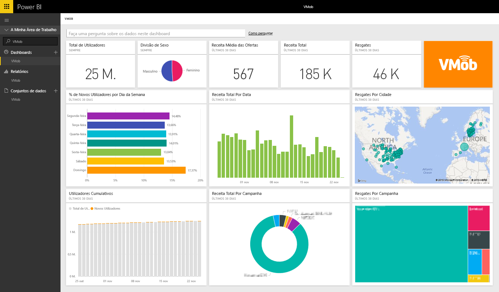

# Ligar VMob com o Power BI
É fácil acompanhar e explorar dados do VMob com o Power BI e o pacote de conteúdos do VMob. O Power BI devolve os seguintes dados: Estatísticas do Utilizador para todas as horas e nos últimos 30 dias, KPI de Varejo nos últimos 30 dias e Desempenho da Campanha nos últimos 30 dias.

Ligue-se ao [pacote de conteúdo do VMob](https://app.powerbi.com/getdata/services/vmob) para o Power BI.

## Como se ligar
1. Selecione **Obter Dados** na parte inferior do painel de navegação esquerdo.
   
    
2. Na caixa **Serviços**, selecione **Obter**.
   
   
3. Selecione **VMob** \> **Obter**.
   
   
4. Quando solicitado, insira o URL do VMob e clique no botão Avançar. Este URL é fornecido pelo VMob em separado.
   
    
5. Escolha a opção **Básico** no menu suspenso do Método de autenticação, introduza o nome de utilizador do VMob e a palavra-passe e clique no botão **Iniciar Sessão**.
   
    
6. O processo de importação é iniciado automaticamente e o Power BI devolve os dados do VMob para criar um relatório e dashboard prontos para utilizar.
   
   

**O que se segue?**

* Experimente [fazer uma pergunta na caixa de Perguntas e Respostas](power-bi-q-and-a.md) na parte superior do dashboard
* [Altere os mosaicos](service-dashboard-edit-tile.md) no dashboard.
* [Selecione um mosaico](service-dashboard-tiles.md) para abrir o relatório subjacente.
* Embora o seu conjunto de dados seja agendado para atualizações diárias, pode alterar o agendamento de atualização ou tentar atualizá-lo a pedido através de **Atualizar Agora**

## Próximos passos
[Introdução ao Power BI](service-get-started.md)

[Obter dados no Power BI](service-get-data.md)

