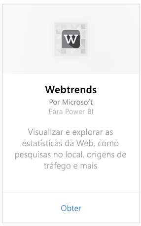
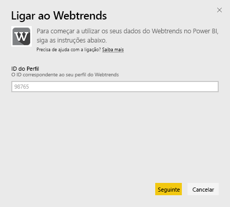
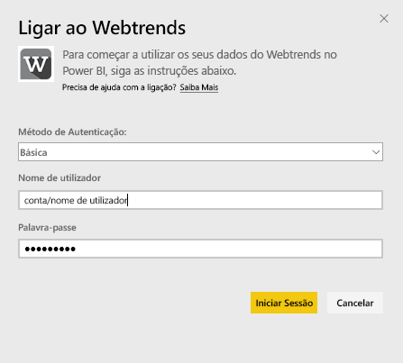
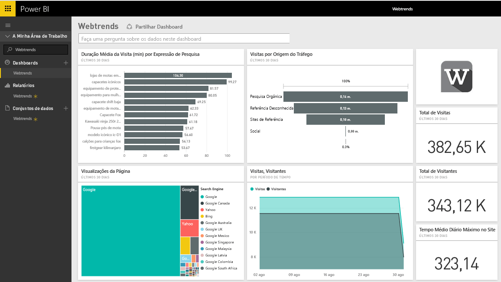
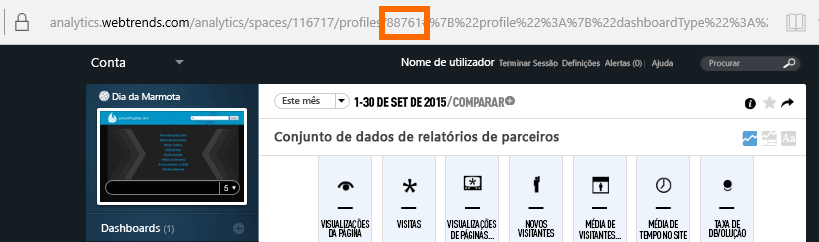
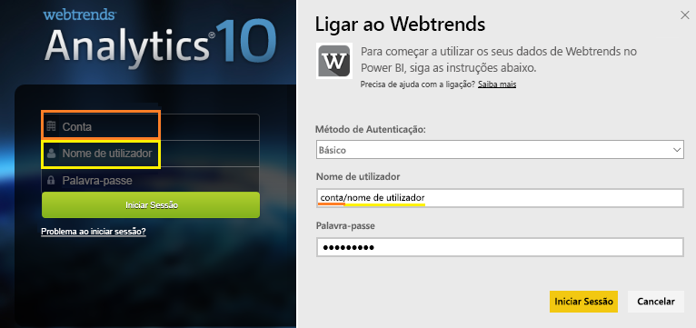

# Ligar ao Webtrends com o Power BI
O pacote de conteúdos do Webtrends para o Power BI inclui uma variedade de métricas prontas a usar, como o total de visualizações e visitas de página por origem do tráfego. A visualização dos seus dados do Webtrends no Power BI começa com a ligação à sua conta do Webtrends. Pode usar o dashboard e os relatórios fornecidos, ou personalizá-los de modo a realçar as informações mais importantes para si.  Os dados serão atualizados automaticamente uma vez por dia.

Ligue-se ao [pacote de conteúdos do Webtrends para o Power BI](https://app.powerbi.com/getdata/services/webtrends).

## Como se ligar
1. Selecione **Obter Dados** na parte inferior do painel de navegação esquerdo.
   
   
2. Na caixa **Serviços**, selecione **Obter**.
   
   
3. Selecione **Webtrends** \> **Obter**.
   
   
4. O pacote de conteúdos liga-se a um ID de perfil específico do Webtrends. Veja detalhes sobre como [encontrar esse parâmetro](#FindingParams) abaixo.
   
   
5. Forneça as suas credenciais do Webtrends para ligar. É importante observar que no campo do nome de utilizador é esperado que insira a sua conta e nome de utilizador. Veja os [detalhes](#FindingParams) abaixo.
   
   
6. Após a aprovação, o processo de importação será iniciado automaticamente. Quando concluído, um novo dashboard, relatório e modelo aparecerão no Painel de Navegação. Selecione o dashboard para ver os seus dados importados.
   
   

**O que se segue?**

* Experimente [fazer uma pergunta na caixa de Perguntas e Respostas](power-bi-q-and-a.md) na parte superior do dashboard
* [Altere os mosaicos](service-dashboard-edit-tile.md) no dashboard.
* [Selecione um mosaico](service-dashboard-tiles.md) para abrir o relatório subjacente.
* Embora o seu conjunto de dados seja agendado para atualizações diárias, pode alterar o agendamento de atualização ou tentar atualizá-lo a pedido através de **Atualizar Agora**

## O que está incluído

O pacote de conteúdos do Webtrends efetua pull de dados dos seguintes relatórios:  

| Nome do Relatório | ID do Relatório |
| --- | --- |
| Métrica-chave | |
| Pesquisas no Site |34awBVEP0P6 |
| Páginas de Saída |7FshY8eP0P6 |
| Páginas Seguintes |CTd5rpeP0P6 |
| Páginas Anteriores |aSdOeaUgnP6 |
| Páginas do site |oOEWQj3sUo6 |
| Clickthroughs de Anúncios no Site |41df19b6d9f |
| Cidades |aUuHskcP0P6 |
| Países |JHWXJNcP0P6 |
| Visitantes |xPcmTDDP0P6 |
| Duração da Visita |U5KAyqdP0P6 |
| Frases de Pesquisa |IKYEDxIP0P6 |
| Orugens de Tráfego |JmttAoIP0P6 |
| Motores de busca |yGz3gAGP0P6 |
| Páginas de Entrada |i6LrkNVRUo6 |

>[!NOTE]
>Para os perfis do SharePoint, os nomes de métrica podem ser um pouco diferentes do que é mostrado na IU do Webtrends. O seguinte mapeamento é feito para manter a consistência entre os perfis do SharePoint e da Web:   

    - Sessões = Visitas  
    - Novos Utilizadores = Novos Visitantes  
    - Vistas Por Sessão = Visualizações de Página por Visita  
    - Duração Média do Utilizador Diário = Tempo Médio no Site por Visitante  

## Requisitos de sistema
O pacote de conteúdos requer acesso a um perfil do Webtrends com o [conjunto correto de relatórios](#Included) ativado.

## Parâmetros de localização
O seu ID de perfil do Webtrends pode ser encontrado no URL depois de selecionar um perfil:

As credenciais são as mesmas que introduz ao entrar no Webtrends, no entanto, contamos que insira a sua conta e nome de utilizador na mesma linha, separados por uma barra invertida:

## Resolução de problemas
Pode encontrar um problema durante o carregamento do pacote de conteúdos, depois de fornecer as credenciais. Se vir a mensagem “Oops” durante o carregamento, veja as sugestões de resolução de problemas abaixo. Se continuar a ter problemas, registe um pedido de suporte em https://support.powerbi.com

1. O ID de Perfil correto está a ser usado; consulte [Parâmetros de localização](#FindingParams) para mais detalhes.
2. O utilizador tem acesso aos relatórios listados na secção [“O que está incluído”](#Included)

## Próximos passos
[Introdução ao Power BI](service-get-started.md)

[Power BI - Conceitos Básicos](service-basic-concepts.md)

