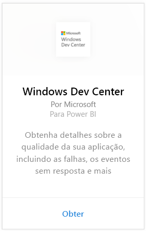
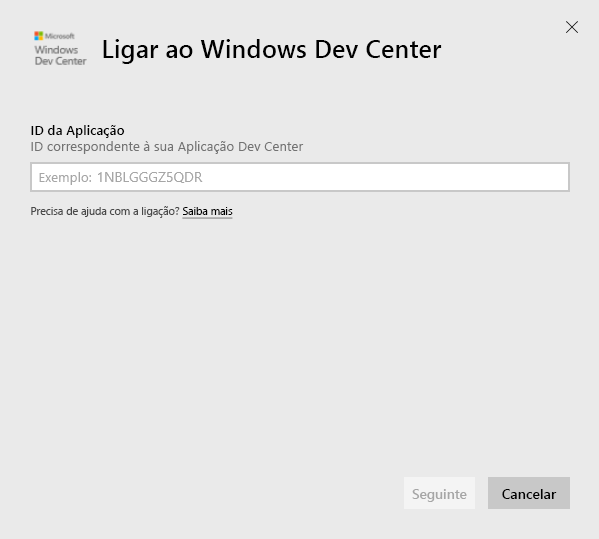
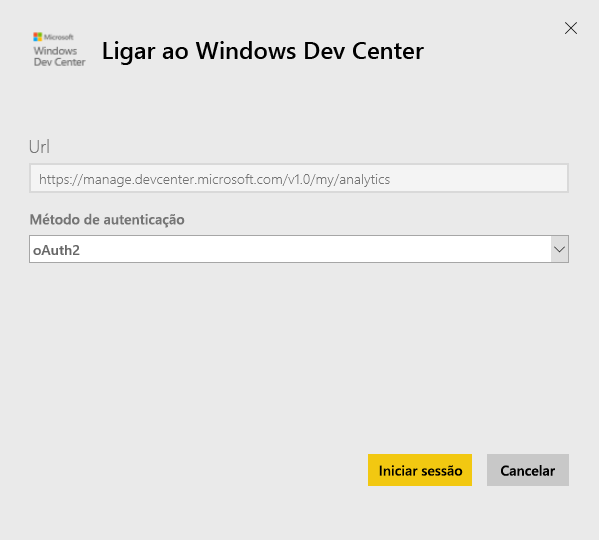
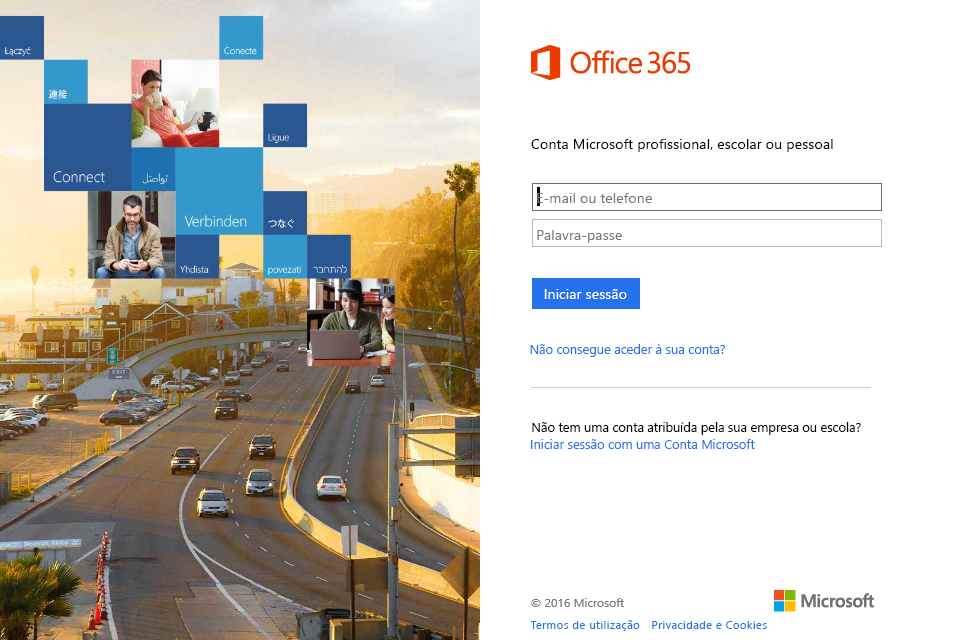
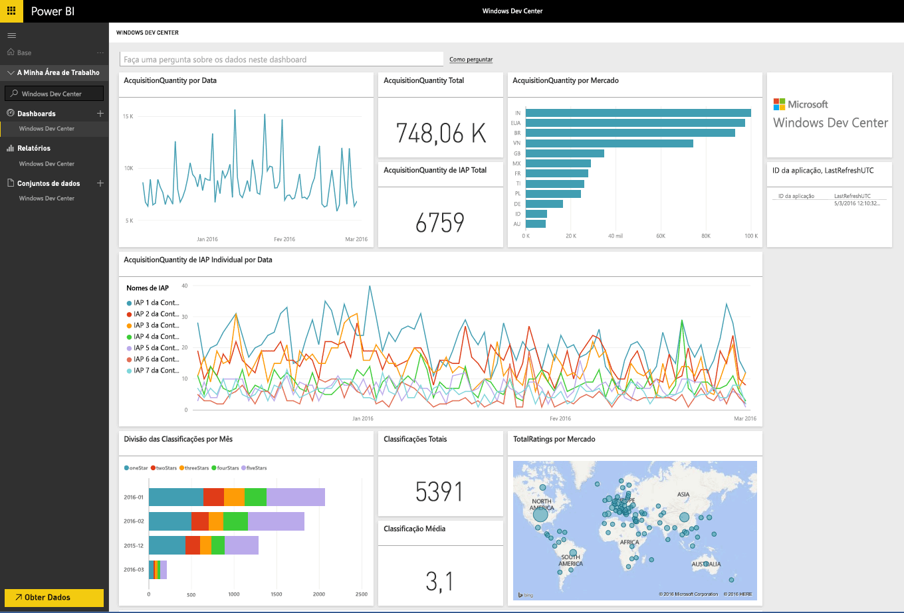
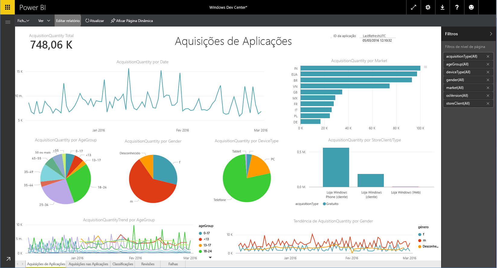

# Ligue-se ao Windows Dev Center com o Power BI
Explore e monitorize os seus dados de análise de aplicação do Windows Dev Center no Power BI com o pacote de conteúdos do Power BI. Os dados serão atualizados automaticamente uma vez por dia.

Ligue-se ao [pacote de conteúdos do Windows Dev Center](https://app.powerbi.com/getdata/services/devcenter) para o Power BI.

## Como se ligar
1. Selecione **Obter Dados** na parte inferior do painel de navegação esquerdo.
   
   
2. Na caixa **Serviços**, selecione **Obter**.
   
   
3. Selecione **Windows Dev Center**  \> **Obter**.
   
   
4. Insira o ID de aplicação de uma aplicação que possua e clique em Seguinte. Veja detalhes sobre como [encontrar esses parâmetros](#FindingParams) abaixo.
   
   
5. Como **Método de Autenticação**, selecione **oAuth2** \> **Iniciar Sessão**. Quando solicitado, introduza as credenciais do Azure Active Directory associadas à sua conta do Windows Dev Center (mais detalhes em [Requisitos de Sistema](#Requirements)).
   
    
   
    
6. Após a aprovação, o processo de importação será iniciado automaticamente. Quando concluído, um novo dashboard, relatório e modelo aparecerão no Painel de Navegação. Selecione o dashboard para ver os dados importados e escolha um mosaico para navegar até aos relatórios subjacentes.
   
    
   
    

**E agora?**

* Experimente [fazer uma pergunta na caixa de Perguntas e Respostas](power-bi-q-and-a.md) na parte superior do dashboard
* [Altere os mosaicos](service-dashboard-edit-tile.md) no dashboard.
* [Selecione um mosaico](service-dashboard-tiles.md) para abrir o relatório subjacente.
* Embora o seu conjunto de dados seja agendado para atualizações diárias, pode alterar o agendamento de atualização ou tentar atualizá-lo a pedido através de **Atualizar Agora**

## O que está incluído
O pacote de conteúdos do Power BI do Dev Center inclui dados de análise para a sua aplicação e aquisições de IAP, classificações, análises e estado de funcionamento da aplicação. Os dados são limitados para os últimos 3 meses. e é uma janela móvel, portanto as datas incluídas serão atualizadas à medida que o conjunto de dados for atualizado.

## Requisitos de sistema
Este pacote de conteúdos requer pelo menos uma aplicação publicada na Loja Windows e uma conta do Windows Dev Center (mais detalhes [aqui](https://msdn.microsoft.com/windows/uwp/publish/manage-account-users)).

## Parâmetros de localização
Pode encontrar o ID de aplicação indo à página Identidade da aplicação em Gestão de aplicações.

O ID da aplicação encontra-se no final do seu URL da Windows 10 Store, https://www.microsoft.com/store/apps/ **{applicationId}**

## Próximos passos
[Introdução ao Power BI](service-get-started.md)

[Obter dados no Power BI](service-get-data.md)

