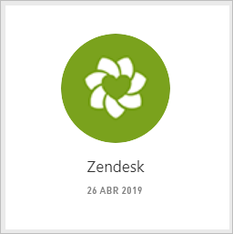
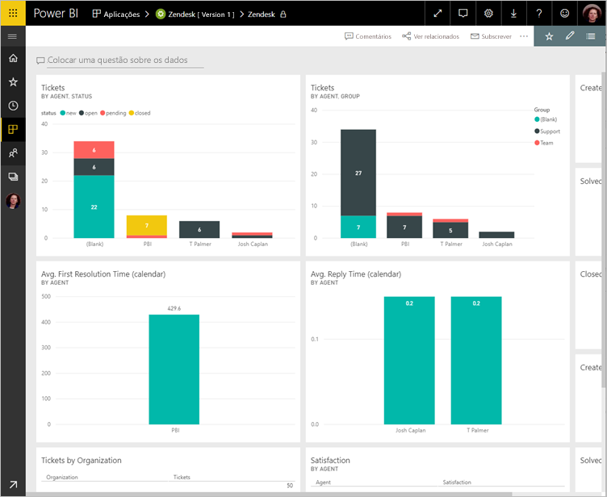
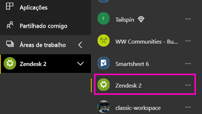
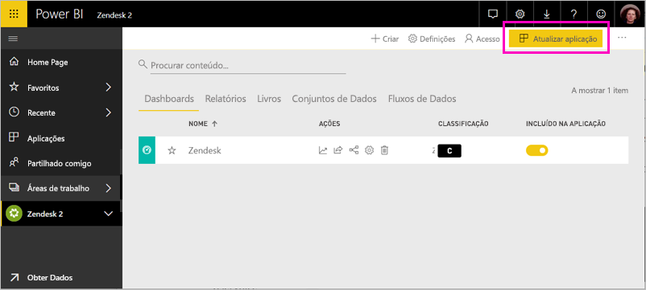

# Ligue-se ao Zendesk com Power BI

Este artigo orienta-o por meio de receber os seus dados da sua conta do Zendesk com uma aplicação de modelo do Power BI. A aplicação do Zendesk oferece um dashboard do Power BI e um conjunto de relatórios do Power BI que fornecem informações sobre os volumes de pedidos e o desempenho do agente. Os dados são atualizados automaticamente uma vez por dia. 

Depois de instalar a aplicação de modelo, pode personalizar o dashboard e relatório para realçar as informações que mais lhe interessa. Em seguida, pode distribuí-la como uma aplicação para os colegas na sua organização.

Ligue-se ao [pacote de conteúdos do Zendesk](https://app.powerbi.com/getdata/services/zendesk) ou leia mais sobre a [Integração do Zendesk](https://powerbi.microsoft.com/integrations/zendesk) com o Power BI.

Depois de instalar a aplicação de modelo, pode alterar o dashboard e relatório. Em seguida, pode distribuí-la como uma aplicação para os colegas na sua organização.

>[!NOTE]
>Precisa de uma conta de administrador do Zendesk para se ligar. Mais detalhes sobre os [requisitos](#system-requirements) abaixo.

## Como se ligar

[!INCLUDE [powerbi-service-apps-get-more-apps](./includes/powerbi-service-apps-get-more-apps.md)]

3. Selecione **Zendesk** \> **obter agora**.
4. Na **instalar esta aplicação do Power BI?** selecionar **instalar**.
4. Na **aplicações** painel, selecione a **Zendesk** mosaico.

    

6. Na **introdução à sua nova aplicação**, selecione **ligar a dados**.

    

4. Forneça o URL associado à sua conta. O URL tem o formato **https://company.zendesk.com** . Veja detalhes sobre [como encontrar estes parâmetros](#finding-parameters) abaixo.
   
   

5. Quando solicitado, insira as suas credenciais do Zendesk.  Selecione **oAuth 2** como o Mecanismo de Autenticação e clique em **Entrar**. Siga o fluxo de autenticação do Zendesk. (Se já tem sessão iniciada Zendesk no seu browser, pode não ser solicitadas credenciais.)
   
   > [!NOTE]
   > Este pacote de conteúdos requer que ligue com uma conta de administrador do Zendesk. 
   > 
   
   
6. Clique em **Permitir** para permitir que o Power BI aceda aos seus dados do Zendesk.
   
   
7. Clique em **Conectar** para iniciar o processo de importação. 
8. Depois do Power BI importar os dados, consulte a lista de conteúdo para a sua aplicação de Zendesk: um novo dashboard, relatório e conjunto de dados.
9. Selecione o dashboard para iniciar o processo de exploração.

    
   
## Modificar e distribuir a sua aplicação

Instalou a aplicação de modelo do Zendesk. Isso significa que criou também a área de trabalho de aplicação do Zendesk. Na área de trabalho, pode alterar o relatório e dashboard e, em seguida, distribuí-la como uma *aplicação* aos colegas na sua organização. 

1. Para ver todo o conteúdo do seu novo espaço de trabalho de Zendesk, na barra de navegação esquerdo, selecione **áreas de trabalho** > **Zendesk**. 

    

    Esta vista é a lista de conteúdo para a área de trabalho. No canto superior direito, verá **atualizar aplicação**. Quando estiver pronto para distribuir a sua aplicação para os seus colegas, que é onde começar. 

    

2. Selecione **relatórios** e **conjuntos de dados** para ver os outros elementos na área de trabalho.

    Leia sobre [distribuir aplicações](service-create-distribute-apps.md) para os seus colegas.

## Requisitos de sistema
Uma conta de administrador do Zendesk é necessária para aceder ao pacote de conteúdos do Zendesk. Se for um agente ou um utilizador final e estiver interessado em visualizar os dados do Zendesk, adicione uma sugestão e rever o conector do Zendesk no [Power BI Desktop](desktop-connect-to-data.md).

## Parâmetros de localização
O URL do Zendesk vai ser igual ao URL que utiliza para se ligar à sua conta do Zendesk. Se não se lembrar do URL do Zendesk, utilize a [ajuda de início de sessão](https://www.zendesk.com/login/) do Zendesk.

## Resolução de problemas
Se estiver a ter problemas de ligação, verifique o URL do Zendesk e confirme que está a utilizar uma conta de administrador do Zendesk.

## Próximos passos

* [Criar novas áreas de trabalho no Power BI](service-create-the-new-workspaces.md)
* [Instalar e utilizar aplicações no Power BI](consumer/end-user-apps.md)
* [Ligar a aplicações do Power BI para serviços externos](service-connect-to-services.md)
* Perguntas? [Experimente perguntar à Comunidade do Power BI](http://community.powerbi.com/)

