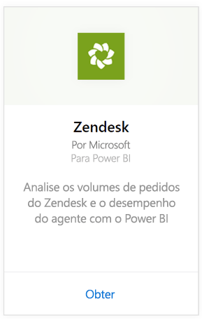
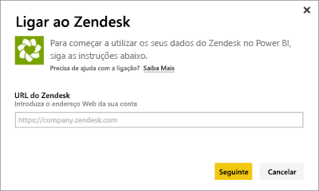
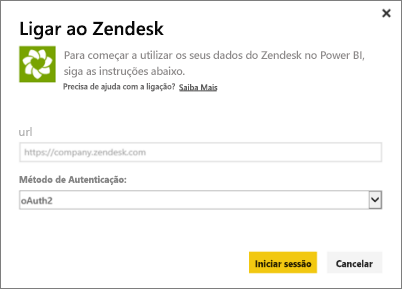
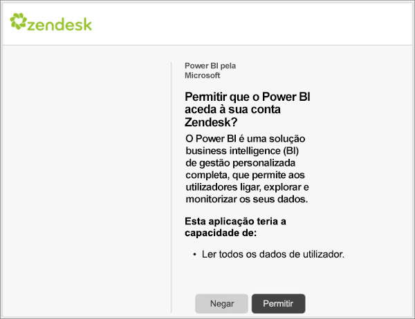
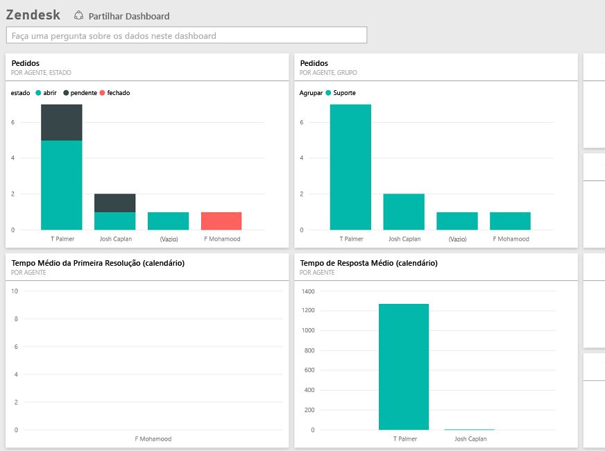

# Ligue-se ao Zendesk com Power BI
O pacote de conteúdos do Zendesk oferece um dashboard e um conjunto de relatórios do Power BI que fornecem informações sobre os volumes de pedidos e o desempenho do agente. Pode utilizar o dashboard e os relatórios fornecidos, ou então personalizá-los para destacar as informações que mais interessam.  Os dados são atualizados automaticamente uma vez por dia. 

Ligue-se ao [pacote de conteúdos do Zendesk](https://app.powerbi.com/getdata/services/zendesk) ou leia mais sobre a [Integração do Zendesk](https://powerbi.microsoft.com/integrations/zendesk) com o Power BI.

>[!NOTE]
>Uma conta de administrador do Zendesk é necessária para ligar-se. Mais detalhes sobre os [requisitos](#Requirements) abaixo.

## Como se ligar
1. Selecione **Obter Dados** na parte inferior do painel de navegação esquerdo.
   
   
2. Na caixa **Serviços**, selecione **Obter**.
   
    
3. Selecione **Zendesk** \> **Obter.**
   
   
4. Forneça o URL associado à sua conta. Tem o formato **https://company.zendesk.com**; veja detalhes sobre como [encontrar esses parâmetros](#FindingParams) abaixo.
   
   
5. Quando solicitado, insira as suas credenciais do Zendesk.  Selecione **oAuth 2** como o Mecanismo de Autenticação e clique em **Entrar**. Siga o fluxo de autenticação do Zendesk. (Se já tiver iniciado a sessão no Zendesk no seu browser, talvez as suas credenciais não sejam solicitadas.)
   
   > [!NOTE]
   > Este pacote de conteúdo requer a conexão com uma conta de Administrador do Zendesk. 
   > 
   > 
   
   
6. Clique em **Permitir** para permitir que o Power BI aceda aos seus dados do Zendesk.
   
   
7. Clique em **Conectar** para iniciar o processo de importação. Depois do Power BI importar os dados, verá um novo dashboard, relatório e conjunto de dados no painel de navegação esquerdo. Os novos itens estão marcados com um asterisco amarelo \*.
   
   

**O que se segue?**

* Experimente [fazer uma pergunta na caixa de Perguntas e Respostas](power-bi-q-and-a.md) na parte superior do dashboard
* [Altere os mosaicos](service-dashboard-edit-tile.md) no dashboard.
* [Selecione um mosaico](service-dashboard-tiles.md) para abrir o relatório subjacente.
* Embora o seu conjunto de dados seja agendado para atualizações diárias, pode alterar o agendamento de atualização ou tentar atualizá-lo a pedido através de **Atualizar Agora**

## O que está incluído
O pacote de conteúdos do Power BI inclui dados sobre o seguinte:  

* Utilizadores (utilizadores finais e agentes)  
* Organizações  
* Grupos  
* Pedidos  

Há também um conjunto de medidas que foram calculadas, como tempo médio de espera e pedidos resolvidos nos últimos sete dias. Uma lista completa está incluída no pacote de conteúdos.

## Requisitos do sistema
Uma conta de administrador do Zendesk é necessária para aceder ao pacote de conteúdos do Zendesk. Se é um agente ou um utilizador final e estiver interessado em ver os seus dados no Zendesk, adicione uma sugestão e examine o conector do Zendesk no [Power BI Desktop](desktop-connect-to-data.md).

## A localizar parâmetros
O URL do Zendesk vai ser igual ao URL que utiliza para se ligar à sua conta do Zendesk. Se não se lembrar do URL do Zendesk, utilize a [ajuda de início de sessão](https://www.zendesk.com/login/) do Zendesk.

## Resolução de problemas
Se estiver com problemas para se ligar, verifique o URL do Zendesk e confirme que está a utilizar uma conta de administrador do Zendesk.

## Próximos passos
* [Introdução ao Power BI](service-get-started.md)
* [Obter Dados](service-get-data.md)

