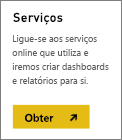
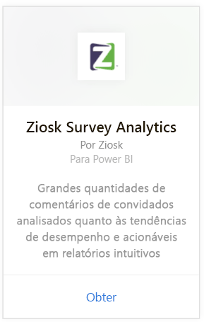
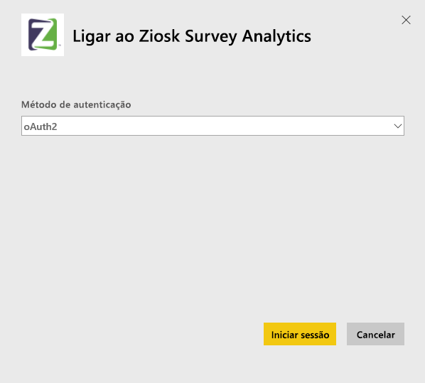
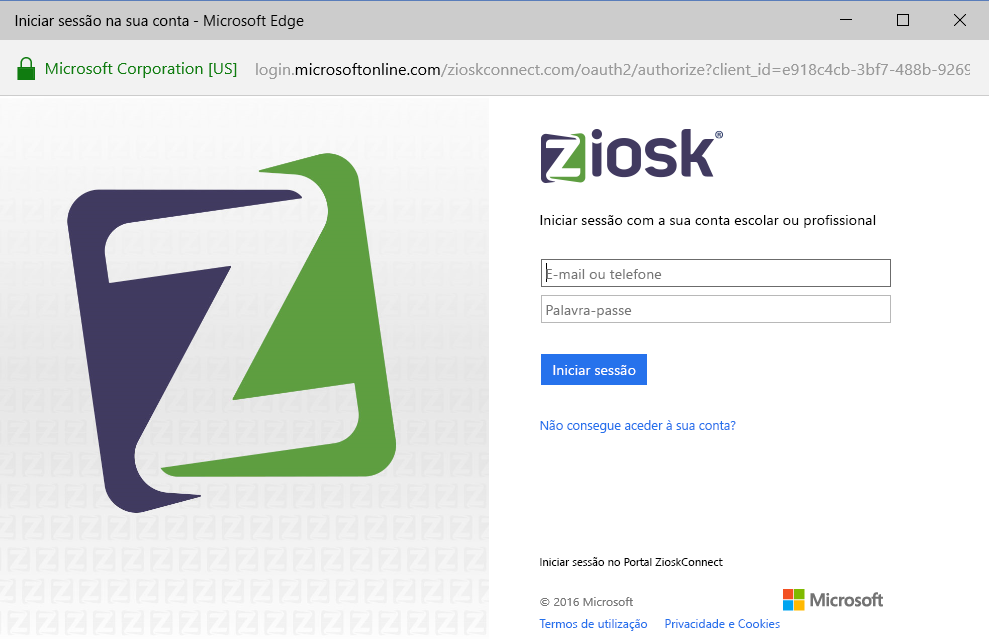

# Ligue-se ao Ziosk Survey Analytics com o Power BI
O pacote de conteúdos do Ziosk Survey Analytics para o Power BI oferece aos restaurantes que disponibilizam tablets do Ziosk acesso incomparável às informações fornecidas pelos dados de pesquisa do Ziosk, incluindo segmentação por dia, local, funcionários e muito mais.

Ligue-se ao [pacote de conteúdos do Ziosk Survey Analytics](https://app.powerbi.com/getdata/services/ziosk-survey-analytics) para o Power BI.

## Como se ligar
1. Selecione **Obter Dados** na parte inferior do painel de navegação esquerdo.  
   
    
2. Na caixa **Serviços**, selecione **Obter**.  
   
    
3. Selecione **Ziosk Survey Analytics** e selecione **Obter**.  
   
    
4. Selecione **OAuth 2** e **Iniciar Sessão**. Quando solicitado, forneça as suas credenciais do Ziosk.
   
    
   
    
5. Depois de estar ligado, são carregados automaticamente um dashboard, um relatório e um conjunto de dados. Após a conclusão, os blocos são atualizados com dados da sua conta do Ziosk.
   
    

**O que se segue?**

* Experimente [fazer uma pergunta na caixa de Perguntas e Respostas](power-bi-q-and-a.md) na parte superior do dashboard
* [Altere os mosaicos](service-dashboard-edit-tile.md) no dashboard.
* [Selecione um mosaico](service-dashboard-tiles.md) para abrir o relatório subjacente.
* Embora o seu conjunto de dados seja agendado para atualizações diárias, pode alterar o agendamento de atualização ou tentar atualizá-lo a pedido através de **Atualizar Agora**

## O que está incluído
O pacote de conteúdos inclui dados das seguintes tabelas:  

    - Alcohol Category  
    - Appetizer Category  
    - CommentKeywords  
    - Date  
    - Daypart  
    - Dessert Category  
    - FreeForm  
    - Kids Category  
    - Messages  
    - Premium Content Category  
    - Question  
    - Store  
    - Surveys  
    - Weekday  

## Requisitos do sistema
É necessário ter uma conta do Ziosk com permissões de acesso às tabelas acima para criar uma instância deste pacote de conteúdo.

## Próximos passos
[O que é o Power BI?](power-bi-overview.md)

[Power BI - Conceitos Básicos](service-basic-concepts.md)

