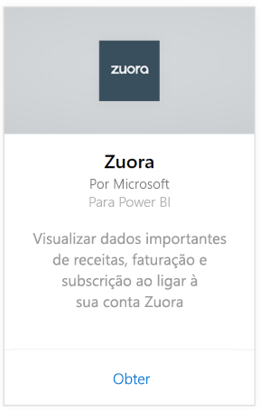
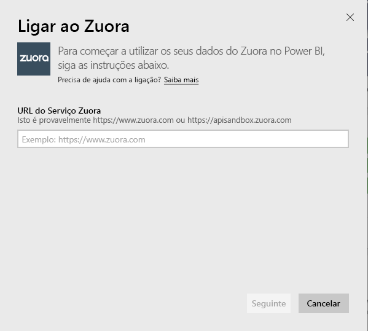
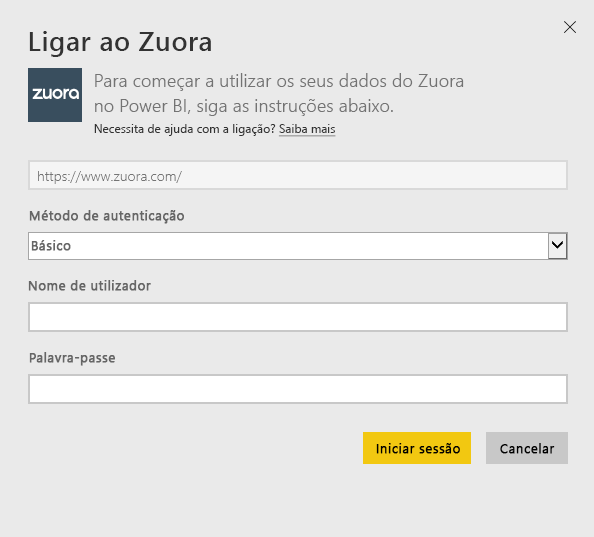
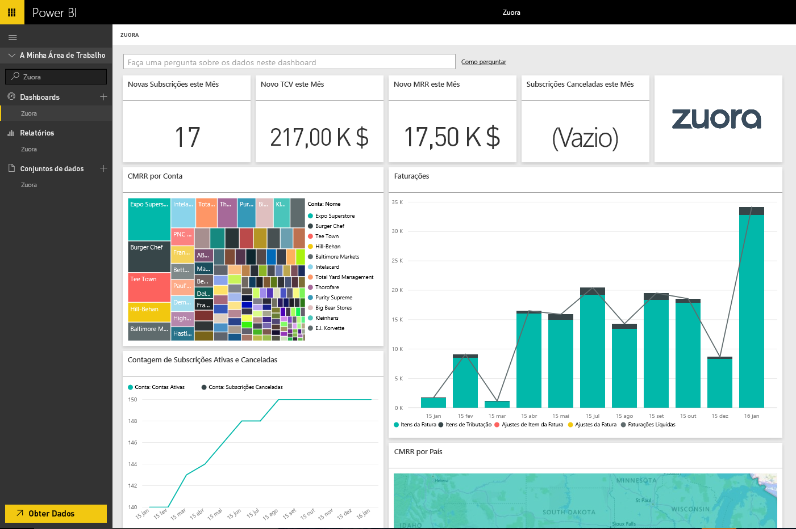

# Ligue-se ao Zuora com o Power BI
O Zuora para o Power BI permite que visualize dados importantes de receitas, faturação e subscrição. Utilize o dashboard e os relatórios predefinidos para analisar tendências de utilização, acompanhar cobranças e pagamentos e monitorizar receitas recorrentes ou personalizá-las para atender às suas necessidades exclusivas do dashboard e do relatório.

Ligue-se ao [Zuora](https://app.powerbi.com/getdata/services/Zuora) para o Power BI.

## Como se ligar
1. Selecione **Obter Dados** na parte inferior do painel de navegação esquerdo.

   
2. Na caixa **Serviços**, selecione **Obter**.

   
3. Selecione **Zuora** \>  **Obter**.

   
4. Especifique o URL do Zuora. Geralmente, o URL é "<https://www.zuora.com>". Veja os detalhes sobre como [encontrar esses parâmetros](#FindingParams) abaixo.

   
5. Para o **Método de Autenticação**, selecione **Básico** e forneça o seu nome de utilizador e a sua palavra-passe (diferencia maiúsculas de minúsculas) e selecione **Iniciar Sessão**.

    
6. Após a aprovação, o processo de importação será iniciado automaticamente. Quando concluído, um novo dashboard, relatório e modelo aparecerão no Painel de Navegação. Selecione o dashboard para ver os seus dados importados.

     

**O que se segue?**

* Experimente [fazer uma pergunta na caixa de Perguntas e Respostas](power-bi-q-and-a.md) na parte superior do dashboard
* [Altere os mosaicos](service-dashboard-edit-tile.md) no dashboard.
* [Selecione um mosaico](service-dashboard-tiles.md) para abrir o relatório subjacente.
* Embora o seu conjunto de dados seja agendado para atualizações diárias, pode alterar o agendamento de atualização ou tentar atualizá-lo a pedido através de **Atualizar Agora**

## O que está incluído
O pacote de conteúdos utiliza a API AQUA do Zuora para efetuar pull das seguintes tabelas:

| Tabelas |  |  |
| --- | --- | --- |
| Account |InvoiceItemAdjustment |Refund |
| AccountingCode |Payment |RevenueSchedule |
| AccountingPeriod |PaymentMethod |RevenueScheduleItem |
| BillTo |Product |Subscription |
| DateDim |ProductRatePlan |TaxationItem |
| Invoice |ProductRatePlanCharge |Uso |
| InvoiceAdjustment |RatePlan | |
| InvoiceItem |RatePlanCharge | |

Também inclui as medidas calculadas abaixo:

| Medida | Descrição | Pseudocálculo |
| --- | --- | --- |
| Conta: Pagamentos |Valores totais de pagamento num período de tempo, com base na data de realização do pagamento. |SUM (Payment.Amount)  WHERE Payment.EffectiveDate =< TimePeriod.EndDate AND    Payment.EffectiveDate >= TimePeriod.StartDate |
| Conta: Reembolsos |Valores totais de reembolso num período de tempo, com base na data de reembolso. O valor é comunicado como um número negativo. |-1*SUM (Refund.Amount) WHERE Refund.RefundDate =< TimePeriod.EndDate AND    Refund.RefundDate >= TimePeriod.StartDate |
| Conta: Pagamentos Líquidos |Pagamentos de Conta mais Reembolsos de Conta num período de tempo. |Account.Payments + Account.Refunds |
| Conta: Contas Ativas |A contagem de contas ativas num período de tempo. As subscrições devem ter sido iniciadas na data de início de um período de tempo ou antes. |COUNT (Account.AccountNumber) WHERE     Subscription.Status != "Expired" AND    Subscription.Status != "Draft" AND    Subscription.SubscriptionStartDate <= TimePeriod.StartDate AND    (Subscription.SubscriptionEndDate > TimePeriod.StartDate OR Subscription.SubscriptionEndDate = null) – assinatura evergreen |
| Conta: Receita Média Recorrente |MRR bruto por conta ativa num período de tempo. |Gross MRR/Account.ActiveAccounts |
| Conta: Assinaturas Canceladas |O número de contas que cancelaram uma assinatura num período de tempo. |COUNT (Account.AccountNumber) WHERE Subscription.Status = "Cancelled" AND    Subscription.SubscriptionStartDate <= TimePeriod.StartDate AND    Subscription.CancelledDate >= TimePeriod.StartDate |
| Contas: Erros de Pagamento |Valor total de erros de pagamento. |SUM (Payment.Amount) WHERE Payment.Status = "Error" |
| Item de Agendamento de Receita: Receita Reconhecida |Receita total reconhecida num período de contabilidade. |SUM (RevenueScheduleItem.Amount) WHERE AccountingPeriod.StartDate = TimePeriod.StartDate |
| Assinatura: Novas Assinaturas |Contagem de novas assinaturas num período de tempo. |COUNT (Subscription.ID) WHERE Subscription.Version = "1" AND    Subscription.CreatedDate <= TimePeriod.EndDate AND    Subscription.CreatedDate >= TimePeriod.StartDate |
| Fatura: Itens da Fatura |Valores totais de encargos de item da fatura num período de tempo. |SUM (InvoiceItem.ChargeAmount) WHERE     Invoice.Status = "Posted" AND    Invoice.InvoiceDate <= TimePeriod.EndDate AND    Invoice.InvoiceDate >= TimePeriod.StartDate |
| Fatura: Itens de Tributação |Valores totais de item de tributação num período de tempo. |SUM (TaxationItem.TaxAmount) WHERE Invoice.Status = "Posted" AND    Invoice.InvoiceDate <= TimePeriod.EndDate AND    Invoice.InvoiceDate >= TimePeriod.StartDate |
| Fatura: Ajustes de Item da Fatura |Valores totais de ajuste de item da fatura num período de tempo. |SUM (InvoiceItemAdjustment.Amount)  WHERE     Invoice.Status = "Posted" AND    InvoiceItemAdjustment.AdjustmentDate <= TimePeriod.EndDate AND    InvoiceItemAdjustment.AdjustmentDate >= TimePeriod.StartDate |
| Fatura: Ajustes de Fatura |Valores totais de ajuste de fatura num período de tempo. |SUM (InvoiceAdjustment.Amount)  WHERE     Invoice.Status = "Posted" AND    InvoiceAdjustment.AdjustmentDate <= TimePeriod.EndDate AND    InvoiceAdjustment.AdjustmentDate >= TimePeriod.StartDate |
| Fatura: Faturações Líquidas |Soma dos itens da fatura, itens de tributação, ajustes de item da fatura e ajustes da fatura num período de tempo. |Invoice.InvoiceItems + Invoice.TaxationItems + Invoice.InvoiceItemAdjustments + Invoice.InvoiceAdjustments |
| Fatura: Balanço de Faturação em Vencimento |Soma do balanço de faturas lançadas. |SUM (Invoice.Balance)  WHERE     Invoice.Status = "Posted" |
| Fatura: Cobranças Brutas |Soma dos valores de cobrança de item da fatura para faturas lançadas num período de tempo. |SUM (InvoiceItem.ChargeAmount)  WHERE     Invoice.Status = "Posted" AND    Invoice.InvoiceDate <= TimePeriod.EndDate AND    Invoice.InvoiceDate >= TimePeriod.StartDate |
| Fatura: Ajustes Totais |Soma de ajustes de fatura processados e ajustes de item de fatura associados às faturas lançadas. |SUM (InvoiceAdjustment.Amount)  WHERE     Invoice.Status = "Posted" AND    InvoiceAdjustment.Status = "Processed" + SUM (InvoiceItemAdjustment.Amount)  WHERE     Invoice.Status = "Posted" AND    invoiceItemAdjustment.Status = "Processed" |
| Despesas de Plano de Taxa: MRR Bruto |Soma da receita mensal recorrente das subscrições num período de tempo. |SUM (RatePlanCharge.MRR)  WHERE     Subscription.Status != "Expired" AND    Subscription.Status != "Draft" AND    RatePlanCharge.EffectiveStartDate <= TimePeriod.StartDate AND        RatePlanCharge.EffectiveEndDate > TimePeriod.StartDate     OR    RatePlanCharge.EffectiveEndDate = null --evergreen subscription |

## Requisitos do sistema
É necessário ter acesso à API do Zuora.

## A localizar parâmetros
Forneça o URL com a qual se liga normalmente para aceder aos seus dados do Zuora. As opções válidas são:  

* https://www.zuora.com  
* https://www.apisandbox.zuora.com  
* O URL correspondente à instância do serviço  

## Resolução de problemas
O pacote de conteúdos do Zuora mantém vários aspetos diferentes da sua conta do Zuora. Se não utilizar determinadas funcionalidades, pode ver os mosaicos/relatórios correspondentes vazios. Se tiver problemas ao carregar, contacte o Suporte do Power BI.

## Próximos passos
[Introdução ao Power BI](service-get-started.md)

[Obter dados no Power BI](service-get-data.md)
