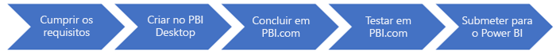

# Descrição geral do programa de pacotes de conteúdos do serviço Power BI
Um pacote de conteúdos é um conjunto de conteúdos que permite aos utilizadores obter imediatamente informações a partir de uma origem. Um pacote de conteúdos concentra-se normalmente num cenário empresarial específico que fornece informações para uma função, domínio ou fluxo de trabalho.

Os ISVs podem criar pacotes de conteúdos de modelo que permitem aos clientes ligar e instanciar com as suas próprias contas. Como especialistas de domínio, podem desbloquear os dados de forma a serem facilmente consumíveis pelos utilizadores empresariais. Os pacotes de conteúdos oferecem monitorização e análise ad-hoc aos seus clientes sem elevados investimentos na infraestrutura de relatórios.

Estes pacotes de conteúdos de modelo criados por ISVs podem ser submetidos para a equipa do Power BI para serem disponibilizados publicamente na galeria de pacotes de conteúdos do Power BI (app.powerbi.com/getdata/services) e no Microsoft AppSource (appsource.microsoft.com). Pode encontrar um exemplo de experiência de pacotes de conteúdos públicos [aqui](template-content-pack-experience.md).

## Descrição geral
O processo geral para desenvolver e submeter um pacote de conteúdos de modelo inclui múltiplos passos.

 

1. [Reveja os requisitos](#requirements) e certifique-se de que os cumpre
2. [Crie conteúdos](template-content-pack-authoring.md#queries) no Power BI Desktop
3. [Crie um dashboard](template-content-pack-authoring.md#dashboard) no PowerBI.com
4. [Teste o pacote de conteúdos](template-content-pack-testing.md) na sua organização
5. [Submeta](template-content-pack-testing.md#submission) o conteúdo para o Power BI para publicação

## Requisitos
Para criar e submeter um pacote de conteúdos a publicar no serviço Power BI e no AppSource, tem de cumprir os seguintes requisitos:

* Ter uma aplicação SaaS utilizada por utilizadores empresariais.
* A aplicação SaaS tem dados de utilizador que podem ser visualizados no Power BI.
* A aplicação SaaS tem uma API acessível através da Internet pública. Idealmente, trata-se de uma API REST ou um feed OData. Os pacotes de conteúdos do Power BI suportam vários tipos de autenticação, como Autenticação Básica, OAuth 2.0 e Chave de API. 
* A sua aplicação SaaS é aprovada para publicar um pacote de conteúdos. Submeter o pedido para pbiservicesapps@microsoft.com. Vamos rever cada submissão quanto a relevância e utilização esperada. 
* Contrato de parceiro assinado. Vai fazê-lo no [passo de submissão](template-content-pack-testing.md#submission).

Veja a secção sobre [criação](template-content-pack-authoring.md) para obter mais detalhes sobre os requisitos técnicos.

## Cenário empresarial
Os pacotes de conteúdos fornecem informações e métricas concentradas num cenário empresarial específico. A compreensão da sua audiência e do benefício obtido do pacote de conteúdos ajuda a assegurar que os utilizadores serão bem-sucedidos com os conteúdos que fornece.

### Sugestões
* Identificar o público-alvo e a tarefa que estão a tentar realizar  
* Concentrar-se num determinado período de tempo (últimos 90 dias) ou nos últimos N resultados  
* Importar apenas as tabelas/colunas relacionadas com o seu cenário  
* Considerar disponibilizar mais do que um pacote de conteúdos para cenários exclusivos separados  

## Perguntas frequentes
**Como entidade externa, posso criar um pacote de conteúdos do serviço Power BI para uma aplicação SaaS que não possuo?**

É necessário assinar um contrato de parceiro com o proprietário da aplicação SaaS antes de publicar o pacote de conteúdos no serviço. Como entidade externa, terá de assinar o contrato de parceiro com o proprietário da aplicação SaaS.

**Não tenho uma API para programadores pública para o meu serviço. Posso continuar a criar um pacote de conteúdos do serviço Power BI que obtenha os dados diretamente a partir do armazenamento de dados?**

Não. Os pacotes de conteúdos do serviço Power BI requerem uma API para programadores acessível através da Internet pública.

**Que tipo de APIs são suportados pelos pacotes de conteúdos do serviço e que tipos de autenticação podem utilizar?**

Os pacotes de conteúdos do serviço Power BI suportam qualquer API REST ou feed OData. O Power BI pode utilizar diversos tipos de autenticação, incluindo Autenticação Básica, OAuth2.0 e Chave de API Web. Pode obter mais detalhes sobre os requisitos técnicos no artigo [Criação](template-content-pack-authoring.md#dashboard).

**Tenho um pacote de conteúdos publicado no Power BI. Como posso atualizá-lo?**

Os pacotes de conteúdos publicados podem ser atualizados uma vez por mês. Os pedidos de atualização submetidos para [pbiservicesapps@microsoft.com](mailto:pbiservicesapps@microsoft.com) antes do último dia do mês atual, serão publicados na primeira semana do mês seguinte.

**Tenho mais perguntas sobre Pacotes de Conteúdos do serviço. Como posso contactá-lo?**

Não hesite em enviar-nos um e-mail com as suas perguntas para [pbiservicesapps@microsoft.com](mailto:pbiservicesapps@microsoft.com)

## Suporte
Para obter suporte durante o desenvolvimento, utilize [https://powerbi.microsoft.com/support](https://powerbi.microsoft.com/support). Os incidentes dos clientes são rapidamente reencaminhados para a equipa adequada.

## Passo seguinte
[Criação](template-content-pack-authoring.md)