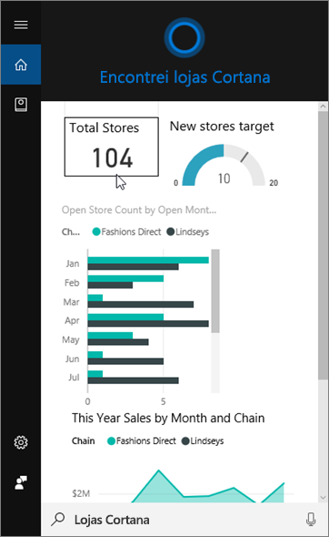
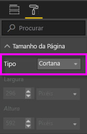
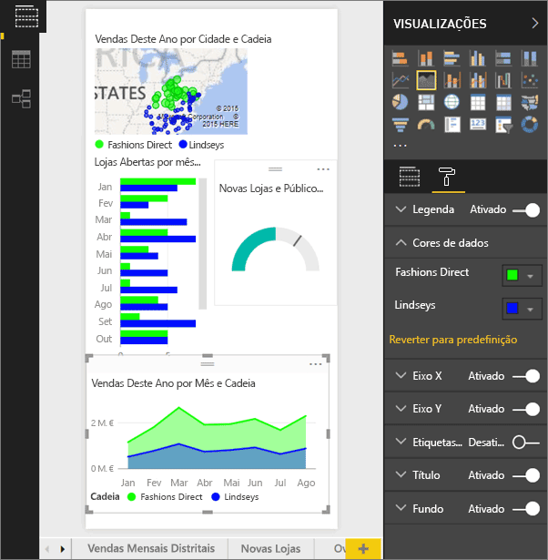
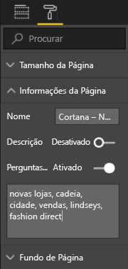
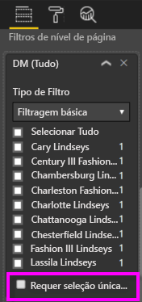

# Utilize o serviço Power BI ou o Power BI Desktop para criar uma Página de Resposta personalizada para a Cortana
Utilize as funcionalidades completas do Power BI para criar páginas de relatório especiais, denominadas *Páginas de resposta da Cortana* (e, por vezes, denominadas *Cartões de resposta da Cortana*) concebidas especificamente para responder a perguntas da Cortana.

> [!IMPORTANT]
> Se estiver a experimentar a Cortana e a pré-visualização do **dashboard** do Power BI, pode ignorar o resto deste artigo. Não existem requisitos de configuração para a Cortana poder procurar os seus dashboards do Power BI.
> 
> 

## Antes de começar
Dispõe de quatro documentos que o ajudam a configurar e utilizar a Cortana para o Power BI. Se ainda não o tiver feito, comece por ler o primeiro artigo. Além disso, o segundo artigo é particularmente importante porque descreve alguns passos que terá de executar antes de poder começar a utilizar as páginas de resposta da Cortana.

**Artigo 1**: [Saiba como a Cortana e o Power BI funcionam em conjunto](service-cortana-intro.md)

**Artigo 2**: [Para procurar relatórios do Power BI: ativar a integração entre a Cortana, o Power BI e o Windows](service-cortana-enable.md)

**Artigo 3**: Este artigo

**Artigo 4**: [Resolver problemas](service-cortana-troubleshoot.md)

## Criar uma página de resposta da Cortana concebida especificamente para a Cortana
Uma *página de resposta da Cortana* num relatório é dimensionada especificamente para a Cortana para que a Cortana possa apresentá-la no ecrã como uma resposta a uma pergunta. Para criar uma página de resposta para a Cortana:

1. Recomendamos que comece com uma [página de relatório em branco](power-bi-report-add-page.md).
2. No painel **Visualizações**, selecione o ícone de rolo de pintura e selecione **Tamanho da Página** > **Tipo** > **Cortana**.
   
    
3. Crie um visual ou um conjunto de visuais que deseja que apareçam na Cortana em resposta a uma pergunta específica (ou a um conjunto de perguntas).
4. Certifique-se de que todos os visuais se ajustam dentro dos limites da página. Opcionalmente, modifique as configurações de exibição, os rótulos de dados, cores e planos de fundo.  
   
    
5. Nomeie a página e adicione nomes alternativos. A Cortana usa esses nomes ao pesquisar resultados. No painel **Visualizações**, selecione o ícone de pincel e escolha **Informações da Página**. Ative as Perguntas e Respostas para este elemento visual ao mover o controlo de deslize para **Ativo**.
   
    
   
   > [!TIP]
   > Para melhorar os resultados, evite utilizar palavras que também sejam nomes de colunas.
   > 
   > 
6. Opcionalmente, se o relatório tiver filtros ao nível da página, poderá querer definir **Exigir seleção única**. A Cortana só mostra este relatório como uma resposta se um, e apenas um, dos itens do filtro for especificado na pergunta. A opção **Exigir seleção única** pode ser encontrada na parte inferior do painel **Filtros**.
   
   > [!NOTE]
   > Não tem de definir a opção **Requer seleção única** para pedir à Cortana para apresentar um relatório com filtros de nível de página. Por exemplo "mostrar vendas de Charlotte Lindseys" irá apresentar a página de resposta, independentemente da definição Requer seleção única.
   > 
   > 
   
     
   
      Por exemplo, se perguntar à Cortana:
   
   * “mostrar vendas por nome de loja”, esta página de resposta não será apresentada porque não incluiu nenhum dos itens no filtro de nível de página necessário.
   * “mostrar vendas de Cary Lindseys e Charlotte Lindseys”, esta página de resposta não será apresentada porque especificou mais de um item no filtro de nível de página necessário.
   * “mostrar vendas de Charlotte Lindseys”, esta página de resposta será apresentada.
     
     = "mostrar vendas", esta página de resposta não será apresentada porque não incluiu nenhum dos itens no filtro de nível de página necessário.

> [!IMPORTANT]
> Para que a Cortana possa aceder à página de resposta da Cortana, primeiro precisa de [Ativar o conjunto de dados para a Cortana](service-cortana-enable.md).
> 
> 

## Como é que a Cortana ordena os resultados?
Os resultados com respostas com pontuação alta (como uma correspondência completa de um nome de página especificado) serão apresentadas primeiro como uma *melhor correspondência* na Cortana. Várias correspondências melhores podem ser apresentada se existirem várias páginas de resposta da Cortana no Power BI. As respostas com pontuação média ou mais baixa, como as respostas que não se baseiam no nome de uma página de resposta ou uma pergunta com palavras que não foram entendidas pelo Power BI, são listadas como ligações abaixo das melhores correspondências na Cortana.

> [!NOTE]
> Quando um novo conjunto de dados ou uma página de resposta personalizada da Cortana é adicionada ao Power BI e ativada para a Cortana, pode demorar até 30 minutos até que os resultados comecem a ser apresentados na Cortana. Iniciar e terminar sessão no Windows 10 ou reiniciar o processo da Cortana no Windows 10 fará com que os novos conteúdos sejam apresentados de imediato.
> 
> 

## Próximos passos
[Utilizar a Cortana com o Power BI](service-cortana-intro.md)

Continua a não conseguir utilizar a Cortana juntamente com o Power BI?  Experimente a [resolução de problemas da Cortana](service-cortana-troubleshoot.md).

Mais perguntas? [Pergunte à Comunidade do Power BI](http://community.powerbi.com/)

