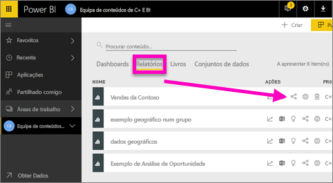
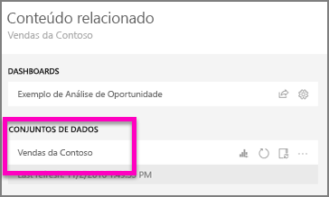
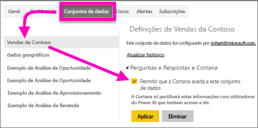
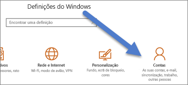
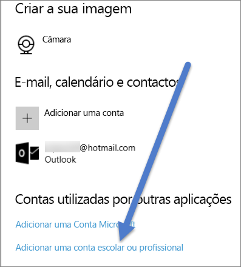

# Ativar a Cortana para aceder a relatórios do Power BI (e conjuntos de dados associados)
Leu a [Introdução à Cortana e ao Power BI](service-cortana-intro.md) (se não a leu, recomendamos que a leia primeiro e depois regresse a esta secção). Agora, quer experimentar.  Antes de poder fazer perguntas em linguagem natural na Cortana e encontrar respostas de dados armazenados em ***relatórios*** do Power BI, existem alguns requisitos. Especificamente, precisa do seguinte.

> [!NOTE]
> Se estiver a experimentar a Cortana e a pré-visualização do ***dashboard*** do Power BI, pode ignorar o resto deste artigo. Não existem requisitos de configuração para a Cortana poder procurar os seus dashboards do Power BI.
> 
> 

No serviço Power BI

* ative um ou mais conjuntos de dados para a Cortana (os relatórios são criados sobre conjuntos de dados, pelo que a Cortana precisa de acesso a esses conjuntos de dados)

No Microsoft Windows

* Certifique-se de que está a executar a versão 1511 ou posterior do Windows 10
* Certifique-se de que o Power BI e o Windows conseguem comunicar entre si. Isto significa ligar a sua conta ao Windows.

## Utilizar o serviço Power BI para permitir à Cortana aceder a páginas de relatórios no Power BI
Permitir à Cortana o acesso aos relatórios no Power BI é um processo simples.  A única coisa que precisa de fazer é ativar o conjunto de dados subjacente do relatório ao selecionar "Ativar a Cortana para aceder a este conjunto de dados". Depois de o fazer, qualquer utilizador que tenha acesso ao conjunto de dados no Power BI, a partir das funcionalidades de pacotes de conteúdos, aplicações e partilha do Power BI, poderá obter respostas do relatório na Cortana no Windows 10.

Terá de iniciar sessão no serviço Power BI (não no Power BI Desktop) e repetir estes passos para cada conjunto de dados ao qual pretende que a Cortana consiga aceder.

1. Determine que conjuntos de dados devem ser ativados. Na lista de conteúdos de relatório, selecione o relatório ao qual pretende que a Cortana aceda e selecione o ícone **Ver relacionados**  .
   
    
2. O conjunto de dados associado a este relatório é **Contoso Sales** (Vendas Contoso).
   
    
3. À direita do nome do conjunto de dados, selecione as **reticências (…) > Definições**.  
   
    
4. Selecione **Perguntas e Respostas e Cortana** > **Ativar a Cortana para aceder a este conjunto de dados** > **Aplicar**.
   
   
   
   Neste exemplo, vamos ativar a Cortana no conjunto de dados Contoso Sales (Vendas Contoso).
   
   > [!NOTE]
   > Quando um novo conjunto de dados ou cartão de resposta da Cortana é adicionado ao Power BI e ativado para a Cortana, podem ser necessários até 30 minutos para que comecem a surgir resultados. Iniciar e terminar sessão no Windows 10, ou reiniciar o processo da Cortana no Windows 10, permitirá que o novo conteúdo seja apresentado de imediato.
   > 
   > Se ativar um conjunto de dados para a Cortana e esse conjunto de dados fizer parte de um pacote de conteúdos ou aplicação sua, terá de voltar a publicar para que os seus colegas também o consigam utilizar com a Cortana.
   > 
   > 

## Adicionar as suas credenciais do Power BI ao Windows
Terá de executar a versão 1511 ou posterior do Windows 10.

1. Determine que versão do Windows 10 está a executar. Abra **Definições**.
    

    Em seguida, selecione **Sistema > Acerca de**. Junto à parte inferior do ecrã, verá **Especificações de Windows > Versão**

   * Se tiver a versão 1511 a 1607 do Windows 10 (Atualização Windows de 10 de Novembro de 2015), adicione a sua conta escolar ou profissional e a conta Microsoft (complete os passos 2 e 3 abaixo).
   * Se tiver a versão 1607 ou posterior do Windows 10 (atualização de julho de 2016 do Windows 10), adicione a sua conta escolar ou profissional (complete apenas o passo 2 abaixo).
1. Adicione a sua conta escolar ou profissional à Cortana.
   
   * Abra as **Definições** > **Contas**.
     
       
   * Navegue até à parte inferior e selecione **Adicionar uma conta escolar ou profissional**. Ou, na página **Contas**, selecione **Acesso profissional ou escolar > Ligar**.
     
     

A Cortana usará essa conta escolar ou profissional para verificar o Power BI quanto a possíveis respostas para as suas perguntas na Cortana.

## Próximos passos
[Criar*cartões de resposta da Cortana* no Power BI](service-cortana-answer-cards.md)

[Resolução de problemas de integração do Power BI e da Cortana](service-cortana-troubleshoot.md)

Mais perguntas? [Pergunte à Comunidade do Power BI](http://community.powerbi.com/)

